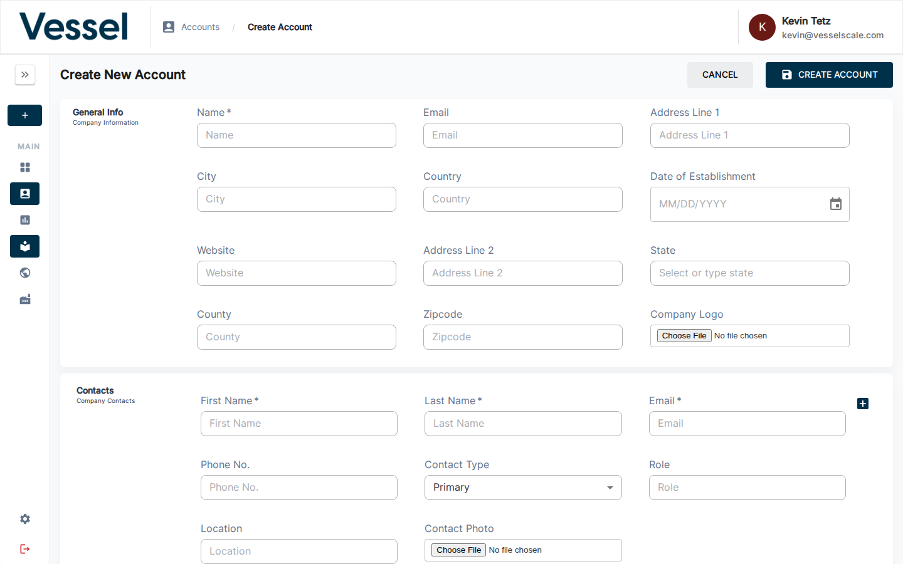
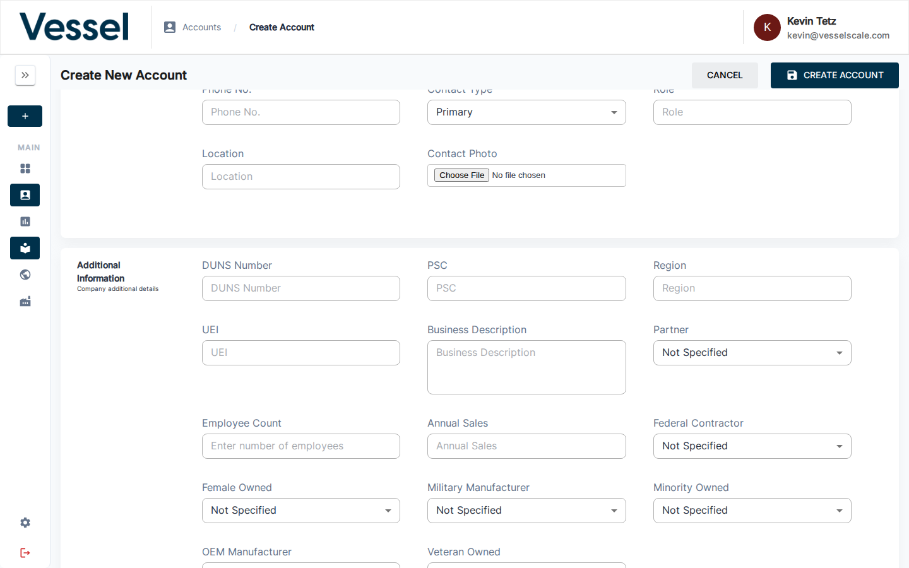

# Create Account

Use this form to add a new account to the platform.

## What you can do here

- Enter company name, contact, industry, and location
- Set account-level properties
- Save the account and begin adding assessments

## Overview

The Create Account form uses the same fields and layout as the [Edit Account](edit.md) page. Sections include:

| Section | Fields |
|---------|--------|
| **General Info** | Name \*, Email, Address Line 1, City, Country, Date of Establishment, Website, Address Line 2, State, County, Zipcode, Company Logo |
| **Contacts** | First Name \*, Last Name \*, Email \*, Phone No., Contact Type, Role, Location, Contact Photo |
| **Additional Information** | DUNS Number, PSC, Region, UEI, Business Description, Partner, Employee Count, Annual Sales, Federal Contractor, Female Owned, Military Manufacturer, Minority Owned, OEM Manufacturer, Veteran Owned |

See [Edit Account](edit.md) for a full description of each field.

## Saving

After filling in the required fields, click **Save** to create the account. Validation errors will be displayed if required fields are missing or invalid data is entered. Once saved, you'll be taken to the new account's details page where you can begin adding assessments.

## Related

- [Getting Started: Step 1](../../getting-started/creating-your-account.md) — Quick-start guide to creating accounts
- [Edit Account](edit.md) — Full field reference
- [Account Details](details.md) — View account information
- [Accounts](index.md) — Accounts overview
