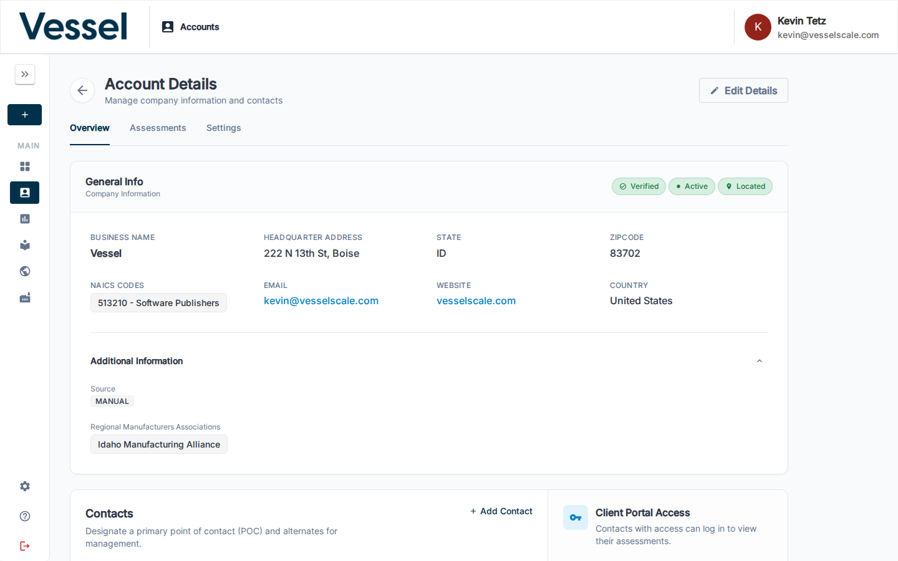
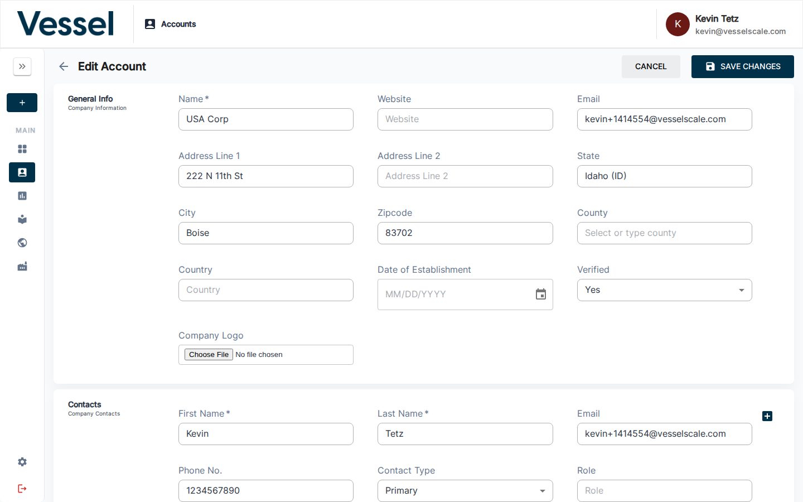

# Account Details

The Account Details page shows all information associated with a specific account.

## What you can do here

- View contact information, industry classification, and location
- See evaluations linked to this account
- Edit account information

## Overview

The Account Details view provides a comprehensive snapshot of a single organization. This page consolidates all key information about an account in one place, including company name, contact information, geographic location, NAICS industry codes, and operational details. The overview section serves as your starting point for understanding the complete profile of an account and its current status within the system.

## Edit Account

The Account Edit interface allows administrators to update account information. From this page, you can modify contact details, update industry classifications, change location information, and manage other account-level settings. This ensures your account data remains current and accurate as business information changes over time.

## Assessments

The Assessments section displays all assessments associated with this account. Here you can see the history of assessments performed on the organization, their completion status, scores, and dates. This gives you a complete audit trail of the account's assessment activity and helps track progress over time.

## Related

- [Accounts](index.md)
- [Assessments](../assessments/index.md)
