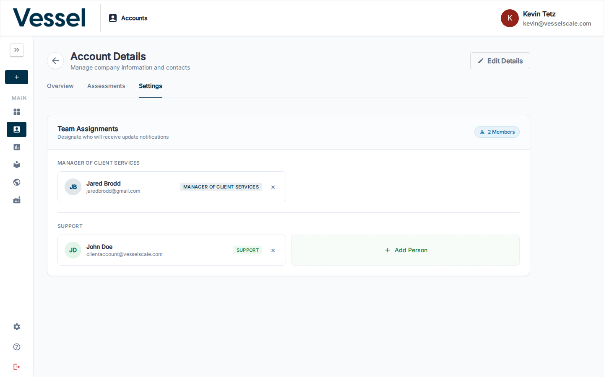

# Account Details

The Account Details page shows all information associated with a specific account. It is organized into three tabs: **Overview**, **Assessments**, and **Settings**.

## What you can do here

- View contact information, industry classification, and location
- See all assessments linked to this account
- Assign team members to roles for this account
- Configure which Web Reports appear in the Client Portal
- Edit the account or preview the Client Portal as the client sees it

## View as Client

The **View as Client** button opens a live preview of the [Client Portal](../client-portal/index.md) for this account — exactly as the client would see it.

When you click **View as Client**, a **Preview Mode** banner appears at the top of the portal confirming that you are viewing on behalf of this account. You can return to the Account Details page at any time by clicking **Return to Account**.

Use this to:

- Verify the client can see the correct assessments
- Confirm which Web Reports are available in the portal
- Troubleshoot portal access issues before escalating to the client

---

## Overview tab

The **Overview** tab provides a comprehensive snapshot of the organization: company name, contact information, geographic location, NAICS industry codes, and operational details. This is your starting point for understanding the complete profile of an account and its current status in the system.

### Web Reports Configuration

The Web Reports panel within the Overview tab controls which assessment report templates are made available to this account's client portal view.

When you enable Web Report templates for an account, they become available for the organization's representatives to view in the **Client Portal**. This allows you to:

- **Control Portal Visibility** — Choose which report templates clients can access
- **Customize Per Account** — Different accounts can have different report templates available
- **Manage Sensitivity** — Enable only reports appropriate for a specific client
- **Streamline Navigation** — Clients only see the reports that are relevant to them

#### How Web Reports configuration works

1. **Reports are created in Settings** — Administrators create and manage Web Report templates in **Settings → Web Reports**
2. **Templates are enabled per account** — On this page, select which available templates should be enabled for this specific account
3. **Clients see enabled reports** — When clients log into the Client Portal, they see a **Reports** card showing only the enabled reports for their account
4. **Only active templates shown** — Only Web Report templates marked as **Active** in Settings are available for account assignment

When you check the box next to a report template, that report becomes visible to the account in the Client Portal. Unchecking removes it from the portal view. Changes take effect immediately — no additional save step required.

For more information about creating and managing Web Report templates, see **[Web Reports](../settings/web-reports.md)** in Settings.

---

## Assessments tab

The **Assessments** tab displays all assessments associated with this account. For each assessment you can see:

- Assessment name and collection
- Start and close dates
- Number of responses
- Executive contact assigned to the assessment
- Current status (e.g. In Progress, Results Review, Completed)

This gives you a complete audit trail of the account's assessment activity and makes it easy to track progress across multiple assessments over time. Use the search bar and status filter to narrow down the list.

---

## Settings tab

The **Settings** tab controls team assignments for this account — designating who will receive update notifications and manage the client relationship.

### Team Assignments

The Team Assignments panel shows all configured role slots for this account. Each role slot can have one or more users assigned.

#### Manager of Client Services

!!! note "Role name is configurable"
    The label **Manager of Client Services** (and other role titles shown here) can be customized for your organization on the **[Branding](../settings/branding.md)** settings page. The exact titles displayed will match whatever your organization has configured.

The **Manager of Client Services** role designates the primary person responsible for the client relationship on this account. This person will:

- Receive update and activity notifications for the account
- Be visible to the client as their main point of contact
- Appear on assessments associated with this account as the executive contact

**To assign a Manager of Client Services:**

1. Open the **Settings** tab on the Account Details page
2. Under **Team Assignments**, locate the **Manager of Client Services** (or your organization's equivalent role name) section
3. Click **+ Add Person** to open the user selector
4. Search for and select the user to assign
5. The assignment saves immediately

To remove a user, click the **×** on their assignment card.

#### Other role slots

Additional role slots (such as **Support**) may appear depending on how your organization has configured team roles in Branding settings. Each works the same way — click **+ Add Person** to assign a user.

---

## Geocoding

The Geocoding section allows you to assign geographic coordinates to an account based on its address. This enables the platform to map accounts in the [Ecosystem](../ecosystem/index.md) view and support location-based filtering.

!!! warning "Address accuracy is critical"
    For geocoding to work correctly, the account's address must be complete and correctly formatted. Verify the street address, city, state/province, and postal code in [Edit Account](edit.md) before geocoding.

---

## Related

- [Edit Account](edit.md) — Update account information
- [Accounts](index.md) — Accounts overview
- [Client Portal](../client-portal/index.md) — Preview what clients see in their portal
- [Web Reports](../settings/web-reports.md) — Create and manage report templates
- [Assessments](../assessments/index.md) — Assessment overview
- [Branding](../settings/branding.md) — Customize role names and team labels

