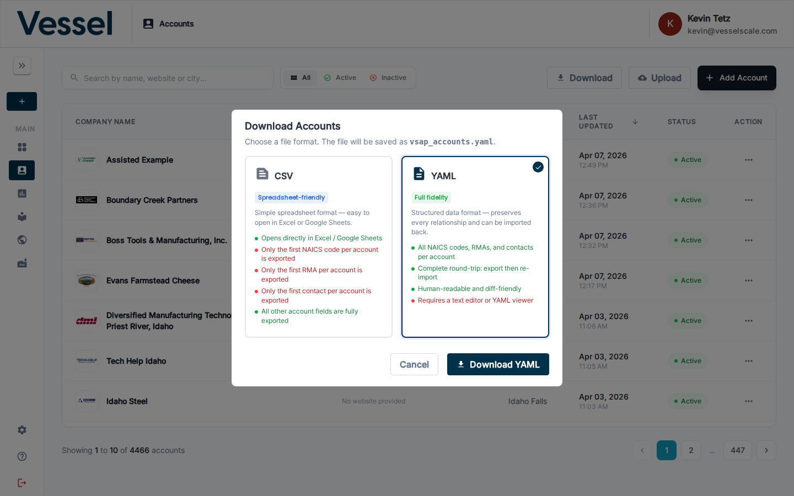
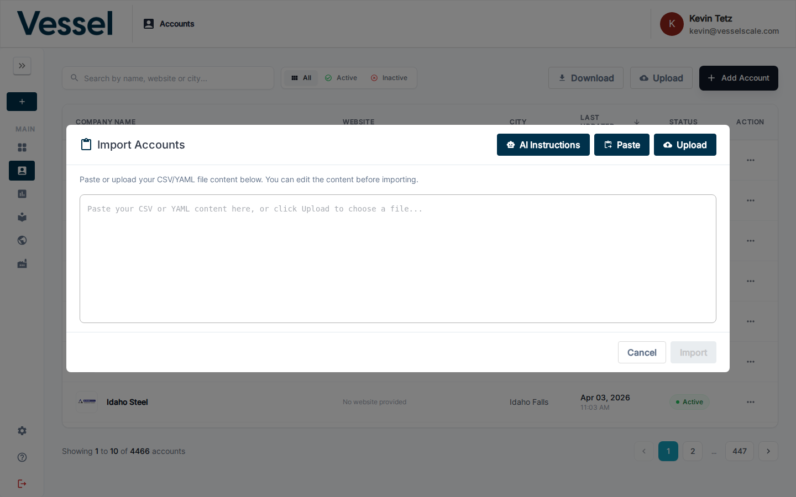

# Import & Export Accounts

Bulk import and export accounts using CSV or YAML formats. This feature lets you quickly manage large numbers of accounts without manually creating each one.

## What you can do here

- **Export** all accounts in CSV or YAML format for backup, analysis, or sharing
- **Import** accounts from CSV or YAML files to add multiple accounts at once
- **Edit** account data before importing to ensure accuracy
- **Skip** duplicate accounts automatically during import

## Export Accounts

### Overview

The export feature lets you download all accounts from the system in either CSV or YAML format. Choose the format that best fits your workflow.

### How to Export

1. From the **Account List** page, click the **Download** button in the top right toolbar
2. Select your preferred format:
   - **CSV** — Tabular format, good for spreadsheets and data analysis
   - **YAML** — Structured format with full relationship details, good for backups and re-imports
3. The file will download to your computer with the filename `accounts_export_[date].csv` or `accounts_export_[date].yaml`




### Export Formats

#### CSV Export

CSV (Comma-Separated Values) provides a simplified, flat view of your accounts. Each row represents one account with the most important fields.

**Included Fields:**

| Column | Description | Notes |
|--------|-------------|-------|
| `account.name` | Company name | Always included |
| `account.email` | Company email address | Optional field |
| `account.website` | Company website URL | Optional field |
| `account.address1` | Primary address | Optional field |
| `account.city` | City | Optional field |
| `account.state` | State/Province | Optional field |
| `account.zipcode` | Postal code | Optional field |
| `account.is_active` | Account status | true or false |
| `naics.code` | NAICS industry code | First code only; full list in YAML export |
| `contact.email` | Primary contact email | First contact only; full list in YAML export |

**Example CSV:**

```
account.name,account.email,account.website,account.address1,account.city,account.state,account.zipcode,account.is_active,naics.code,contact.email
Acme Manufacturing,contact@acme.com,https://www.acme.com,1234 Industrial Blvd,Springfield,IL,62701,true,332710,john.smith@acme.com
Global Tech Solutions,,https://www.globaltech.com,5678 Commerce Ave,Austin,TX,78701,true,541511,
Local Services Inc,info@localservices.com,,999 Main St,Denver,CO,80202,false,,sarah.jones@localservices.com
```

#### YAML Export

YAML (YAML Ain't Markup Language) provides a complete, structured representation of all account data including all contacts, NAICS codes, and relationships.

**Included Fields:**

- All account fields (name, email, website, address, dates, etc.)
- All associated NAICS codes
- All contacts with full details
- All relationships and metadata

**Example YAML:**

```yaml
accounts:
  - account:
      name: "Acme Manufacturing"
      is_active: true
      email: "contact@acme.com"
      website: "https://www.acmemfg.com"
      address1: "1234 Industrial Blvd"
      city: "Springfield"
      state: "IL"
      zipcode: "62701"
      date_of_establishment: "2010-05-15"
      naics_codes:
        - code: "332710"
          title: "Precision Fastener Manufacturing"
      account_contacts:
        - first_name: "John"
          last_name: "Smith"
          email: "john.smith@acme.com"
          phone: "217-555-0123"
          contact_type: "Manager"
  - account:
      name: "Global Tech Solutions"
      is_active: true
      website: "https://www.globaltech.com"
      address1: "5678 Commerce Ave"
      city: "Austin"
      state: "TX"
      zipcode: "78701"
      naics_codes:
        - code: "541511"
          title: "Custom Computer Programming Services"
      account_contacts:
        - first_name: "Sarah"
          last_name: "Johnson"
          email: "sarah.johnson@globaltech.com"
          phone: "512-555-0456"
          contact_type: "Director"
        - first_name: "Mike"
          last_name: "Chen"
          email: "mike.chen@globaltech.com"
          phone: "512-555-0789"
          contact_type: "Coordinator"
```

---

## Import Accounts

### Overview

The import feature lets you add multiple accounts at once by uploading a CSV or YAML file. The system will automatically detect the format, validate the data, and create new accounts while skipping duplicates.

### How to Import



1. From the **Account List** page, click the **Upload** button in the top toolbar
2. The import dialog will open with three options:
   - **Paste** — Copy account data directly from clipboard
   - **Upload** — Select a CSV or YAML file from your computer
   - **Manually Edit** — Paste or edit content in the text area before importing

3. Choose your method:
   - **For Paste:** Copy your data to clipboard, click **Paste**, and the content will be loaded into the editor
   - **For Upload:** Click **Upload**, select your file, and the content will be loaded
   - **For Edit:** Directly edit the content in the text area

4. Review the content for accuracy (edit as needed)
5. Click **Import** to process the file
6. A progress overlay will appear while the import runs in the background
7. The system will display:
   - ✅ **Created** — Number of new accounts successfully created
   - ⏭️ **Skipped** — Number of duplicate accounts skipped (by name)
   - ❌ **Errors** — Any validation errors with details

!!! info "Import runs in the background"
    Account import is processed as a background job to avoid timeouts with large files.
    A spinner will display while the import is running. Do not close or refresh the page until it completes.

### Required Fields

Only **two fields are required** for each account:

| Field | Description | Example |
|-------|-------------|---------|
| `name` | Company name (must be unique) | "Acme Manufacturing" |
| `is_active` | Account status | `true` or `false` |

**All other fields are optional.** You can add as much or as little detail as you want.

### Supported Fields

| Field | Type | Required | Notes |
|-------|------|----------|-------|
| `name` | Text | ✅ Yes | Must be unique; duplicates are skipped |
| `is_active` | Boolean | ✅ Yes | `true` or `false` |
| `email` | Email | Optional | Company email address |
| `website` | URL | Optional | Must start with http:// or https:// |
| `address1` | Text | Optional | Primary street address |
| `address2` | Text | Optional | Suite, building, or secondary address |
| `city` | Text | Optional | City name |
| `state` | Text | Optional | State or province abbreviation |
| `zipcode` | Text | Optional | Postal code |
| `county` | Text | Optional | County name |
| `country` | Text | Optional | Country name |
| `date_of_establishment` | Date | Optional | Format: YYYY-MM-DD |
| `business_description` | Text | Optional | Company description |
| `logo_url` | URL | Optional | Direct URL to company logo image |
| `naics_codes` | List | Optional | Industry classification codes |
| `account_contacts` | List | Optional | Contact persons at the company |

### Contact Fields (Nested)

If you include `account_contacts`, each contact can have:

| Field | Type | Notes |
|-------|------|-------|
| `first_name` | Text | Contact first name |
| `last_name` | Text | Contact last name |
| `email` | Email | Contact email address (optional; can derive from name) |
| `phone` | Text | Contact phone number |
| `contact_type` | Text | Job title or role |
| `location` | Text | Office location or department |

---

### File Size Limits

| Limit | Value | Notes |
|-------|-------|-------|
| Maximum file size | **10 MB** | Files larger than 10 MB are rejected at upload |
| Inline preview threshold | **1 MB** | Files ≤ 1 MB are shown in the editable text area |
| Large file behaviour | File summary shown | Files > 1 MB display a banner instead of the text editor — you cannot edit them inline, but they import normally |

**Why is there a preview limit?**
Rendering a very large file in the in-browser text editor would freeze the page. Files over 1 MB are loaded into memory and sent directly to the server when you click **Import** — no editing step.

---

## Import Methods Comparison

| Method | Best For | Steps |
|--------|----------|-------|
| **Paste** | Small updates, testing | 1. Copy data → 2. Click Paste → 3. Review/edit → 4. Import |
| **Upload File (small, ≤ 1 MB)** | Moderate batches | 1. Select file → 2. Review/edit content → 3. Import |
| **Upload File (large, > 1 MB)** | Large batches (100s of accounts) | 1. Select file → 2. Confirm file summary → 3. Import |
| **Manual Edit** | Quick corrections, template filling | 1. Paste/Upload content → 2. Edit in text area → 3. Import |

---

## AI Assistant Helper

Click the **AI Instructions** button in the import dialog to copy detailed guidance for generating account data. This includes:

- Format specifications for CSV and YAML
- Examples of valid account structures
- Tips for creating realistic data
- Field requirements and constraints
- NAICS code reference

---

## Tips & Best Practices

### Before Importing

1. **Ensure Unique Names** — Duplicate account names will be skipped. Check your file for duplicates.
2. **Validate URLs** — Logo URLs should be real and accessible. Invalid URLs will be accepted but may fail to display.
3. **Check NAICS Codes** — Use valid NAICS codes from the official classification system.
4. **Date Format** — Use YYYY-MM-DD format for dates (e.g., `2024-01-15`).
5. **Test First** — Import a small batch (a few accounts) first to verify the format works before uploading large files.
6. **Keep files under 10 MB** — The maximum supported file size is 10 MB. Split larger datasets into multiple files.

### Handling Errors

If import errors occur:

1. Review the error details displayed in the "Errors" section
2. The error will show the account name and specific problem
3. Fix the issue in the file and re-import
4. Successfully created accounts won't be duplicated on retry

### Format Best Practices

**CSV Tips:**
- Keep it simple — only include fields you're filling
- Use quotes around values with commas: `"123 Main St, Apt 4"`
- Test in a spreadsheet application first

**YAML Tips:**
- Maintain proper indentation (2 spaces per level)
- Quote values with special characters
- Use `null` or omit fields for empty values
- Validate syntax before importing

### De-duplication

- **By Name:** Accounts are considered duplicates if the name exactly matches an existing account
- **Case Sensitive:** "Acme" and "acme" are treated as different accounts
- **Skipped accounts** are reported but don't cause the import to fail
- Re-import the same file multiple times — only new accounts will be added

---

## Troubleshooting

| Issue | Cause | Solution |
|-------|-------|----------|
| File won't upload | Format not supported | Use .csv, .yaml, or .yml files only |
| File rejected immediately | File exceeds 10 MB limit | Split into multiple smaller files and import separately |
| File loaded but no editor shown | File is larger than 1 MB | This is normal — a summary banner is shown instead. Click **Import** to proceed. |
| Import shows errors | Invalid field values | Check the error details and fix the data |
| Accounts not created | Names are duplicates | Ensure each account has a unique name |
| NAICS codes not recognized | Invalid code format | Verify codes are in the official NAICS system |
| Logo URLs not displaying | URL is invalid or broken | Test the URL in a browser; leave blank if unsure |

---

## Related

- [Account List](index.md) — View and manage all accounts
- [Create Account](create.md) — Create a single account manually
- [Account Details](details.md) — View account information
- [Edit Account](edit.md) — Edit account properties
