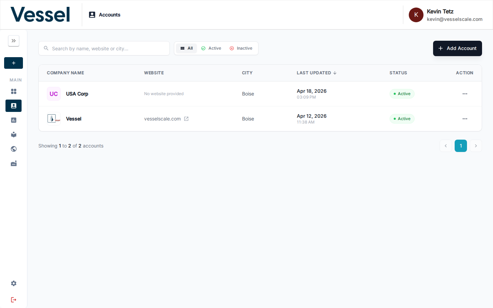

# Accounts

The Accounts section lets you manage all organizations and companies tracked in the platform.

## What you can do here

- Browse and search the full list of accounts
- View account details and associated evaluations
- Create new accounts

## Account List

The account list displays all organizations currently tracked in your system. From this view, you can quickly see key information about each account including the company name, industry classification, location, and any associated evaluations. This list serves as your central hub for account management, allowing you to search, filter, and organize accounts by various criteria to find exactly what you need.

## Related

- [Account Details](details.md)
- [Create Account](create.md)
- [Assessments](../assessments/index.md)
