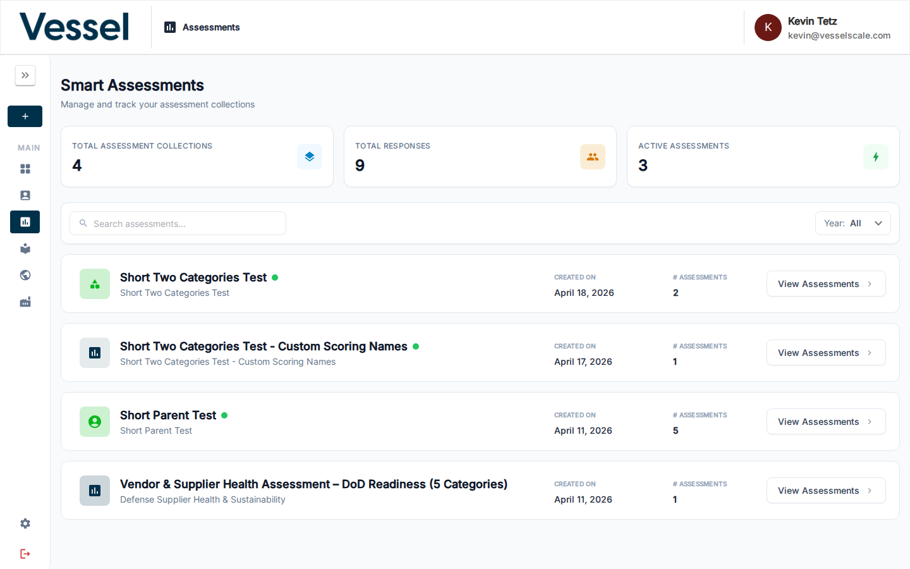

# Create Assessment

Use this form to start a new assessment for an account.

## What you can do here

- Select the account and assessment definition
- Set the evaluation date and assignee
- Begin filling in responses

## Top Section

When creating a new assessment, you'll start with the form header where you:

- **Select Account**: Choose which account this assessment is for
- **Select Assessment Definition**: Pick the assessment template from the Library
- **Set Evaluation Date**: Specify when the assessment was performed
- **Assign Respondent**: Choose who will complete or is completing the assessment

## Editor

After setting the top section details, you'll use the assessment editor to fill in responses to questions organized by category. For complete details about working in the editor—adding responses, managing categories, and navigating questions—see [Edit Assessment](details.md#edit-assessment).

The editor interface is the same whether you're filling in responses while creating a new assessment or editing responses later in Assessment Details.

## Related

- [Assessments](index.md)
- [Library](../library/index.md)
- [Edit Assessment](details.md#edit-assessment)
