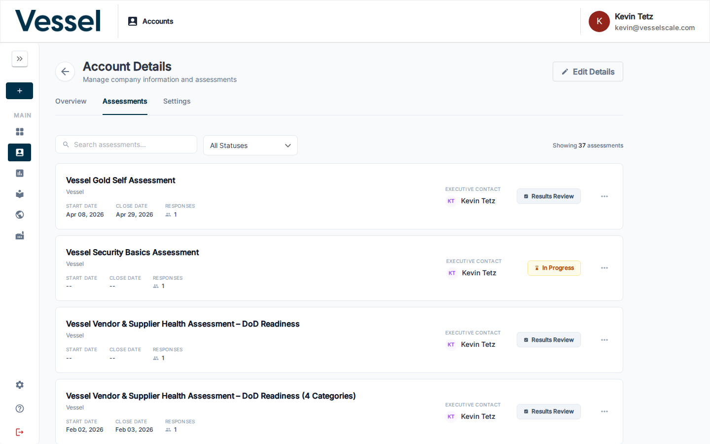

# Assessment Details

The Assessment Details page shows all data captured for a single assessment instance, including question responses, scores, and scoring summaries.

## What you can do here

- Review all question responses and scores for an assessment
- See scoring summaries and category breakdowns
- Edit the assessment or view the Report Builder for this assessment

## Accessing Assessment Details

### From Account Details

The easiest way to view assessment details is through the **[Account Details](../accounts/details.md)** page:

1. Navigate to **Accounts** and open an account
2. Click the **Assessments** tab
3. Click any assessment row to open its details

This shows all assessments for a specific account with their status, dates, and assigned executive contact.

### From Assessment Collections

You can also view assessments from the main **Smart Assessments** page:

1. Navigate to **Assessments** from the main menu
2. This shows all assessment collections with their active assessments
3. Click **View Assessments** on a collection card to see individual assessment instances

## Assessment Details Overview

Once you open an assessment, the details page displays:

- **Assessment name** — Title of the assessment  
- **Account/Client name** — The organization being assessed
- **Dates** — Start and close dates
- **Status** — Current state (Completed, In Progress, Results Review, etc.)
- **Executive Contact** — Person assigned to manage this assessment

Below the header, you'll find two main sections:

### Responses Section

The Responses section displays each question from the assessment alongside the respondent's answer. Questions are grouped by category, and scorable questions show their assigned point value.

You can:
- Review all answers to audit the assessment  
- Understand the basis for scores and recommendations
- See supporting documentation or notes for answers

See [Assessment Question Types](question-types.md) for details on how each question type captures and scores responses.

### Scoring Section

The Scoring section shows how the respondent's answers translated into the final score. This includes:

- **Category scores** — Score breakdown by assessment section
- **Overall score** — Final result using the configured scoring method
- **Scoring method** — Either **Averaged** (scores averaged across all questions) or **Summed** (scores totaled)
- **Scoring sections** — Categories like "At Risk", "Could Improve", "Optimal"

See [Assessment Scoring](scoring.md) for detailed explanation of how scores are calculated and how scoring sections are defined.

## Editing an Assessment

From the Assessment Details page, you can edit the assessment to modify responses. The editor shows:

- **Questions organized by category**
- **Current responses and answers**
- **Navigation** between different sections
- **Progress tracking** showing which questions have been answered

The editor provides a consistent interface whether creating a new assessment or revisiting responses to an existing one.

## Related

- [Getting Started: Step 5](../../getting-started/analyze-results.md) — Quick-start guide to analyzing results
- [Assessments](index.md) — Overview
- [Account Details](../accounts/details.md) — View assessments by account
- [Report Builder](report-builder.md) — Create custom reports
- [Question Types](question-types.md) — Question type details
- [Scoring](scoring.md) — Scoring system explanation

