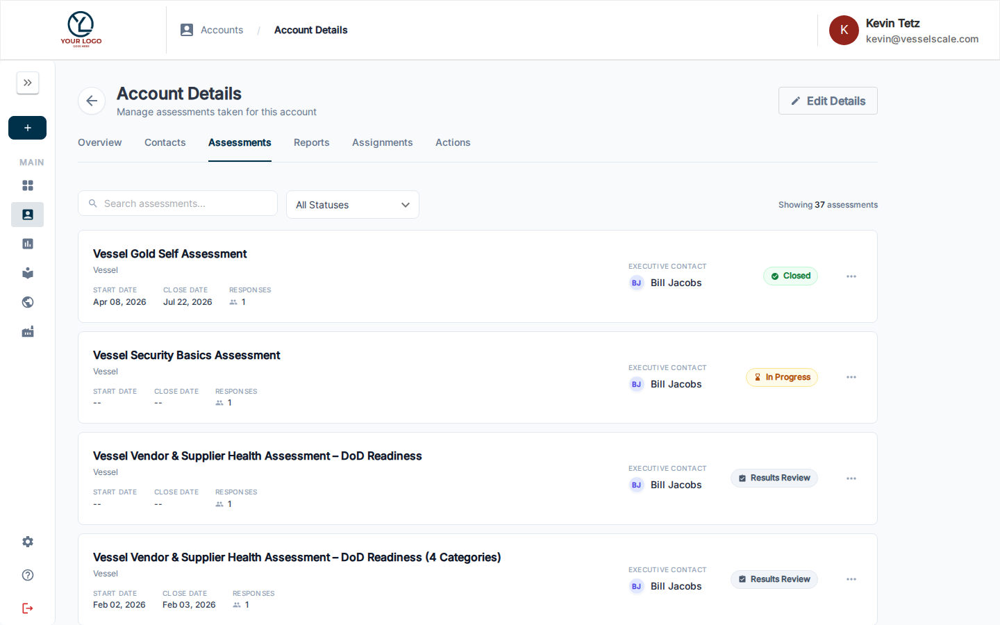
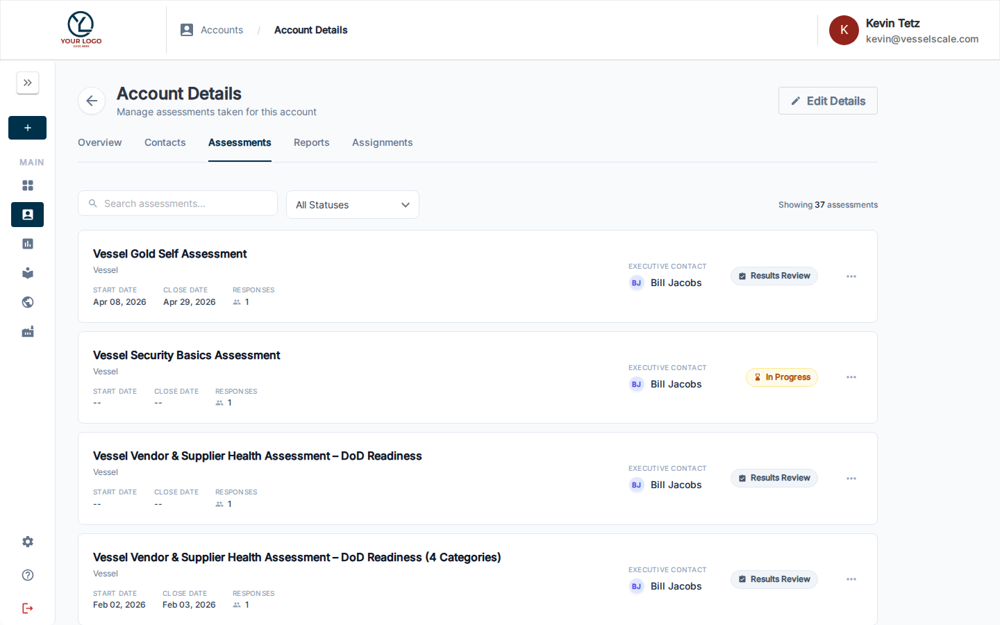

# Assessment Details

The Assessment Details page shows all data captured for a single assessment instance, including question responses, scores, and scoring summaries.

## What you can do here

- Review all question responses and scores for an assessment
- See scoring summaries and category breakdowns
- Edit the assessment or view the Report Builder for this assessment

## Accessing Assessment Details

### From Account Details

The easiest way to view assessment details is through the **[Account Details](../accounts/details.md)** page:

1. Navigate to **Accounts** and open an account
2. Click the **Assessments** tab
3. Click any assessment row to open its details

This shows all assessments for a specific account with their status, dates, and assigned executive contact.

### From Assessment Collections

You can also view assessments from the main **Smart Assessments** page:

1. Navigate to **Assessments** from the main menu
2. This shows all assessment collections with their active assessments
3. Click **View Assessments** on a collection card to see individual assessment instances

## Assessment Details Overview

Once you open an assessment, the details page displays:

- **Assessment name** — Title of the assessment  
- **Account/Client name** — The organization being assessed
- **Dates** — Start and close dates
- **Status** — Current state (Completed, In Progress, Results Review, etc.)
- **Executive Contact** — Person assigned to manage this assessment

### Assessment Status Timeline

At the top of the assessment header, a visual progress bar shows the assessment's lifecycle:

The timeline displays four key stages:
- **Draft** — Assessment is being prepared
- **In Progress** — Participants are actively completing the assessment
- **Results Review** — Responses have been collected and are under review
- **Closed** — Assessment is complete and archived

The current stage is highlighted with a pulsing animation, and the bar fills progressively as the assessment moves through its lifecycle.

Below the header, you'll find two main sections:

### Responses Section

The Responses section displays each question from the assessment alongside the respondent's answer. Questions are grouped by category, and scorable questions show their assigned point value.

You can:
- Review all answers to audit the assessment  
- Understand the basis for scores and recommendations
- See supporting documentation or notes for answers

See [Assessment Question Types](question-types.md) for details on how each question type captures and scores responses.

### Scoring Section

The Scoring section shows how the respondent's answers translated into the final score. This includes:

- **Category scores** — Score breakdown by assessment section
- **Overall score** — Final result using the configured scoring method
- **Scoring method** — Either **Averaged** (scores averaged across all questions) or **Summed** (scores totaled)
- **Scoring sections** — Categories like "At Risk", "Could Improve", "Optimal"

See [Assessment Scoring](scoring.md) for detailed explanation of how scores are calculated and how scoring sections are defined.

## Assessment Visibility & Privacy

Assessments can be configured as **private** (visible only to client users) or **public** (visible to all authorized users). This allows you to create client-specific assessments that are not visible to other organizations.

### What is a Private Assessment?

A **private assessment** is visible exclusively to users from the client/account organization. It does not appear in public library views or to other accounts. Private assessments are ideal for:

- Client self-service assessments they conduct without executive oversight
- Confidential assessments for specific accounts
- Draft work-in-progress assessments you don't want to share broadly

### What is a Public Assessment?

A **public assessment** is visible to all authorized users in the system. These are typically your standard assessment templates that are used across multiple accounts.

### Setting Assessment Visibility

When creating or editing an assessment, you can control its visibility:

1. Open the **Create Assessment** or **Assessment Details** page
2. In the assessment header, look for the **Visibility** toggle or dropdown
3. Select **Private** to restrict access to the account's client users only
4. Select **Public** (default) to make it visible to all authorized users

### How Visibility Affects Different Users

#### For Client Portal Users
- **See only private assessments** assigned to their account and public assessments available in the Library
- Can create their own assessments from the **All Available Assessments** tab (if enabled)
- Cannot see assessments marked as private for other accounts

#### For Administrators & Account Executives
- **See all assessments** regardless of visibility setting
- Can create, edit, and manage both private and public assessments
- Use **View as Client** to see the portal exactly as clients see it (excluding private assessments not assigned to that account)

#### What Clients See in the Client Portal
When clients log into their portal, they see:

- **Their Assessments** tab: Shows all public and private assessments assigned to them
- **All Available Assessments** tab: Shows only public assessments they can self-start
- **Library**: Shows only public assessments available for browsing

---

## Reports Tab

Once an assessment has responses, a **Reports** tab becomes available on the Assessment Details page. This tab provides access to analysis and export options:

### Available Actions

- **View Analysis Report** — Opens the Report Builder for full analysis and commentary
- **Export as PDF** — Generate a formatted PDF report (if PDF report templates are configured for this account)
- **Export as Web Report** — Publish findings as a shareable web report

### Report Visibility & Access

Report access is controlled by your organization's configuration:

- **PDF Reports** — Available per account based on which PDF templates are enabled on the Account Details page
- **Web Reports** — Available per account based on which Web Report templates are enabled on the Account Details page

For more details, see:
- [Report Builder](report-builder.md) — Full analysis and writing interface
- [PDF Reports](pdf-reports.md) — Configure PDF report templates
- [Web Reports](../settings/web-reports.md) — Create and manage web-based reports

---

## Editing an Assessment

From the Assessment Details page, you can edit the assessment to modify responses. The editor shows:

- **Questions organized by category**
- **Current responses and answers**
- **Navigation** between different sections
- **Progress tracking** showing which questions have been answered

The editor provides a consistent interface whether creating a new assessment or revisiting responses to an existing one.

## Related

- [Getting Started: Step 5](../../getting-started/analyze-results.md) — Quick-start guide to analyzing results
- [Assessments](index.md) — Overview
- [Account Details](../accounts/details.md) — View assessments by account
- [Report Builder](report-builder.md) — Create custom reports
- [Question Types](question-types.md) — Question type details
- [Scoring](scoring.md) — Scoring system explanation

