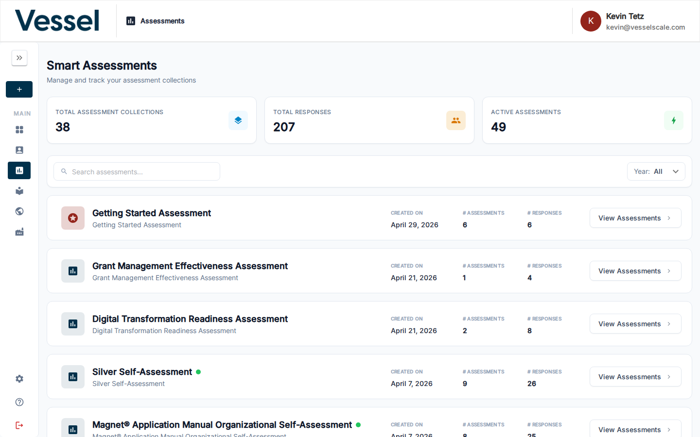

# Assessments

The Assessments section is the primary workspace for managing assessment instances across your accounts.

## What you can do here

- Browse all assessments across accounts
- Filter by assessment type, status, or date
- Open an assessment collection for a specific definition
- Create new assessments

## Assessment Collections

The Assessments view shows a categorized list of all assessment instances in your system. Assessments are typically grouped by assessment definition type, making it easy to find related assessments. This collection view allows you to see patterns in your assessment activity, compare assessments across similar types, and manage large numbers of assessments efficiently. You can filter, sort, and search within these collections to quickly locate specific assessments.

## Related

- [Assessment Details](details.md)
- [Report Builder](report-builder.md)
- [Create Assessment](create.md)
- [Library](../library/index.md)
