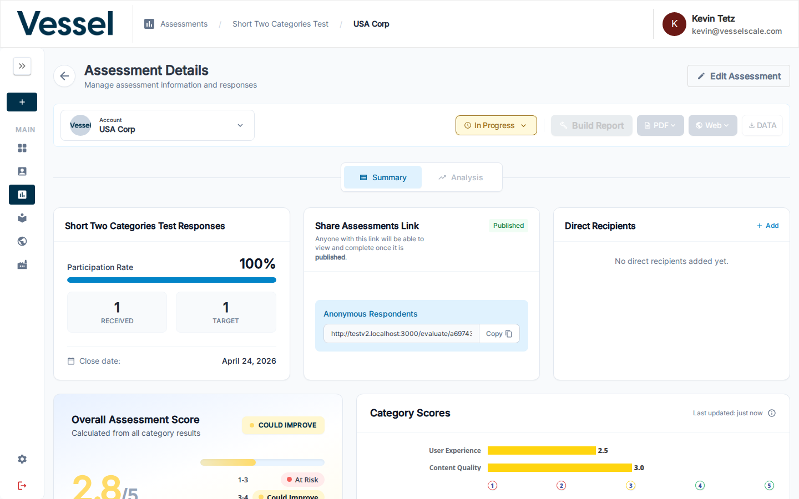

# Report Builder

The Report Builder is where you analyze assessment results and document your findings. It is accessible from the **Assessment Details** page once the assessment has received at least one response.

## Opening the Report Builder

From the **Assessment Details** page, click **Build Report** in the top action bar.

!!! note
    The **Build Report** button is only active when the assessment has received responses. If the button appears grayed out, ensure the assessment is published and that respondents have submitted their answers.

---

## Report Builder Layout

The Report Builder is divided into two main panels:

### Left Panel — Assessment Results

**Category Tabs** at the top let you switch between the assessment's categories (e.g., User Experience, Content Quality, Plan of Action). Each tab shows:

| Section | Description |
|---|---|
| **Assessment Results by Category** | A gauge chart showing the category's average score and zone (At Risk / Could Improve / Optimal) |
| **Pillar Responses Summary** | A breakdown of each question in the category, with the respondent's self-score alongside the assessor's score |

### Right Panel — Analysis Notes

The Analysis Notes panel is where you record your professional analysis for each category. There are four structured sections:

| Section | Purpose |
|---|---|
| **Strengths** | Highlight what the team is doing well |
| **Gaps, Challenges, & Threats** | Identify areas where goals and expectations are not being met |
| **Root Causes** | Describe the underlying reasons for any failures or shortfalls |
| **Plan of Action** | Outline recommended next steps |

Click **+ Add [Section]** to expand a section and enter your notes. Notes are saved per category — switch between category tabs to add analysis for each.

---

## Score Zones

Scores are automatically mapped to one of three zones based on the assessment's scoring configuration:

| Zone | Meaning |
|---|---|
| **At Risk** | Performance is significantly below expectations |
| **Could Improve** | Performance is below optimal but showing potential |
| **Optimal** | Performance meets or exceeds expectations |

---

## Exporting Results

Once your analysis is complete, return to the **Assessment Details** page to export or publish:

- **PDF** — Generate a formatted PDF report. See [PDF Reports](pdf-reports.md).
- **Web** — Publish findings as a shareable web report. See [Web Reports](../settings/web-reports.md).

## Related

- [Getting Started: Step 5](../../getting-started/analyze-results.md) — Quick-start guide to analyzing results
- [Assessment Details](details.md) — Full assessment management
- [Assessment Scoring](scoring.md) — Score calculation reference
- [PDF Reports](pdf-reports.md) — Export as PDF
- [Web Reports](../settings/web-reports.md) — Publish shareable reports
