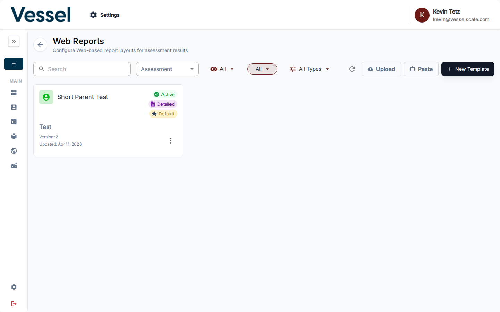

# Web Reports

Web Reports are configurable report templates for assessment results. Administrators build and maintain these templates in **Settings → Web Reports**, then use them throughout the system to render assessment-specific report pages.

This feature is configuration-driven. You are not building a one-off report from a set of selected assessments. Instead, you create reusable templates that:

- belong to an **Assessment Definition**
- define an ordered set of report **sections**
- support dynamic **template variables** such as `{{ assessment_name }}` and `{{ account_name }}`
- can be marked **Active** or **Default**
- can be enabled per account for client portal visibility

## Where Web Reports Are Used

Web Reports appear in several places in the application:

- **Settings → Web Reports**: create, edit, duplicate, import, export, and manage templates
- **Account Details → Web Reports**: enable or disable active report templates for a specific account's client portal view
- **Assessment Details**: open an available report, copy a direct report link, or jump to the report editor
- **Client Portal**: enabled reports appear in the **Reports** card for the client account
- **Direct report URLs**: `/report/{assessmentUuid}` redirects to the default report for that assessment when one exists

!!! info "How default routing works"
	Visiting `/report/{assessmentUuid}` checks for active Web Report templates for that assessment's definition. If a default template exists, the user is redirected to that template. If no configured Web Report is available, the platform falls back to the legacy public report page.

## Web Reports List



Navigate to **Settings → Web Reports** to open the list page.

Each template appears as a card showing:

- **Assessment Definition**: the assessment type this template belongs to
- **Template Name**: the internal name of the report template
- **Status badge**: `Active` when the template is available for use
- **Type badge**: `Detailed`, `Executive`, or `Custom`
- **Default badge**: shown when this template is the default for its assessment definition
- **Version**: increments as the template configuration changes over time
- **Updated date**: last saved date

### Filters

| Control | Purpose |
|---------|---------|
| **Search** | Filter by template name or slug |
| **Assessment** | Show only templates for one assessment definition |
| **All / Active / Inactive** | Filter by template availability |
| **All / Default / Not Default** | Filter by default status |
| **All Types / Detailed / Custom / Executive** | Filter by report type |

### List Actions

The top-right toolbar includes:

| Action | What it does |
|--------|---------------|
| **Refresh** | Reload the list |
| **Upload** | Import a `.yaml` or `.yml` file from disk |
| **Paste** | Paste YAML directly into a modal |
| **New Template** | Create a new Web Report template |

Each template card also has an **Actions** menu with:

| Action | What it does |
|--------|---------------|
| **Copy to Clipboard** | Copies the raw YAML configuration |
| **Copy to New Report** | Duplicates the template as a new inactive report |
| **Download Config** | Downloads the template as a YAML file |
| **Edit** | Opens the report editor |
| **Delete** | Permanently deletes the template |

!!! note "Import behavior"
	Uploading or pasting YAML creates a new template record. Imported templates are created as portable configurations and may need to be linked to an Assessment Definition before they can be used for rendering.

## Creating And Editing A Template


Select **New Template** to create a template or click an existing card to edit it.

The editor has a sticky header with:

- **Back** button
- **Media Library** button
- **Template Variables Reference** button
- **Preview Config** button, which shows the generated YAML
- **Cancel** and **Save Changes** actions
- **Auto-saving blocks...** indicator while content block changes are being persisted during edit mode

### Report Settings

The **Report Settings** section controls report identity and global behavior.

| Field | Description |
|-------|-------------|
| **Report Name** | Internal display name shown in admin UIs and report selectors |
| **Assessment Definition** | The assessment definition this template applies to |
| **Report Type** | `Detailed Report`, `Executive Summary`, or `Custom Report` |
| **Active** | Makes the template available for viewing |
| **Default Report** | Makes the template the default route target for that assessment definition |

Below the metadata are display settings:

| Setting | Description |
|---------|-------------|
| **Show Print Button** | Shows a floating print control in the rendered report |
| **Show Table of Contents** | Enables the table of contents section for report navigation |
| **Enable Deep Linking** | Allows direct links to specific sections using query parameters |
| **Show Table of Contents Button** | Shows a quick-jump button for navigation |
| **Show Expand/Collapse All Button** | Adds a control for accordion-heavy report sections |
| **Font Size** | Sets the base paragraph font size |
| **Section Header Style** | Global styling for section headers |
| **Subsection Header Style** | Global styling for subsection headers |

### Default Starter Template

When you create a new Web Report, the editor starts with a scaffolded report containing these default sections:

1. Cover Page
2. Table of Contents
3. Introduction
4. Methodology
5. Executive Summary
6. Category Scores
7. Category Analysis
8. Plan of Action
9. Assessment Notes
10. Custom Content
11. About Section
12. Divider

If Branding colors are configured for the tenant, the editor uses those colors to prefill parts of the header styling and cover section appearance.

## Report Sections

The **Report Sections** area defines the order and content of the report. Use **Add Section** to insert additional sections, and use the **up/down arrows** on each section row to reorder them.

Each section row supports:

- expand/collapse
- duplicate section
- delete section
- type badge
- section index badge
- content block count when applicable

### Available Section Types

| Category | Section | Purpose | Special controls |
|----------|---------|---------|------------------|
| Core | **Cover Page** | Front page with logo, assessment title, category list, account name, completion date, and respondent count | Subtitle badge, report title, background image, client contact toggle, text color, overlay color, overlay opacity |
| Core | **Introduction** | Opening overview section with summary content | Content blocks |
| Core | **Table of Contents** | Auto-generated list of clickable sections | Uses report structure automatically |
| Core | **Methodology** | Explains scoring or approach | Content blocks, scoring legend toggle |
| Core | **Executive Summary** | High-level summary of results | Content blocks, overall score graphic toggle, gradient colors |
| Analysis | **Category Scores** | Overview of category scores | Content blocks plus dynamic category score output |
| Analysis | **Category Analysis** | Detailed category-level analysis | Content blocks plus dynamic category detail output |
| Analysis | **Plan of Action** | Action-oriented summary with dynamic notes | Overview title, details title, content blocks |
| Analysis | **Assessment Notes** | Standard assessment notes display | Dynamic note rendering |
| Custom | **Custom Content** | Free-form narrative or image section | Content blocks |
| Custom | **About Section** | Typically used for organization/about text | Content blocks |
| Utility | **Divider** | Visual separator between sections | Divider style and height |

## Content Blocks

Many sections support **Content Blocks**, which are reusable layout blocks inside the section.

Content blocks support:

- **Single-column** or **two-column** layout
- **Text / HTML** or **Image** content per slot
- Rich text editing via the HTML editor
- Image URL entry, media library browsing, paste-from-clipboard, and preview
- Padding controls for text and image content
- Background color per block
- Reordering and deletion

This is the main way to add custom narrative, visuals, or layout structure around the report's dynamic assessment data.

## Template Variables

Use the **Template Variables Reference** button in the editor header to view the available placeholders.

These variables can be used in section titles, HTML content, and other text fields:

| Variable | Description |
|----------|-------------|
| `{{ assessment_name }}` | Assessment name |
| `{{ account_name }}` | Account or company name |
| `{{ closed_date }}` | Assessment close date |
| `{{ total_respondents }}` | Number of respondents |
| `{{ overall_score }}` | Overall score |
| `{{ max_score }}` | Maximum possible score |
| `{{ min_score }}` | Minimum possible score |
| `{{ normalized_score }}` | Normalized score |
| `{{ tenant_name }}` | Tenant or organization name |
| `{{ logo_url }}` | Branding logo URL |
| `{{ current_date }}` | Today's date |
| `{{ category_count }}` | Number of categories |
| `{{ question_count }}` | Number of questions |

Unknown variables are left unchanged in the output, so use the exact variable names shown above.

## How A Report Becomes Visible To Users

Creating a template in **Settings → Web Reports** is only the first step.

### 1. The template must be active

Inactive templates do not appear in report lists or public routing.

### 2. The template must belong to the correct assessment definition

Templates are scoped to an **Assessment Definition**. They only render for assessments of that type.

### 3. The template can be marked as the default

The default template is the one used when someone visits:

```text
/report/{assessmentUuid}
```

If no explicit default is set, the system falls back to the first active template for that definition.

### 4. It can be enabled per account

On **Account Details**, the **Web Reports** panel lets an administrator or account executive enable or disable report templates for that specific account.

Important rules:

- Only **active** templates are available for account assignment
- Only templates matching **closed assessments** already taken by that account are offered in the selector
- Enabled templates appear in the client portal's **Reports** card

## Opening And Sharing Reports

Web Reports can be opened from several places:

- **Assessment Details**: open a report inline, open it in a new tab, copy its link, or jump to the editor
- **Client Portal**: open an enabled report from the **Reports** card
- **Direct URL**: use the full route

```text
/report/{assessmentUuid}/{reportUuid}/{reportSlug}
```

The shorter route below redirects to the default configured report when available:

```text
/report/{assessmentUuid}
```

## YAML And Validation Notes

Web Reports are stored as YAML-backed configurations, but the editor manages that YAML for you.

- **Preview Config** shows the generated YAML for the current editor state
- Saving a template rebuilds and stores the YAML
- Validation errors from previous saves are shown in the editor as warning messages
- Duplicating or importing a template preserves the configuration structure without requiring you to re-enter the content manually

!!! note "No WYSIWYG report preview in the editor"
	The editor provides a YAML preview, not a rendered live report preview. To review the final report experience, open the report from Assessment Details or use the direct report URL after saving.

## Tips

- Start with the default scaffold, then remove sections you do not need.
- Use **Detailed Report**, **Executive Summary**, and **Custom Report** consistently so filtering stays useful.
- Mark only one report as the **Default** per assessment definition.
- Use content blocks for explanatory text around the dynamic score and notes sections.
- If a report should be available in the client portal, make sure it is both **Active** and **enabled on the account**.
- Use the **Download Config** and **Upload/Paste** actions to move templates between environments.

## Related

- [Assessments](index.md)
- [Assessment Details](details.md)
- [Branding](../settings/branding.md)
