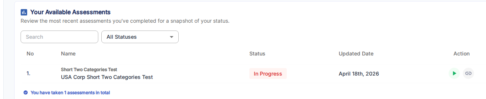

---
tags:
  - client portal
  - assessments
  - assessment status
---

# Assessments Table

The **Your Available Assessments** section is the main table clients see when they open the Client Portal. It lists every assessment assigned to the account along with its current status.

Clients can narrow the list using the **Search** field or filter by status using the **All Statuses** dropdown. A summary line at the bottom of the table shows the total number of assessments on file (e.g., "You have taken 3 assessments in total").

## Table columns

| Column | Description |
|--------|-------------|
| **No** | Row number |
| **Name** | Assessment template name (bold) and instance name below it |
| **Status** | Current completion state — see [Status values](#status-values) below |
| **Updated Date** | Date the assessment was last updated |
| **Action** | Buttons to interact with the assessment — see [Action buttons](#action-buttons) below |

## Status values

| Status | Meaning |
|--------|---------|
| **Not Started** | The assessment has been assigned but no responses recorded yet |
| **In Progress** | The assessment has been started but not yet submitted |
| **Completed** | All responses submitted; results are available |

## Action buttons

Each row in the table has one or more action icons in the **Action** column:

- **Take Assessment** (green ▶ play button) — Opens the assessment survey so the client can fill it out or continue where they left off
- **Copy Link** (link icon) — Copies a direct link to the assessment that can be shared

!!! note "View Analysis"
	Once an assessment is completed and results have been built, a view analysis option becomes available. This links directly to the assessment's analysis and report.

## Related

- [Client Portal Overview](index.md) — how to access and preview the portal
- [Industry Benchmarking](industry-benchmarking.md) — score comparison gauge chart
- [Assessments](../assessments/index.md) — assessment lifecycle overview
- [Report Builder](../assessments/report-builder.md) — build analysis reports for client review
