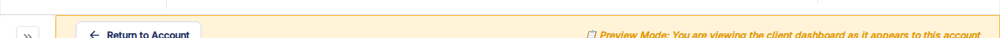
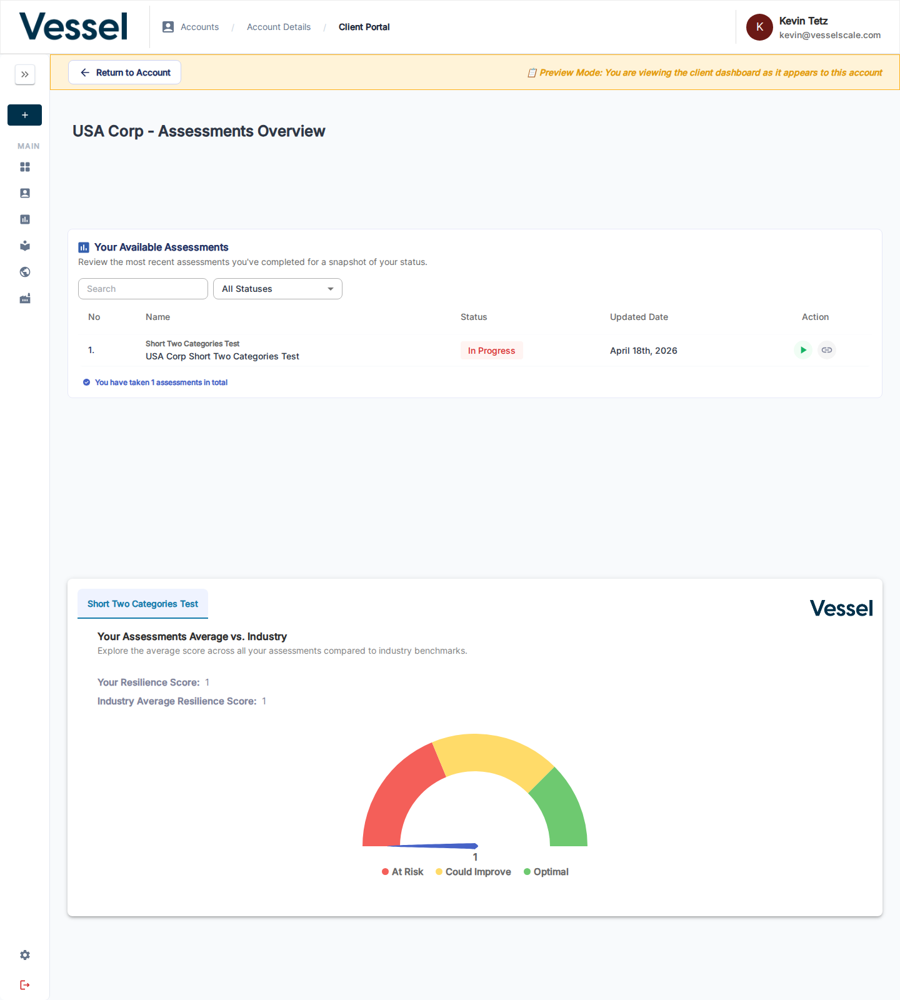

---
tags:
  - client portal
  - client view
  - overview
---

# Client Portal

The **Client Portal** is the view your clients see when they log into VSAP. It shows them their assigned assessments, current status, and how their scores compare to industry benchmarks.

As an administrator, you can preview the portal exactly as a client would experience it using the **View as Client** button on any Account Details page.

## Accessing the Client Portal

### Previewing as an administrator

To see what a specific client sees in their portal:

1. Navigate to the **Account Details** page for that client
2. Click **View as Client** in the action bar

This opens the portal in **Preview Mode** — you see exactly what the client sees, with a yellow banner at the top confirming you are in preview mode and not the client view itself.

Click **Return to Account** at any time to go back to the Account Details page.

---

## What the portal contains

The portal is headed with the account name followed by "Assessments Overview." It contains two main sections:

- **[Your Available Assessments](assessments-table.md)** — a filterable table listing every assessment assigned to this account
- **[Industry Benchmarking](industry-benchmarking.md)** — a gauge chart comparing the account's resilience score to the industry average

---

## Related

- [Assessments Table](assessments-table.md) — table columns, statuses, and action buttons
- [Industry Benchmarking](industry-benchmarking.md) — gauge chart and score zones
- [Account Details](../accounts/details.md) — where to find the View as Client button
- [Web Reports](../settings/web-reports.md) — control which reports appear in the portal
