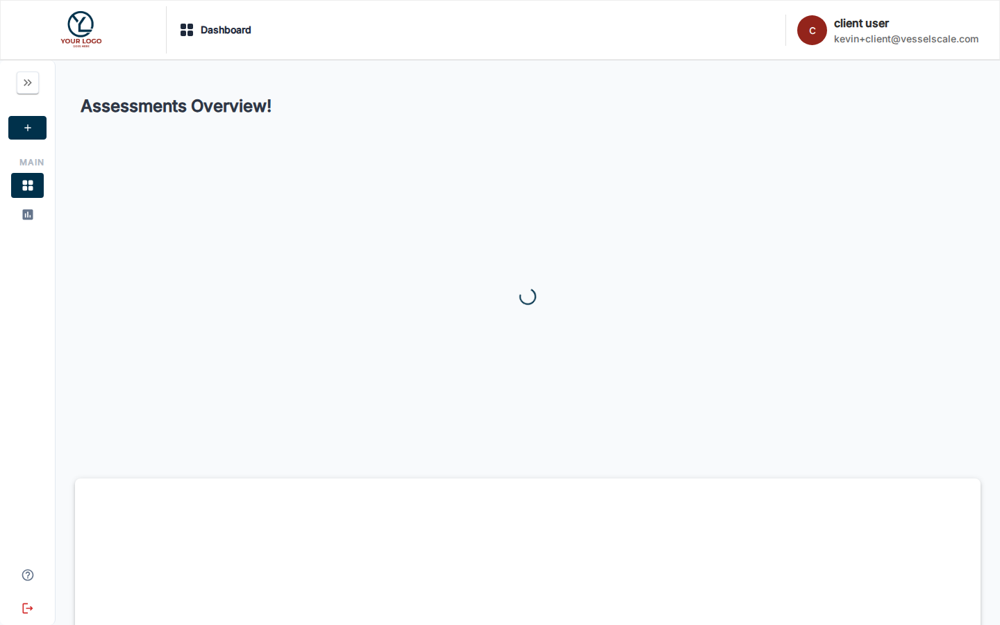

---
tags:
  - client-portal
  - overview
---

# Client Portal

Welcome to your **Client Portal** — your central hub for managing and completing assessments with Vessel Scale. Here you'll find all your assigned assessments, track your progress, view your scores, and access new evaluations your organization has made available to you.

---

## What You Can Do in the Client Portal

The Client Portal gives you access to:

- **Your Assessments** — View all assessments assigned to you, track their status, and continue working on in-progress evaluations
- **All Available Assessments** — Browse every assessment type your organization offers and start new ones on your own without waiting for an assignment
- **Assessment Library** — Search and discover assessments by name, description, or category
- **Industry Benchmarking** — See how your organization's resilience score compares to industry averages in your sector
- **Analysis & Results** — Review completed assessments, view your scores, and read analysis notes from your Account Executive

---

## Portal Layout

The Client Portal is organized into three main sections:

**[Your Assessments](assessments-table.md)** — A table showing all assessments assigned to or created by you:
- View status (Draft, In Progress, Results Review, Closed)
- Take assessments or continue where you left off
- View completed results
- Copy links to share with colleagues

**[All Available Assessments](all-available-assessments.md)** — A card grid showing every assessment your organization offers:
- Browse and explore available assessment types
- Create new assessments directly from the card grid
- No need to wait for your Account Executive to assign one

**[Industry Benchmarking](industry-benchmarking.md)** — See your performance compared to industry standards:
- Gauge chart showing your resilience score
- Color-coded zones (At Risk, Could Improve, Optimal)
- Industry average comparison

**[Assessment Library](library.md)** — Searchable collection of all assessments:
- Find assessments by name, description, or category
- Launch new evaluations instantly
- Discover what's available to you

---

## Assessment Status & What's Next

When you access an assessment, here's what you'll see:

| Status | What it means | What you do |
|--------|---------------|-----------|
| **Draft** | Assessment created but not yet finalized | Continue editing your responses; they save automatically |
| **In Progress** | Assessment is live and responses are being collected | Submit your responses; others may be filling theirs in |
| **Results Review** | All responses are in; being analyzed | Your Account Executive is reviewing and preparing analysis |
| **Closed** | Assessment is complete and final | View your final scores, analysis, and recommendations |

> **💡 Tip:** Your work saves automatically as you complete assessments. You can close and return to in-progress assessments anytime without losing your progress.

---

## Getting Started

1. Log into VSAP and navigate to the **Client Portal**
2. Check **[Your Assessments](assessments-table.md)** for any assessments waiting for you
3. If none are ready, browse **[All Available Assessments](all-available-assessments.md)** to self-start a new evaluation
4. Once assessments are completed, view results and benchmarking data to understand your performance

---

## Administrators & Account Executives

> **For those managing client access:** See [Account Executive Notes](ae-notes.md) to understand what clients see, how to configure visibility, and how to manage permissions.

To preview the client portal experience for a specific account, visit the **Account Details** page and click **View as Client**. This shows you exactly what that client sees when they log in.

---

## Related

- [Your Assessments](assessments-table.md) — Track your assessments and take action
- [All Available Assessments](all-available-assessments.md) — Self-create new assessments
- [Assessment Library](library.md) — Browse and search assessments
- [Industry Benchmarking](industry-benchmarking.md) — Compare your performance to industry peers
- [Account Executive Notes](ae-notes.md) — For admins: managing client access and visibility
- [Assessment Visibility](../assessments/details.md#assessment-visibility--privacy) — How your Account Executive controls what you see

