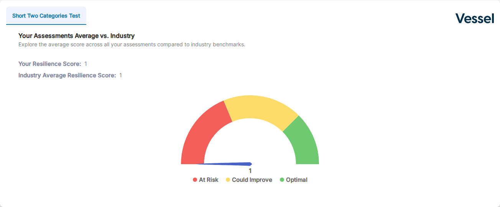

---
tags:
  - client portal
  - industry benchmarking
  - resilience score
  - gauge chart
---

# Industry Benchmarking

The **Industry Benchmarking** section appears below the assessments table in the Client Portal. It shows how an account's resilience score compares to the industry average across all organizations in the same sector.

When an account has assessments across multiple assessment types, a **tab** appears for each type — click a tab to switch between views.

## Reading the gauge

The gauge chart displays three score zones:

| Zone | Color | Meaning |
|------|-------|---------|
| **At Risk** | Red | Score is in the lowest range — significant improvement needed |
| **Could Improve** | Yellow | Score is in the middle range — some improvement recommended |
| **Optimal** | Green | Score is in the highest range — performing well |

The blue needle indicates the account's current score. Below the gauge, the chart also shows:

- **Your Resilience Score** — the account's computed score
- **Industry Average Resilience Score** — the average across all accounts in the same industry

## Related

- [Client Portal Overview](index.md) — how to access and preview the portal
- [Assessments Table](assessments-table.md) — assessment list, statuses, and action buttons
- [Report Builder](../assessments/report-builder.md) — the detailed per-category analysis view
