# Dashboard Components

The dashboard includes 11 built-in analytics components. Each component displays data for the currently selected assessment definition. You can control which components are shown and their order from [Configure Dashboard](configure.md).

---

## Assessments Summary

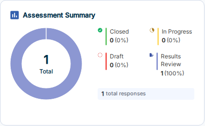

A donut chart showing the breakdown of all assessments by status: **Closed**, **In Progress**, **Draft**, and **Results Review**. The center displays the total count. The ring below shows total responses collected across all assessments.

---

## Total Resilience Score

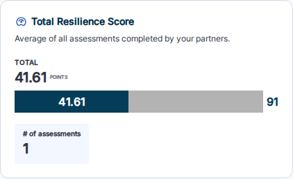

A progress bar showing the average score across all completed assessments relative to the maximum possible score. Displays the total point value and the number of assessments included in the average.

---

## Most Frequently Offered Solutions

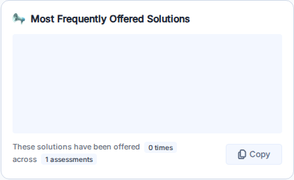

A table listing the solutions most commonly offered across assessments. Shows how many times each solution has been offered and across how many assessments. Use the **Copy** button to copy the list to your clipboard.

---

## Company Size Analysis

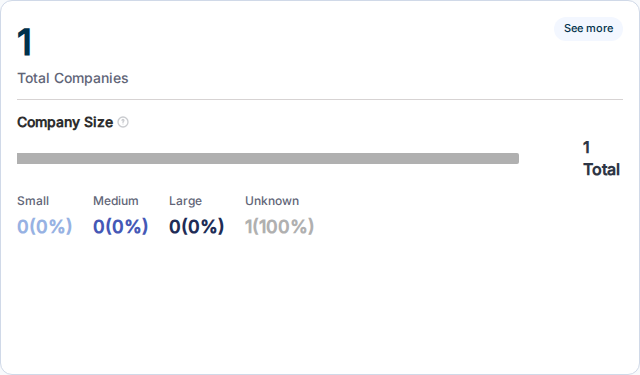

Displays the total number of companies associated with assessments, broken down by size category: **Small**, **Medium**, **Large**, and **Unknown**. The horizontal bar provides a proportional visual summary.

---

## Assessment Scoring by Category

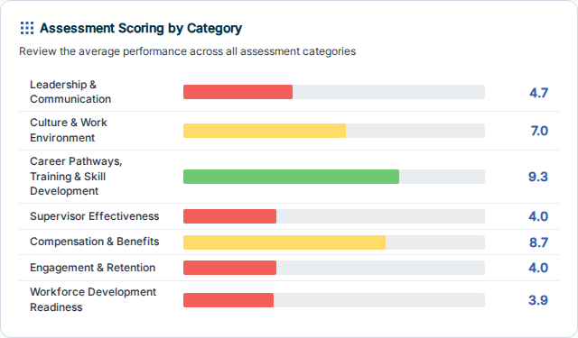

A horizontal bar chart showing the average score for each assessment category. Bars are color-coded by performance tier (red/yellow/green) so you can quickly identify areas of strength and areas needing attention.

---

## Average Score by NAICS Industry

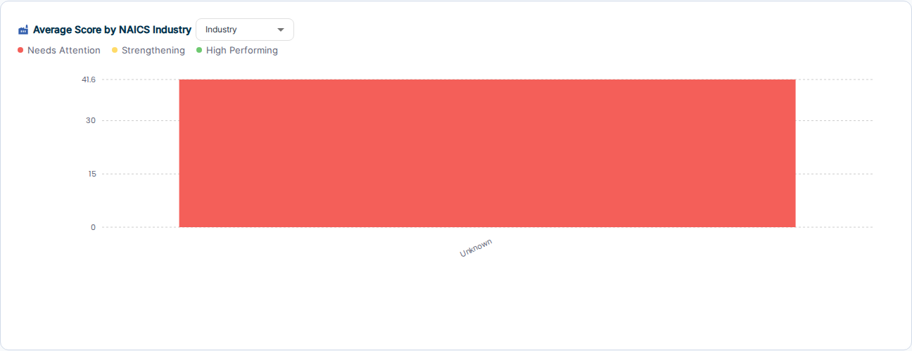

A vertical bar chart comparing average scores across NAICS industry groups. Use the dropdown to switch between **Industry**, **NAICS Group**, and **NAICS Subsector** groupings. Bars are color-coded by performance tier: **Needs Attention** (red), **Strengthening** (yellow), **High Performing** (green).

---

## Top Scoring Accounts

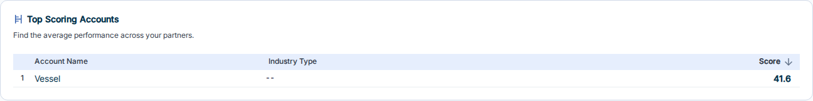

A ranked table of accounts sorted by their average assessment score (highest first). Shows the account name, industry type, and score. Useful for identifying your highest-performing partners at a glance.

---

## Assessments In Progress

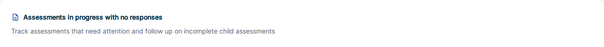

Tracks assessments that need follow-up. Two tabs:

- **Zero Responses** — assessments that are "In Progress" but have not yet received any responses
- **Blocked Children** — child assessments that are blocked from proceeding

---

## Business Size Distribution by NAICS Industry

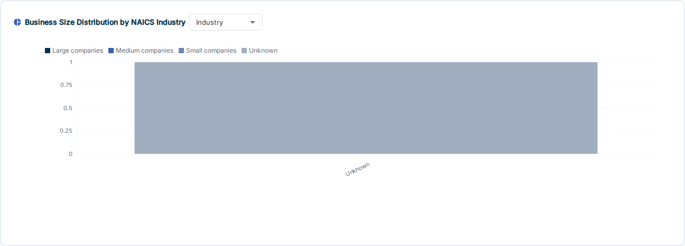

A stacked bar chart showing the mix of **Large**, **Medium**, **Small**, and **Unknown** companies within each NAICS industry group. Use the dropdown to switch grouping levels. Useful for understanding the composition of your partner base by industry.

---

## Highest Scoring Statements

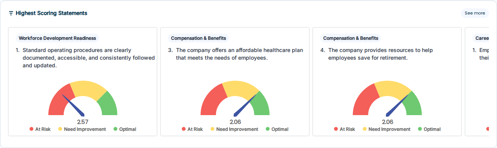

Shows the individual assessment questions with the highest average scores, displayed as gauge charts. Each card shows the question text, the category it belongs to, and the average score with a color-coded gauge (red/yellow/green). Click **See more** to view the full ranked list.

---

## Lowest Scoring Statements

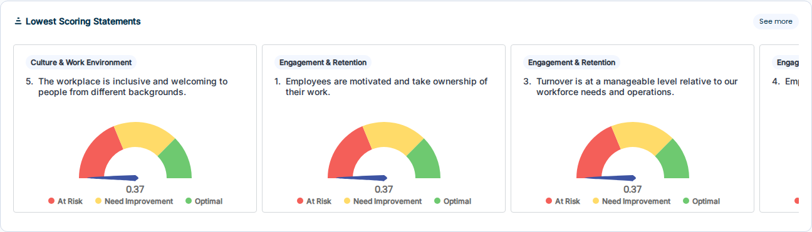

Shows the individual assessment questions with the lowest average scores, displayed as gauge charts. Same format as Highest Scoring Statements. Use this to identify the areas where your partners most consistently need support.

---

## Related

- [Configure Dashboard](configure.md) — add, remove, or reorder components
- [Dashboard Overview](index.md)
