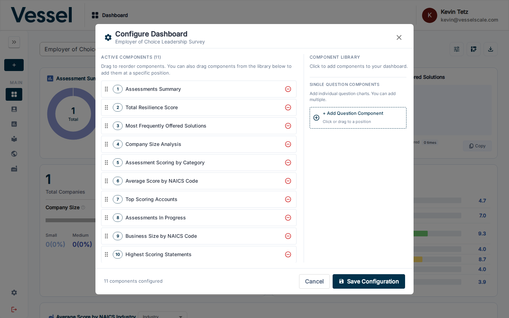

# Configure Dashboard

The Configure Dashboard modal lets you control which analytics components appear on the dashboard and in what order. Configuration is saved per assessment definition.

## Opening the modal

Click the **Configure** button (sliders icon) in the top-right toolbar of the dashboard.

## Active Components

The left panel lists all currently active components, numbered in their display order. Each row has a drag handle on the left and a remove button (red minus icon) on the right.

- **Drag to reorder** — grab the handle and drag a component to a new position
- **Remove** — click the minus icon to remove a component from the dashboard; it moves to the Component Library
- You can also drag a component from the library directly to a specific position in the active list

## Component Library

The right panel contains components available to add to the dashboard:

- **Single Question Components** — add individual question charts. You can add multiple. Click **+ Add Question Component** or drag it to a position in the active list.

## Saving

Click **Save Configuration** to apply your changes. The dashboard will reload with the updated layout. Click **Cancel** to discard any changes.

## Related

- [Components](components.md) — descriptions of each available component
- [Dashboard Overview](index.md)
