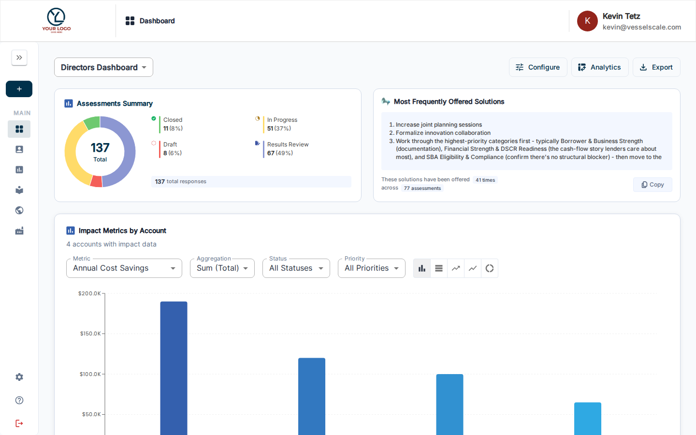
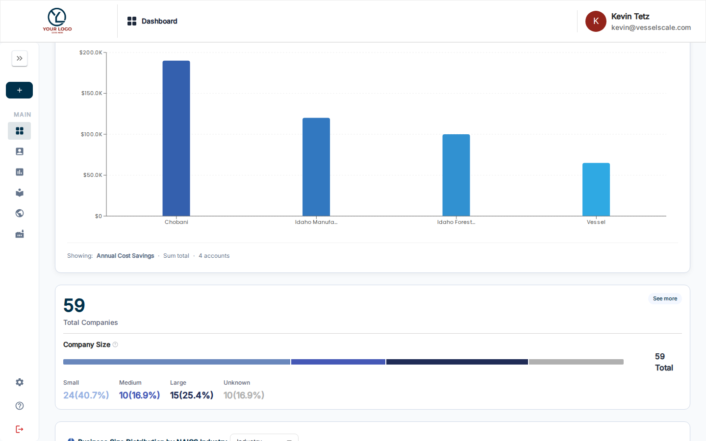
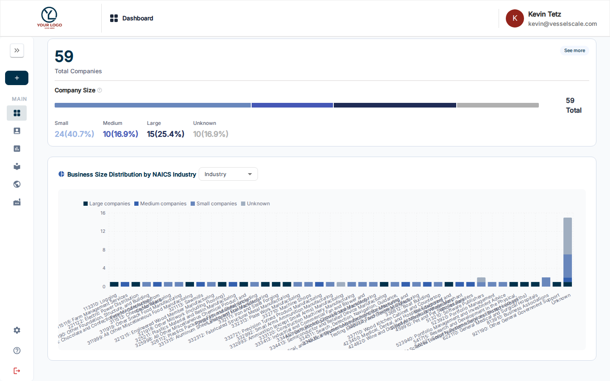

# Directors Dashboard

The Directors Dashboard is a comprehensive analytics and management interface designed for leadership to track organizational performance, ecosystem impact, and strategic initiatives at a high level.

## What you can do here

- View executive-level analytics across your entire assessment ecosystem
- Track company size and business distribution by industry (NAICS codes)
- Monitor action items and impact metrics from your assessment program
- Access offered solutions tracking and recommendations
- Configure dashboard components for your specific needs
- Export analytics data in CSV or YAML formats for reporting

## Accessing the Directors Dashboard

The Directors Dashboard is available from the main Dashboard. Use the **assessment definition selector** at the top to view metrics specific to assessment types, or access the Directors Dashboard view from your navigation menu for executive summary metrics.

## Key Components

### Offered Solutions Tracking
View and manage all solutions that have been offered to accounts based on assessment findings. Track:
- Solutions identified from assessments
- Status and implementation progress
- Associated accounts and assessment categories
- Impact and business value

### Company Size & Business Distribution Analysis
Analyze your ecosystem composition by:
- **Company Size Distribution** — View breakdown of accounts by company size (employees, revenue, etc.)
- **Business Size Distribution by NAICS** — See industry-specific distribution of businesses in your network
- **NAICS Code Visualization** — Understand your ecosystem's industry makeup and concentrations

### Action Tracker Integration
View aggregated action item data from assessments:
- Total action items created
- Items by priority level
- Status breakdown (Open, In Progress, Complete, Won't Do)
- Time to completion metrics

### Impact Metrics Dashboard
Executive-level view of impact metrics:
- Aggregate impact scores across assessments
- Trend analysis of ecosystem performance over time
- Regional or industry-specific impact data
- Recommendations and insights based on patterns

## Configuring the Dashboard

Like the standard Dashboard, the Directors Dashboard supports component configuration:

1. Click the **Configure** button (sliders icon) in the toolbar
2. Add or remove components based on your needs
3. Reorder components for your preferred layout
4. Your configuration is saved automatically

## Exporting Analytics

Export dashboard data for external reporting and analysis:

1. Click the **Download** button (download icon) in the toolbar
2. Choose your export format:
   - **CSV** — Tabular format for spreadsheet analysis
   - **YAML** — Structured format for system integration
3. The export includes all visible components and their underlying data

## Best Practices

- **Regular Review** — Check the Directors Dashboard weekly or monthly to track strategic progress
- **Share Insights** — Use exported data in leadership meetings and strategy sessions
- **Action Items** — Create [Impact Tracker actions](../impact-tracker/index.md) directly from identified gaps
- **Benchmarking** — Compare your ecosystem metrics against [Industry Benchmarks](../industries/hierarchy.md)

## Related

- [Dashboard Overview](index.md)
- [Dashboard Components](components.md)
- [Impact Tracker](../impact-tracker/index.md)
- [Offered Solutions](../assessments/details.md)
