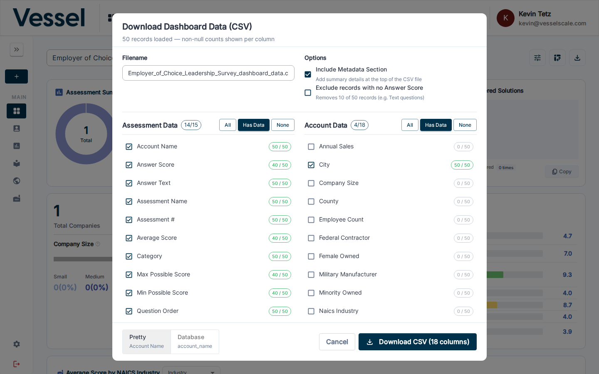

# Download CSV

The Download CSV button opens a modal that lets you configure which columns to include in the export and set key options before downloading. The export covers all assessment response data for the currently selected assessment definition.

## Opening the download dialog

Click the **Download** button (download icon) in the top-right toolbar of the dashboard.

## Download modal

The modal shows how many records will be exported and the non-null count for each available column.

### Filename

The filename is pre-filled based on the assessment definition name. You can edit it before downloading.

### Options

Two checkboxes control the output format:

| Option | Description |
|--------|-------------|
| **Include Metadata Section** | Adds a summary header block at the top of the CSV file with assessment definition details. **Recommended** — this section helps recipients understand the context of the data without needing to open Vessel. |
| **Exclude records with no Answer Score** | Removes rows for question types (e.g. Text) that do not produce a numeric score. The number of rows that will be removed is shown inline. |

### Column selection

Columns are grouped into two sections:

- **Assessment Data** — question-level fields: Account Name, Answer Score, Answer Text, Assessment Name, Assessment #, Average Score, Category, Max/Min Possible Score, Question Order, Question Text, Question Type, Respondent #, Score %, Total Responses
- **Account Data** — account attributes: City, Company Size, County, Employee Count, Federal Contractor, Female Owned, NAICS Industry/Group/Subsector/Sector, Region, State, Veteran Owned, and more

Each column shows a count of non-null values out of total records (e.g. `50 / 50`). Use **All**, **Has Data**, or **None** to quickly select/deselect within a group.

### Column name format

The toggle at the bottom of the modal switches between **Pretty** (human-readable labels like "Account Name") and **Database** (raw field names like `account_name`) for CSV column headers.

## Downloading

Click **Download CSV (N columns)** to generate and download the file. The button label updates as you change your column selections.

## Related

- [Pivot Table](pivot-table.md) — interactive tabular analysis with the same column selection interface
- [Dashboard Overview](index.md)
