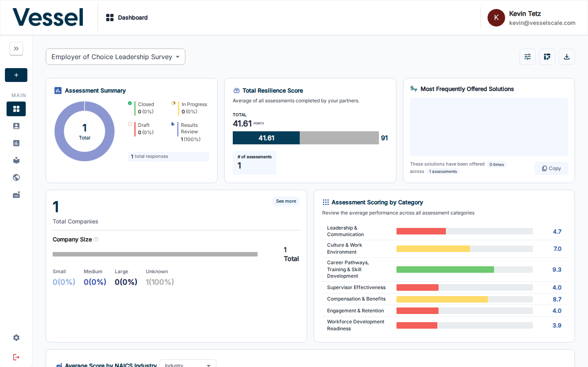

# Dashboard

The Dashboard gives you an at-a-glance view of all assessments for a selected assessment definition — scores, completion status, account breakdowns, and more.

## What you can do here

- View aggregate metrics across all assessments for the selected definition
- Browse and interact with 11 built-in analytics components
- [Configure which components are visible](configure.md) and their order
- [Download a CSV export](download.md) of all assessment data
- Open the [Pivot Table](pivot-table.md) for flexible cross-sectional analysis

## Dashboard Overview

The assessment definition selector at the top of the page controls which assessment's data is displayed across all components. The toolbar in the top-right corner provides quick access to configuration, the pivot table, and CSV download.

| Button | Action |
|--------|--------|
| Configure (sliders icon) | Open [Configure Dashboard](configure.md) to add, remove, or reorder components |
| Pivot Table (grid icon) | Navigate to the [Pivot Table](pivot-table.md) for tabular analysis |
| Download CSV (download icon) | [Download](download.md) all assessment data as a CSV file |

## Components

The dashboard displays up to 11 analytics components. See [Components](components.md) for a description and screenshot of each one.

## Related

- [Getting Started: Step 7](../../getting-started/navigating-the-dashboard.md) — Quick-start guide to the dashboard
- [Components](components.md)
- [Configure Dashboard](configure.md)
- [Download CSV](download.md)
- [Pivot Table](pivot-table.md)
- [Assessments](../assessments/index.md)
