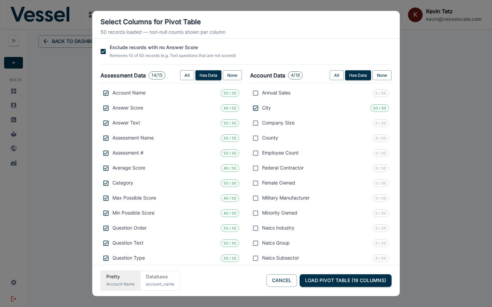
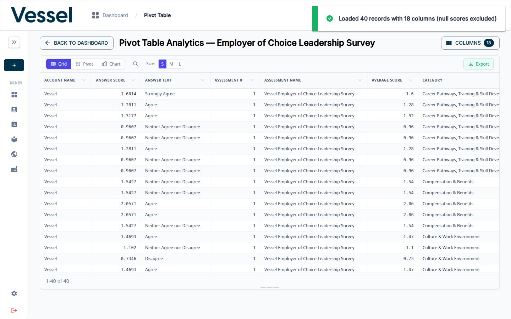

# Pivot Table

The Pivot Table lets you explore all assessment response data for a selected assessment definition in a flexible tabular format. You choose which columns to include, then load the data for sorting, filtering, and export.

## What you can do here

- Select which assessment data and account data columns to include
- View all response records in a scrollable data grid
- Switch between **Grid**, **Pivot**, and **Chart** view modes
- Adjust row size (S / M / L)
- Export the current view

## Opening the Pivot Table

Click the **Pivot Table** button (grid icon) in the top-right toolbar of the dashboard. You can return to the dashboard at any time with the **Back to Dashboard** button.

## Column Selector

When the pivot table opens, a column selector dialog appears. It is divided into two groups:

- **Assessment Data** — question-level fields such as Account Name, Answer Score, Answer Text, Assessment Name, Category, Question Text, and more
- **Account Data** — account attributes such as City, Company Size, NAICS Industry, Employee Count, Federal Contractor status, and more

Each column shows a count of non-null values (e.g. `50 / 50`). Use the **All**, **Has Data**, or **None** toggles to quickly select or deselect columns within a group.

The **Exclude records with no Answer Score** checkbox (checked by default) filters out text-type questions that are not scored.

Click **Load Pivot Table** to fetch the data with your selected columns.

## Data Grid

The grid displays one row per question response. Columns are sortable. The header shows the total records loaded and the number of columns selected.

Use the **Columns** button in the top-right of the grid to show or hide columns without going back to the column selector.

## Related

- [Download CSV](download.md) — export all data without column selection
- [Dashboard Overview](index.md)
