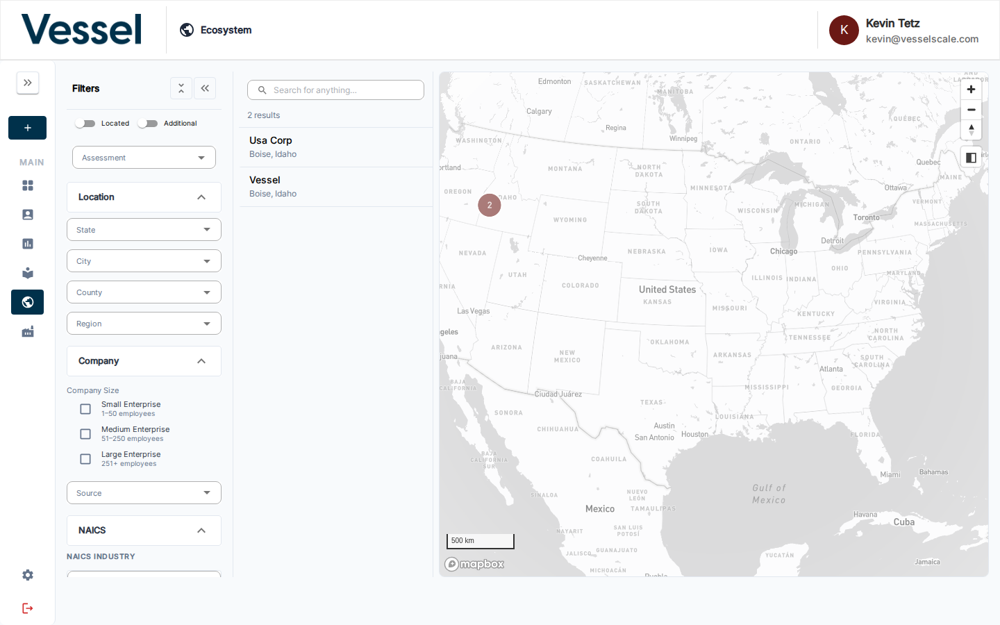
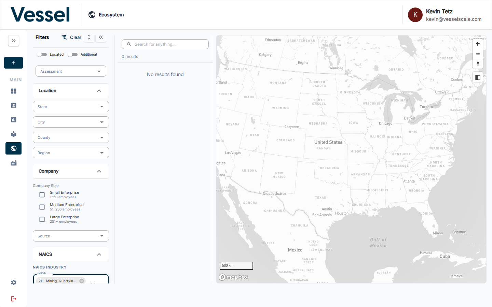

---
tags:
  - ecosystem
  - map
  - filter
  - NAICS
  - geography
  - regions
---

# Filters

The **Filters** panel on the left side of the Ecosystem Map lets you narrow which accounts appear on the map and in the account list.

## Overview

| Filter group | Options |
|---|---|
| **Assessment** | Select an active assessment to enable the Scores view |
| **Location** | State, City, County, Region |
| **Company Size** | Small Enterprise (1–50), Medium Enterprise (51–250), Large Enterprise (251+) |
| **Source** | Filter by data source or shared datasource |
| **NAICS** | Sector, Subsector, Group, Industry (hierarchical — each level filters the next) |

The **Located** / **Additional** toggles at the top control whether geocoded accounts, non-geocoded accounts, or both appear on the map.

Use the **Clear** button at the top of the filters panel to reset all filters at once.

## NAICS Industry Filter

The NAICS filter section provides four cascading Autocomplete fields — Sector, Subsector, Group, and Industry. Selecting a Sector narrows the Subsector options, and so on down the hierarchy.

This matches the same NAICS structure described in [Industries](../industries/index.md).

## Related

- [Ecosystem Map](index.md) — overview
- [Scores View](scores.md) — overlay assessment scores after selecting an Assessment filter
- [Industries](../industries/index.md) — full NAICS hierarchy reference
