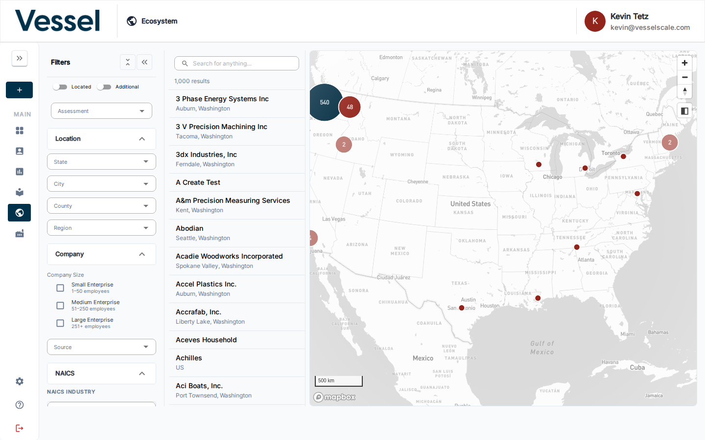
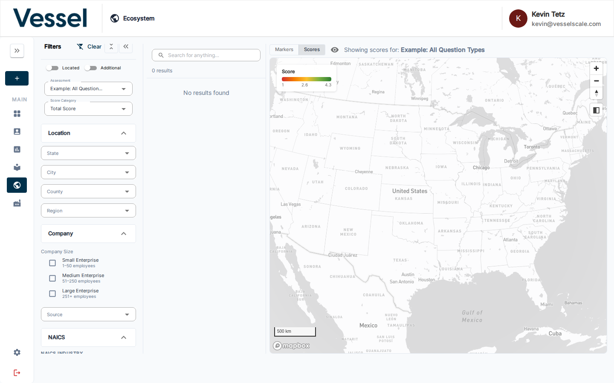
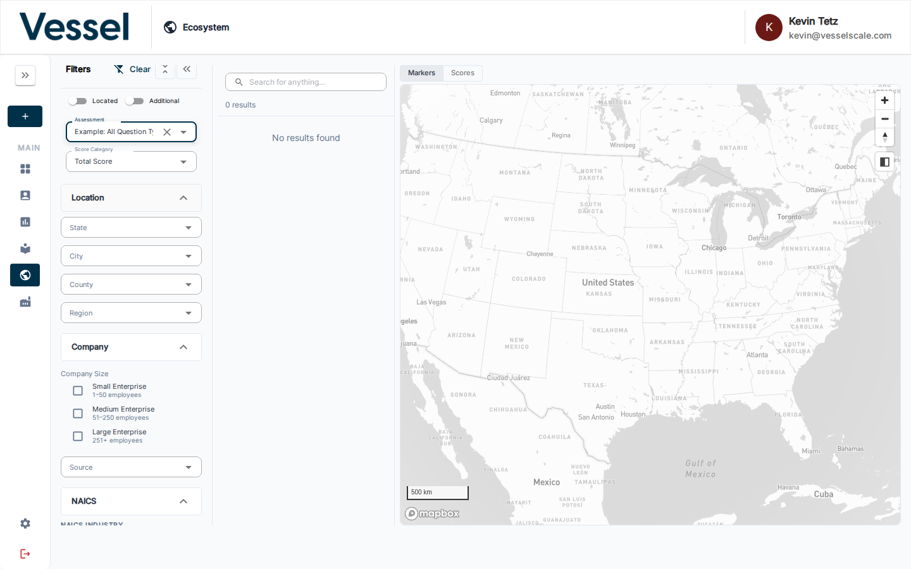
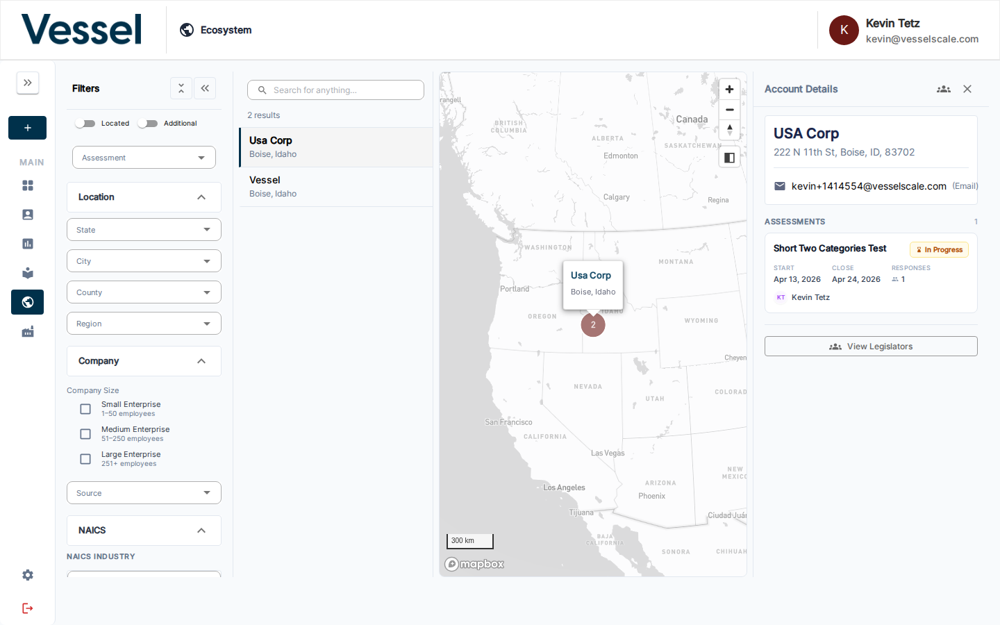
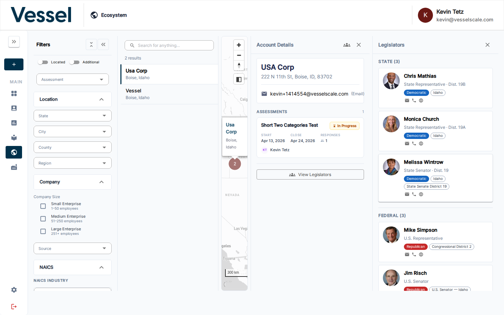

# Ecosystem Map

The Ecosystem Map is an interactive geographic view of all accounts in your platform. It lets you spot geographic clusters, filter down to specific industries or company sizes, visualize assessment scores across the map, and drill into any account for details — including the elected officials who represent that business.

---

## Filters

The **Filters** panel on the left lets you narrow which accounts appear on the map and in the account list.

| Filter group | Options |
|---|---|
| **Assessment** | Select an active assessment to enable Scores view |
| **Location** | State, City, County, Region |
| **Company Size** | Small Enterprise (1–50), Medium Enterprise (51–250), Large Enterprise (251+) |
| **Source** | Filter by data source or shared datasource |
| **NAICS** | Sector, Subsector, Group, Industry (hierarchical — each level filters the next) |

The **Located** / **Additional** toggles at the top control whether geocoded accounts, non-geocoded accounts, or both appear.

Use the **Clear** button (top of filters panel) to reset all filters at once.

---

## NAICS Industry Filter

The NAICS filter section provides four cascading Autocomplete fields — Sector, Subsector, Group, and Industry. Selecting a Sector narrows the Subsector options, and so on down the hierarchy. This matches the same NAICS structure described in [Industries](../industries/index.md).

---

## Scores View

When an Assessment is selected in the filters, a **Markers / Scores** toggle appears at the top of the map. Switch to **Scores** to color-code every account marker by its total score for that assessment.

The color scale runs from red (low) through yellow to green (high), with the score range shown in the legend. A **Score Category** dropdown lets you switch between Total Score and individual category scores. Accounts with no score for that assessment are hidden from the map.

---

## Account List

The panel between the filters and the map shows a scrollable list of all accounts matching the current filters. Each row shows the account name and location. Click any row to open the Account Details panel on the right.

---

## Account Details

Clicking an account opens its **Account Details** panel on the right side of the screen.

The panel shows:

- **Name and address** — the geocoded address if available
- **Contact email**
- **Assessments** — all assessments sent to this account, with status, dates, response count, and assigned team member

---

## Legislators

For geocoded accounts (those with a verified address), the **View Legislators** button appears at the bottom of the Account Details panel. Clicking it opens the **Legislators** sidebar.

The Legislators sidebar shows the elected officials representing that account's address, split into:

- **State** — State Representatives and State Senators for the district
- **Federal** — U.S. Representatives and U.S. Senators

Each legislator card shows their photo, title, district, party, and contact icons (email, phone, website).

---

## Related

- [Industries](../industries/index.md) — NAICS hierarchy used by the Sector/Subsector/Group/Industry filters
- [Accounts](../accounts/index.md) — manage the accounts that appear on the map
- [Assessments](../assessments/index.md) — assessments whose scores can be visualized on the map
