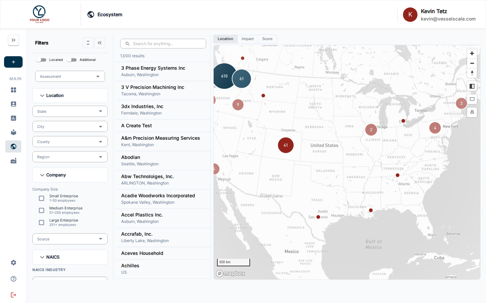
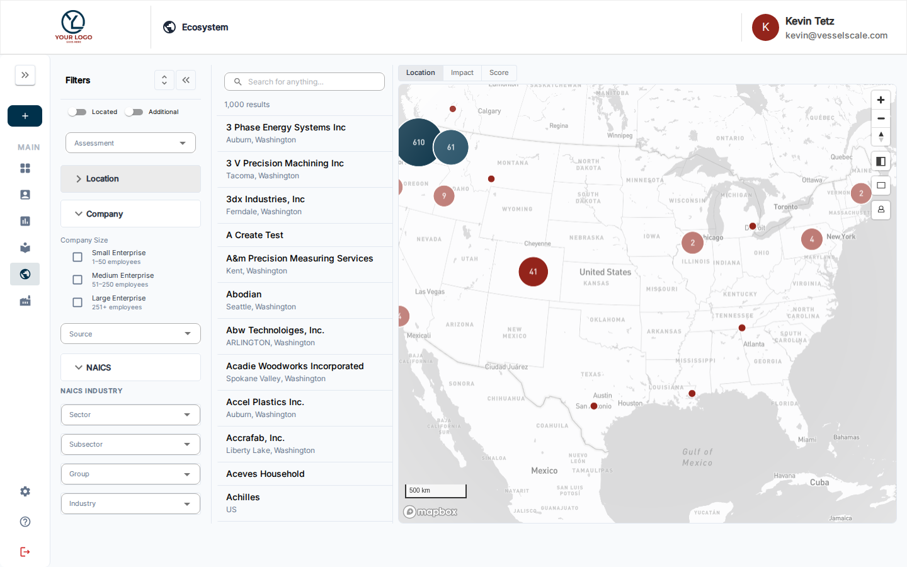
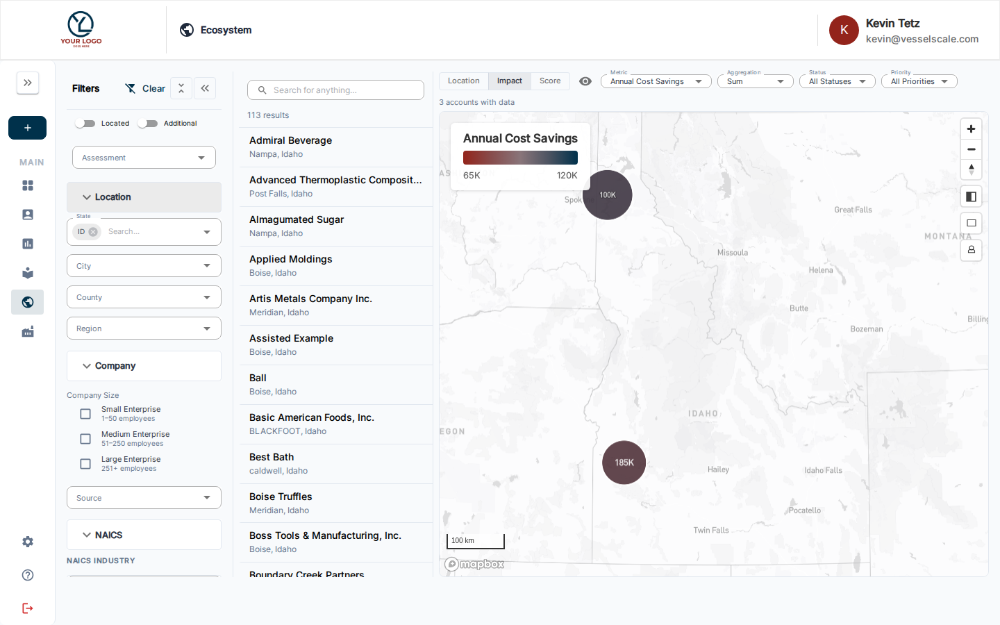

# Ecosystem Map

The Ecosystem Map is an interactive geographic view of all accounts in your platform.

## What you can do here

- Spot geographic clusters of accounts across your region
- Filter by location, company size, industry (NAICS), and data source
- Visualize assessment scores and impact metrics across the map with color-coded markers
- Drill into any account to see its details and assessments
- View the elected officials representing any geocoded account

## Overview

The map gives you a live, filterable picture of your entire account base on an interactive map. Use the left panel to narrow accounts by location, size, or industry, then switch between three visualization tabs to see different data layers. Click any account for full details and legislator information.

## Map Tabs

The Ecosystem Map has **three tabs** at the top to switch between different views:

### Location Tab

The **Location** view shows account markers on the map with geographic distribution. This tab displays:
- Account locations as markers on the geographic map
- Physical distribution of your account base
- Easy identification of geographic clusters and gaps
- Default marker colors based on company size or other account attributes

Use the Location view to get a geographic overview of where your accounts are located and identify regional concentration.

### Impact Tab

The **Impact** view overlays impact metrics on the map to visualize outcome data across your region. This tab displays:
- Impact scores as color-coded markers (red = low, yellow = medium, green = high)
- Geographic patterns in impact performance
- Regional strengths and areas for improvement
- Metrics defined by your organization's impact framework

Use the Impact view to identify which regions are achieving the strongest outcomes and where additional support may be needed.

### Score Tab

The **Score** view overlays assessment results as color-coded markers to visualize assessment performance across your region. This tab displays:
- Assessment scores as color-coded markers (red = low score, yellow = medium, green = high score)
- Color scale legend showing the score range
- Option to switch between total score and individual scoring categories
- Geographic patterns in assessment performance

Use the Score view to identify which regions have highest/lowest assessment results and track performance across your account base.

## Help Video

<iframe width="100%" height="280" src="https://www.youtube.com/embed/1QJUH_MbRCM?si=" style="border: none; border-radius: 8px;" allow="accelerometer; autoplay; clipboard-write; encrypted-media; gyroscope; picture-in-picture; web-share" allowfullscreen></iframe>

<strong>Vessel EcoSystem | Overview</strong>

## Filtering Your Data

Use the **Filters** panel on the left to narrow which accounts appear on all tabs:

- **Assessment** — Select an assessment to enable scoring and category views
- **Location** — Filter by state, city, county, or region
- **Company Size** — Filter by enterprise size (Small, Medium, Large)
- **Source** — Filter by data source or shared datasource
- **NAICS** — Filter by industry (hierarchical: Sector → Subsector → Group → Industry)

## In this section

- [Filters](filters.md) — narrow the map by location, company size, NAICS industry, and more
- [Scores View](scores.md) — visualize assessment scores as color-coded map markers
- [Account List & Details](accounts.md) — browse the account list and view per-account details
- [Legislators](legislators.md) — view the elected officials representing any geocoded account
