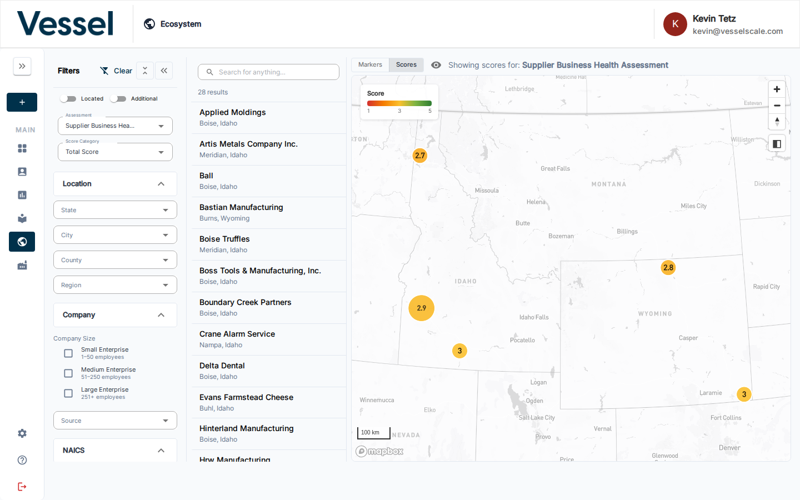
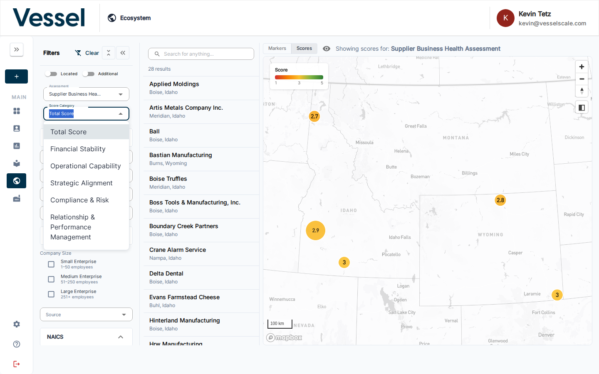
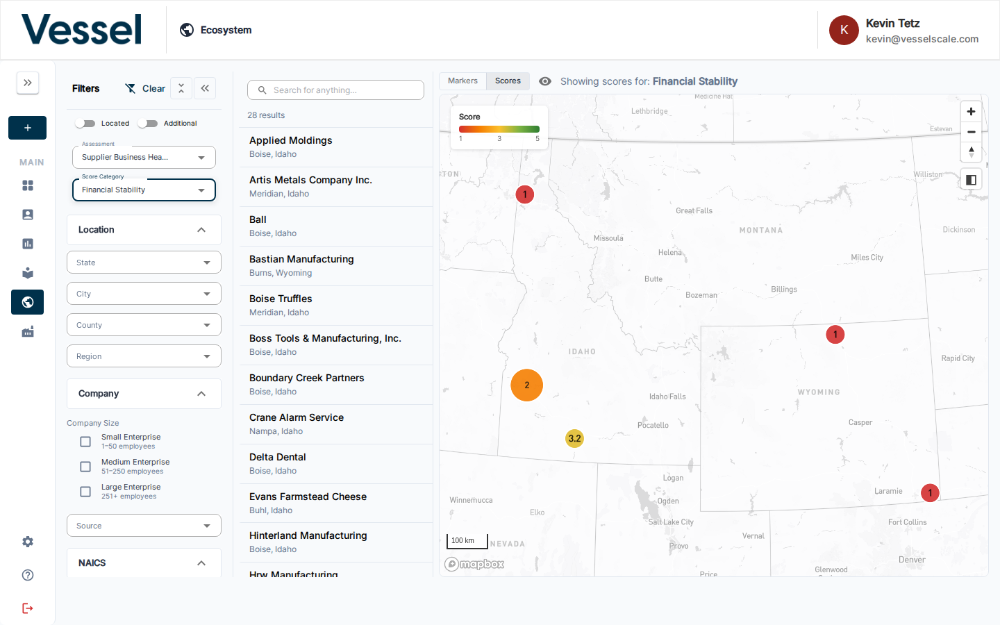

---
tags:
  - ecosystem
  - map
  - scores
  - analytics
  - assessments
  - reporting
---

# Scores View

The Scores view overlays assessment results as color-coded markers on the Ecosystem Map, letting you instantly see how accounts across your region performed on any assessment.

## Enabling Scores View

First, select an **Assessment** in the [Filters](filters.md) panel. Once an assessment is selected, a **Markers / Scores** toggle appears at the top of the map. Switch it to **Scores** to activate the color-coded view.

## Reading the Map

The color scale runs from **red** (low score) through **yellow** to **green** (high score). The score range is shown in the legend on the map:

- **Red zones** indicate accounts with lower assessment scores
- **Yellow zones** indicate accounts in the mid-range
- **Green zones** indicate accounts with higher assessment scores
- Accounts with **no score** for the selected assessment are hidden from the map

## Score Categories

When you select an assessment, the **Score Category** dropdown becomes available. This dropdown lets you switch between viewing different scoring metrics:

- **Total Score** — The overall assessment score across all categories (default)
- **Individual Category Scores** — Any scoring categories defined in the assessment

Each organization defines their own assessment categories. For example, an assessment might have categories like:
- Financial Stability
- Operational Excellence
- Risk Management
- Compliance

### Viewing Different Score Categories

1. Click the **Score Category** dropdown in the filters panel
2. Select any category to switch the map visualization
3. The markers update instantly to show scores for that specific category

### Example: Financial Stability Category

Here the map is showing scores specifically for the **Financial Stability** category. Notice how the distribution of colors changes — accounts that score high on overall resilience might score differently on specific categories.

## Related

- [Ecosystem Map](index.md) — overview
- [Filters](filters.md) — select an assessment and narrow down which accounts appear
- [Account List & Details](accounts.md) — click an account marker to view its details
- [Assessments](../assessments/index.md) — manage the assessments whose scores can be visualized here

