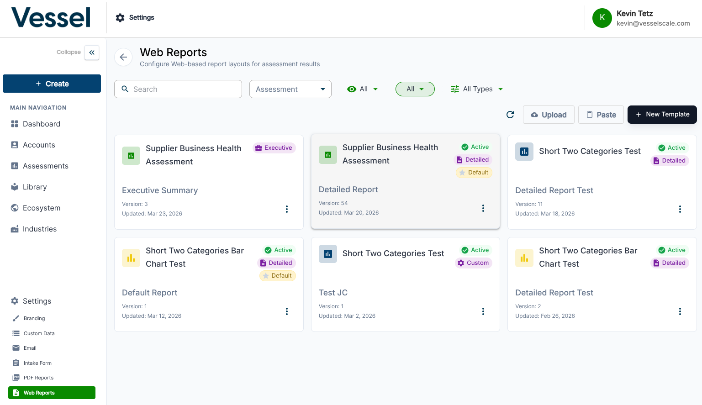
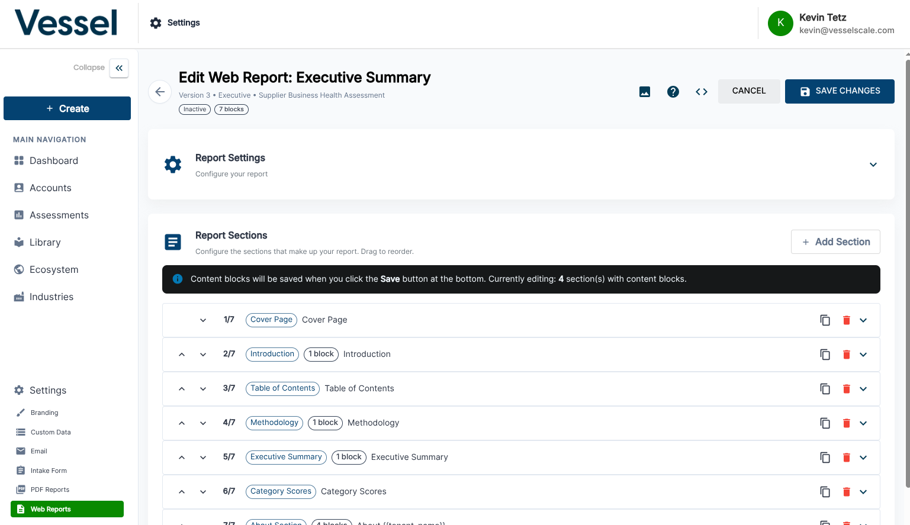

# Report Builder

The Report Builder lets you generate analysis and scoring reports from assessment data.

## What you can do here

- Select assessments to include in the report
- Choose scoring dimensions and comparison views
- Export or share reports

## Web Reports List

The Reports List shows all previously generated reports and analysis outputs. This archive of reports allows you to access historical analysis, compare reports over time, and share results with stakeholders. From this view, you can filter reports by date range, assessment type, or account to quickly find the analysis you need.

## Report Builder Interface

The Report Builder interface provides powerful tools for generating custom reports from your assessment data. Select which assessments to include, choose your analysis dimensions, and specify how you want the data presented. The builder allows you to create visual comparisons across multiple assessments, see scoring breakdowns, and generate insights from your assessment data. Once configured, you can export reports in multiple formats or share them directly with team members and stakeholders.

## Usage

_Coming soon._

## Related

- [Assessments](index.md)
- [Assessment Details](details.md)
- [Dashboard Pivot Table](../dashboard/pivot-table.md)
