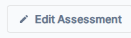
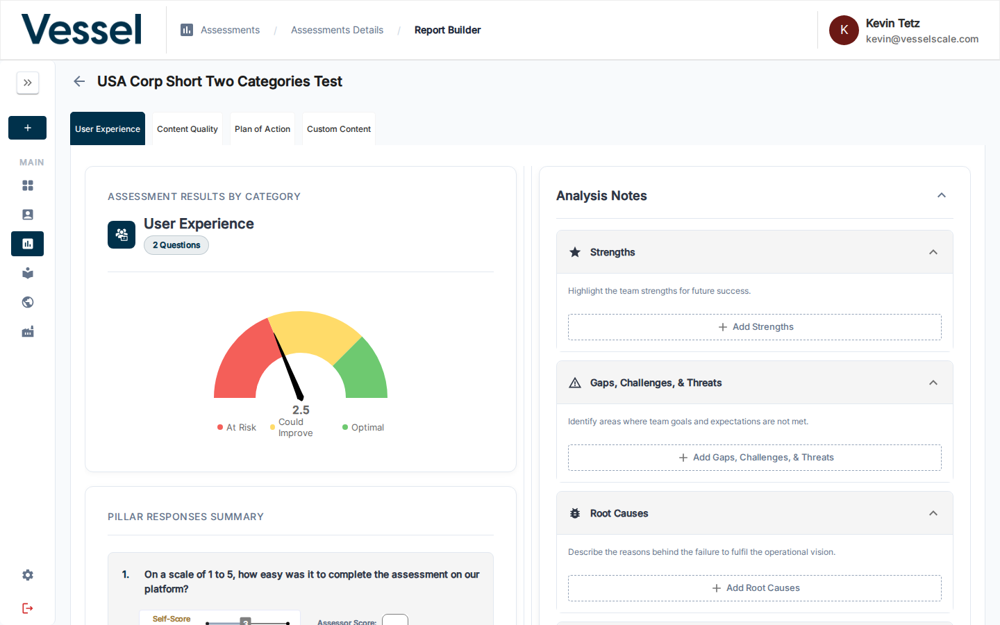

---
tags:
  - getting-started
  - assessments
  - reports
  - analysis
---

# Step 5 — Analyze Results

When responses come in, open the Report Builder to review scores and document your analysis.

---

## Opening the Report Builder

From the Assessment Details page, click **Build Report** in the top action bar.

!!! note
    **Build Report** is only active after at least one response has been submitted.

---

## Working in the Report Builder

Switch between **category tabs** at the top to review each section. For each category you'll see:

- A **gauge chart** showing the score and zone (At Risk / Could Improve / Optimal)
- A **Pillar Responses Summary** breaking down each question
- **Analysis Notes** fields to document Strengths, Gaps & Challenges, Root Causes, and a Plan of Action

---

## Next Step

[Step 6 — Create a Web Report](create-web-report.md){ .md-button }

[Full guide: Report Builder](../assessments/report-builder.md){ .md-button .md-button--secondary }

## Related

- [Report Builder Reference](../assessments/report-builder.md) — Detailed analysis tools
- [Assessment Scoring](../assessments/scoring.md) — Understand score calculations
- [PDF Reports](../assessments/pdf-reports.md) — Export findings as PDF
