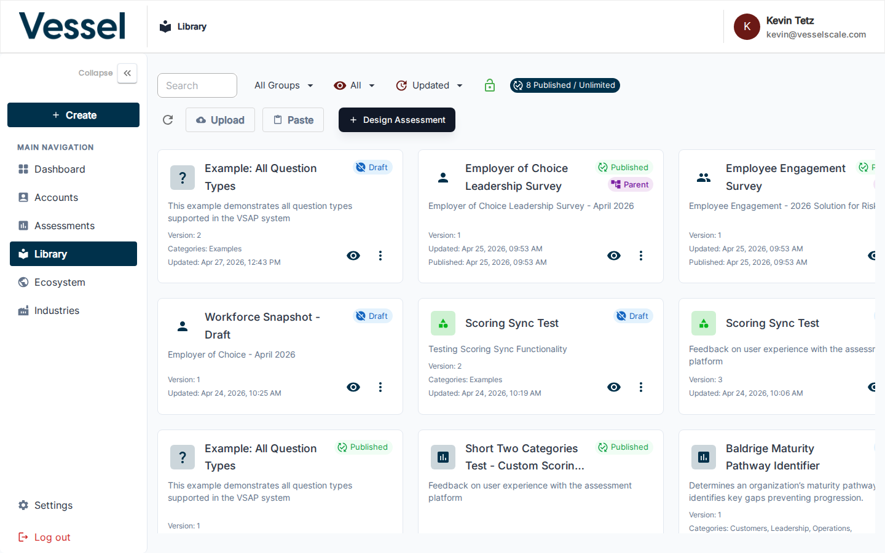
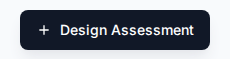

---
tags:
  - getting-started
  - preparation
  - library
  - design
  - templates
---

# Preparation Step 2 — Design an Assessment

Before creating individual assessments for clients, you need to build an assessment **template** in the Library. The template defines the questions, scoring rules, and categories that all assessments of that type will use.

!!! note "Terminology"
    In your organization, assessments might be called "Evaluations", "Surveys", "Reviews", or something else entirely. You can customize what the platform calls assessments in **[Settings → Branding](../../settings/branding.md#assessment-property-name)**. All references throughout the system will use your chosen terminology.

---

## Opening the Library

Click **Library** in the left sidebar to access assessment templates.

See [Library Overview](../../library/index.md) for complete details on managing assessment templates.

---

## Creating a New Template

Click **+ Design Assessment** in the top-right corner.

The template editor opens. Give it a name, then add categories and questions.

---

## What Goes in a Template

| Element | Description |
|---|---|
| **Categories** | Top-level groupings (e.g., User Experience, Plan of Action) — organize your assessment structure |
| **Questions** | Individual prompts within each category — supports multiple choice, rating scales, open-ended text, and more |
| **Scoring** | Define score zones: At Risk, Could Improve, Optimal — controls how results are calculated |

Learn more: [Question Types](../../library/question-types.md) | [Scoring Rules](../../library/scoring.md)

---

## Using an Existing Template

If a template already exists that fits your needs, you can use it directly when [creating an assessment](../workflow/step-1-assign.md) — you do not need to create a new one.

Browse existing templates in the Library and search by name or category to find what you need.

---

## Editing & Managing Templates

- **Edit a template:** Click the template name in the Library to open the editor
- **Duplicate a template:** Use the duplicate option to create a variation based on an existing template
- **Archive a template:** Hide inactive templates from the list
- **View usage:** See which assessments use each template

See [Library Reference](../library/index.md) for complete template management instructions.

---

## Next Step

[Step 3 — Deliver your Assessment](../workflow/step-3-deliver.md){ .md-button }

---

## Related

- [Library Overview](../library/index.md) — Assessment template management and best practices
- [Question Types](../library/question-types.md) — Supported question formats and use cases
- [Scoring Rules](../library/scoring.md) — Define score zones and thresholds
- [Assessment Categories](../library/categories.md) — Organize your assessment structure
