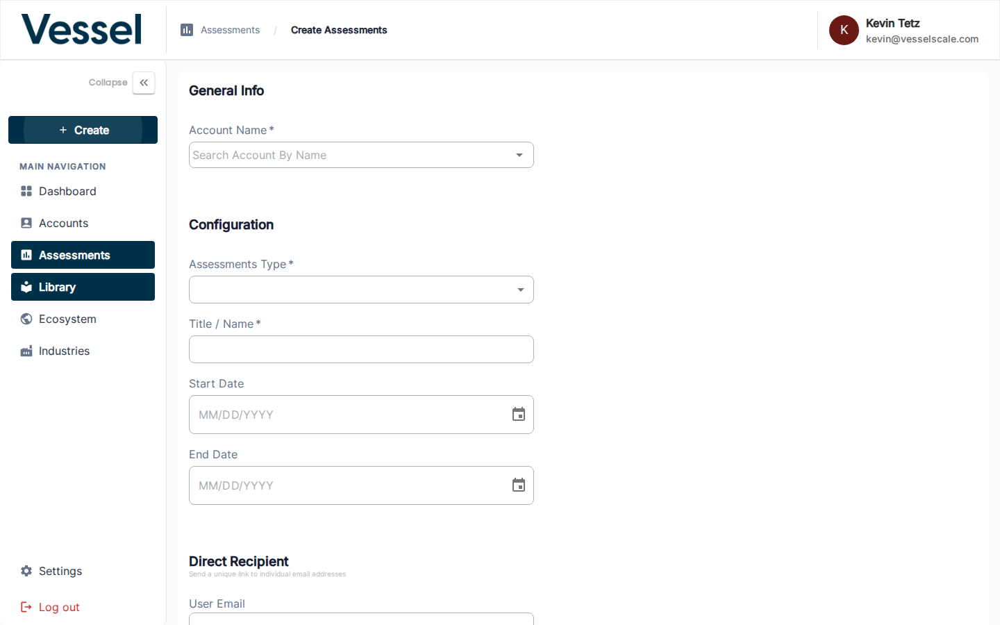

---
tags:
  - getting-started
  - assessments
  - create
---

# Step 3 — Create an Assessment

With an account and a Library template ready, create the assessment that ties them together.

---

## Opening the Create Assessment Form

Click **+ Create → New Assessment** in the sidebar, or navigate to **Assessments → Create Assessment**.

---

## Form Fields

| Field | Description |
|---|---|
| **Account Name** | Search and select the account being assessed |
| **Assessment Type** | Choose the Library template to use |
| **Title / Name** | A descriptive name for this assessment instance |
| **Start Date** | When the assessment opens for responses |
| **End Date** | When the assessment closes |
| **Direct Recipient** | Optional — a specific respondent's email address |

Click **Save** to create the assessment. You will be taken to the assessment detail page.

---

## Next Step

[Step 4 — Send to Respondents](send-assessment.md){ .md-button }

[Full guide: Create Assessment](../assessments/create.md){ .md-button .md-button--secondary }

## Related

- [Create Assessment Reference](../assessments/create.md) — Form fields and options
- [Assessment Details](../assessments/details.md) — View and manage assessment
