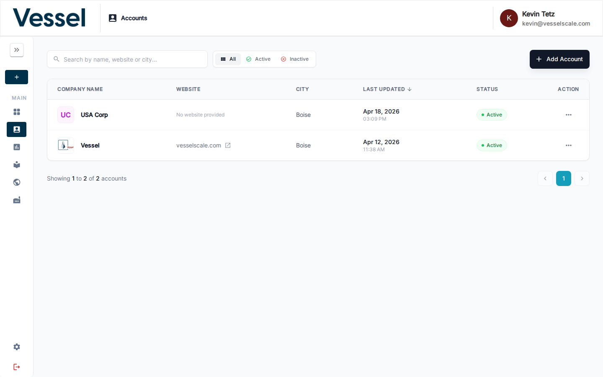
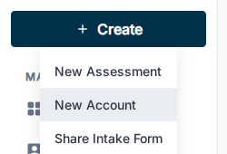

---
tags:
  - getting-started
  - onboarding
  - account
  - setup
  - login
---

# Creating an Account

In VSAP, an **account** represents a client organization you are assessing. Before you can run an assessment, you need to create at least one account.

---

## The Accounts List

Navigate to **Accounts** in the sidebar to see all existing accounts.

Use the search bar to filter by name, website, or city. Toggle between **All**, **Active**, and **Inactive** to narrow the list.

---

## Two Ways to Create an Account

### Option A — Create from the Sidebar

Click the **+ Create** button at the top of the sidebar and select **New Account**.

This opens the Create Account form directly.

### Option B — Add Account Button

From the Accounts list page, click **+ Add Account** in the top-right corner.

Both methods open the same Create Account form.

---

## Filling In the Create Account Form

The form has three sections:

| Section | Key Fields |
|---|---|
| **General Info** | Company name *(required)*, email, address, website, country, state, city, zip code, company logo |
| **Contacts** | First name *(required)*, last name *(required)*, email *(required)*, phone, contact type, role |
| **Additional Information** | DUNS number, UEI, PSC, region, employee count, annual sales, business description, and other organizational attributes |

Click **Save** when done. You will be taken to the new account's detail page.

!!! tip "Want the client to fill in their own details?"
    Use **Share Intake Form** from the **+ Create** menu. This sends the client a link to a survey form where they enter their own information. See [Intake Forms](../settings/intake-forms.md) to configure the form.

---

## Next Step

[Step 2 — Design an Assessment](design-assessment.md){ .md-button }

## Related

- [Create Account Reference](../accounts/create.md) — Full field reference
- [Accounts Overview](../accounts/index.md) — Manage all client organizations
