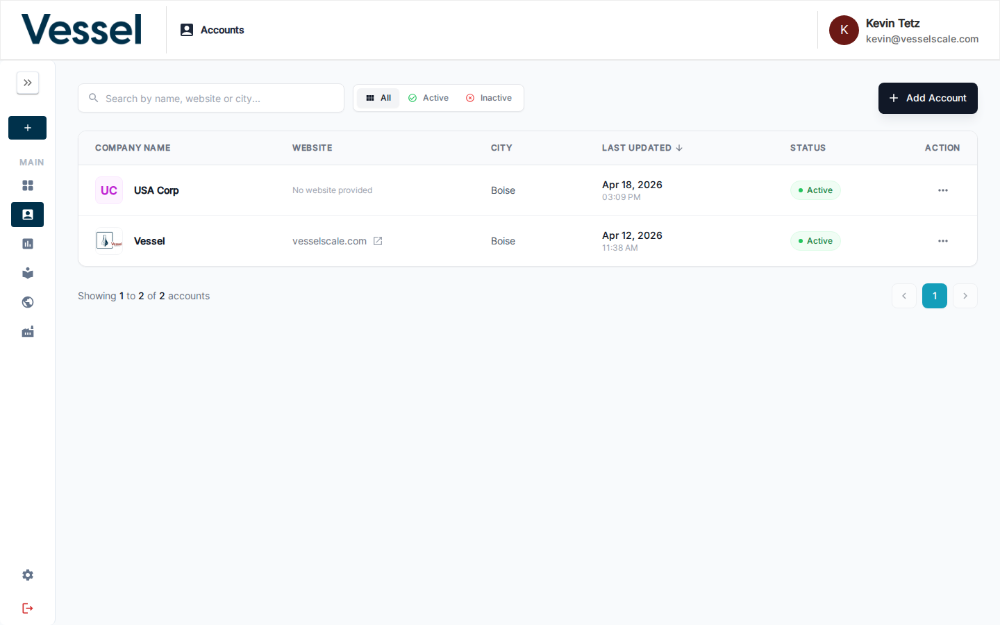
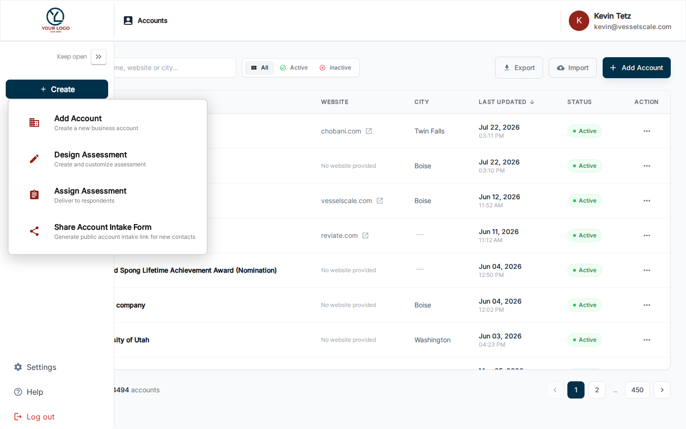

---
tags:
  - getting-started
  - onboarding
  - setup
---

# Step 1 — Add an Account

In VSAP, an **account** represents a client organization you are assessing. Before you can run an assessment, you need to create at least one account.

!!! note "Let Clients Create Their Own Account"
    External users can self-register and populate their own account details through the **Intake Form**. Simply share an intake form link with them, and their submission automatically creates an account in your system. See [Configure Intake Forms](../settings/intake-forms.md) for details on how to set this up.

---

## The Accounts List

Navigate to **Accounts** in the sidebar to see all existing accounts.

Use the search bar to filter by name, website, or city. Toggle between **All**, **Active**, and **Inactive** to narrow the list.

Learn more: [Accounts Overview](../accounts/index.md)

---

## Two Ways to Create an Account

### Option A — Create from the Sidebar

Click the **+ Create** button at the top of the sidebar and select **New Account**.

This opens the Create Account form directly.

### Option B — Add Account Button

From the Accounts list page, click **+ Add Account** in the top-right corner.

Both methods open the same Create Account form.

---

## Filling In the Create Account Form

The form has three sections:

| Section | Key Fields |
|---|---|
| **General Info** | Company name *(required)*, email, address, website, country, state, city, zip code, company logo |
| **Contacts** | First name *(required)*, last name *(required)*, email *(required)*, phone, contact type, role |
| **Additional Information** | DUNS number, UEI, PSC, region, employee count, annual sales, business description, and other organizational attributes |

Click **Save** when done. You will be taken to the new account's detail page.

### Full Reference

For detailed information on all account fields, see [Create Account Reference](../accounts/create.md).

---

## Next Step

[Step 2 — Design an Assessment](design-assessment.md){ .md-button }

---

## Related

- [Create Account Reference](../accounts/create.md) — Full field reference and options
- [Accounts Overview](../accounts/index.md) — Manage all client organizations
- [Intake Forms](../settings/intake-forms.md) — Let clients self-register
- [Account Details Page](../accounts/details.md) — View and edit account information
