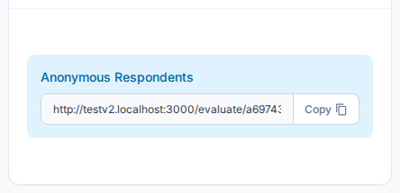

---
tags:
  - getting-started
  - assessments
  - create
  - share
  - respondents
---

# Step 3 — Deliver your Assessment

Create assessment instances from your Library template and share them with respondents to collect their feedback.

---

## Part 1 — Create an Assessment Instance

### Opening the Create Assessment Form

Click **+ Create → New Assessment** in the sidebar, or navigate to **Assessments → Create Assessment**.

### Form Fields

| Field | Description |
|---|---|
| **Account Name** | Search and select the account being assessed *(required)* |
| **Assessment Type** | Choose the Library template to use *(required)* |
| **Title / Name** | A descriptive name for this assessment instance |
| **Start Date** | When the assessment opens for responses |
| **End Date** | When the assessment closes |
| **Direct Recipient** | Optional — a specific respondent's email address to receive a direct link |

### Saving the Assessment

Click **Save** to create the assessment. You will be taken to the assessment detail page.

Learn more: [Create Assessment Reference](../assessments/create.md)

---

## Part 2 — Share the Assessment with Respondents

Once the assessment is created, you need to share it so respondents can submit their answers.

### Step 1 — Publish the Assessment

The assessment must be set to **Published** status before respondents can submit responses. On the assessment detail page, change the status from the status dropdown in the header area.

!!! tip "Draft vs. Published"
    Keep assessments in **Draft** status while you're setting them up. Move to **Published** once you're ready to share with respondents.

---

### Step 2 — Share the Assessment

On the Assessment Details page, scroll down to the **Share Assessments Link** card.

There are three ways to deliver the assessment:

#### Option A — Anonymous Respondents

Copy the **Assessment Link** and share it however you like — email, chat, or your own portal. Anyone with the link can submit a response once the assessment is published.

**Best for:** Open surveys, public feedback, or when you don't need to track specific respondents.

#### Option B — Direct Recipients

Click **+ Add** to send a unique, one-time link to a specific email address. Direct links are tied to that recipient and cannot be reused.

**Best for:** Targeted assessments, ensuring specific individuals respond, or tracking who responded.

#### Option C — Intake Form

Use the Intake Form to deliver assessments alongside account creation. When a client submits an intake form, they can immediately launch an assessment as part of the same workflow.

**Best for:** New client onboarding, combining account setup with initial assessment.

Learn more: [Intake Forms](../settings/intake-forms.md)

---

## Tracking Responses

The assessment detail page shows **Total**, **Closed**, and **In Progress** counts so you can monitor participation in real time.

Key information displayed:
- **Response status** — How many respondents have submitted vs. are still working
- **Submission dates** — When responses were received
- **Response completeness** — Which respondents completed the assessment

---

## Next Step

[Step 4 — Provide Results](deliver-results.md){ .md-button }

---

## Related

- [Assessment Details Reference](../assessments/details.md) — Full assessment management
- [Assessment Details Page](../assessments/details.md) — View and manage assessment
- [Create Assessment Reference](../assessments/create.md) — Form fields and options
- [Share Assessments](../assessments/details.md#sharing) — Respondent management and sharing options
- [Intake Forms](../settings/intake-forms.md) — Self-service account and assessment delivery
- [Assessment Status & Workflow](../assessments/workflow.md) — Understanding assessment states