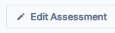

---
tags:
  - getting-started
  - assessments
  - reports
  - analysis
  - web-reports
---

# Step 4 — Deliver Results

When responses come in, use the Report Builder to analyze scores and document your findings. Then publish a branded web report to share results with your client.

---

## Part 1 — Analyze Results in the Report Builder

### Opening the Report Builder

From the Assessment Details page, click **Build Report** in the top action bar.

!!! note
    **Build Report** is only active after at least one response has been submitted.

### What You'll See in the Report Builder

The Report Builder presents your assessment data organized by category:

**Switch between category tabs** at the top to review each section. For each category you'll see:

| Component | Purpose |
|---|---|
| **Gauge Chart** | Visual representation of the score and zone (At Risk / Could Improve / Optimal) |
| **Pillar Responses Summary** | Question-by-question breakdown of responses and scores |
| **Analysis Notes** | Documented findings organized by theme |

### Documenting Your Analysis

Complete these analysis sections for a comprehensive report:

1. **Strengths** — Identify what's working well
2. **Gaps & Challenges** — Highlight areas of concern
3. **Root Causes** — Explain why certain gaps exist
4. **Qualitative Insights** — Summarize key themes from open-ended responses
5. **Plan of Action** — Document recommended next steps

!!! tip "AI-Generated Insights"
    The **Qualitative Insights** tab contains an AI-generated summary of open-ended question responses. Review and edit the content before including it in your published report.

### Saving Your Work

As you add analysis notes, your work is automatically saved. You can return to the Report Builder at any time to review or update your findings.

---

## Part 2 — Create and Publish a Web Report

### What is a Web Report?

A **Web Report** publishes your assessment findings as a branded, interactive web page that clients can view in their browser. It combines assessment scores, charts, analysis notes, and custom branding into a professional, shareable document.

### Setting Up Report Templates

Before you can publish a web report, you need to create a report template that controls the layout, branding, and sections shown.

Navigate to **Settings → Web Reports** to create report templates.

**Template options include:**

- **Layout & Structure** — Choose which sections to display (scores, charts, insights, recommendations)
- **Branding** — Add your logo, colors, and custom styling
- **Content Customization** — Include your analysis, insights, and recommendations
- **Client Information** — Display account and contact details

[Full guide: Web Reports Template Settings](../settings/web-reports.md){ .md-button }

### Attaching & Publishing a Report

Once you have a report template created:

1. From the **Assessment Details** page, click the **Web** button in the top action bar
2. Select a report template from the available options
3. Review the preview
4. Click **Publish**

Once published, a shareable URL is generated that you can send directly to the client.

!!! tip "Sharing the Report"
    Copy the report URL and share it via email, your client portal, or any communication channel. The report is viewable in any web browser and doesn't require the client to log in to VSAP.

### What the Client Sees

The published web report includes:

- **Assessment Scores** — Visual charts and gauges for each category
- **Analysis Summary** — Your documented strengths, gaps, and insights
- **Recommendations** — Your suggested plan of action
- **Branded Design** — Your logo, colors, and custom styling
- **Professional Layout** — Easy-to-read, mobile-friendly format

---

## Going Deeper

Once you've published your first web report, explore these additional features:

- [Configure Web Report Templates](../settings/web-reports.md) — Create and manage report designs
- [PDF Reports](../assessments/pdf-reports.md) — Export findings as a downloadable PDF
- [Branding Settings](../settings/branding.md) — Customize all reports with your logo and colors
- [Assessment Scoring Details](../assessments/scoring.md) — Understand score calculations
- [Report Builder Reference](../assessments/report-builder.md) — Detailed analysis tools and options

---

## Optional: Explore Additional Features

After mastering the four-step workflow, you can explore:

- **[Dashboard](../dashboard/index.md)** — View assessment activity and trends across all accounts
- **[Ecosystem View](../ecosystem/index.md)** — Compare performance across multiple accounts
- **[Settings](../settings/index.md)** — Configure intake forms, web reports, branding, and more
- **[Library](../library/index.md)** — Build and manage assessment templates

---

## Related

- [Report Builder Reference](../assessments/report-builder.md) — Detailed analysis tools
- [Web Reports Reference](../settings/web-reports.md) — Template creation and management
- [Assessment Scoring](../assessments/scoring.md) — Understand score calculations
- [PDF Reports](../assessments/pdf-reports.md) — Export findings as PDF
- [Branding](../settings/branding.md) — Customize report appearance and colors