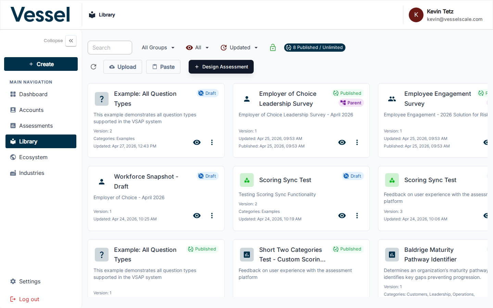
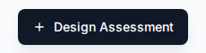

---
tags:
  - getting-started
  - library
  - assessment-design
---

# Step 2 — Design an Assessment

Before creating individual assessments, you need an assessment **template** in the Library. The Library is where you define the questions, scoring rules, and categories that all assessments of that type will use.

---

## Opening the Library

Click **Library** in the left sidebar.

---

## Creating a New Template

Click **+ Design Assessment** in the top-right corner.

The template editor opens. Give it a name, then add categories and questions.

---

## What Goes in a Template

| Element | Description |
|---|---|
| **Categories** | Top-level groupings (e.g., User Experience, Plan of Action) |
| **Questions** | Individual prompts within each category — supports multiple choice, rating scales, and more |
| **Scoring** | Define score zones: At Risk, Could Improve, Optimal |

---

## Using an Existing Template

If a template already exists that fits your needs, you can use it directly when [creating an assessment](create-assessment.md) — you do not need to create a new one.

---

## Next Step

[Step 3 — Create an Assessment](create-assessment.md){ .md-button }

[Full guide: Library](../library/index.md){ .md-button .md-button--secondary }

## Related

- [Library Overview](../library/index.md) — Assessment template management
- [Question Types](../library/question-types.md) — Supported question formats
- [Scoring Rules](../library/scoring.md) — Define score zones and thresholds
