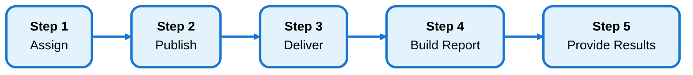

---
tags:
  - getting-started
  - onboarding
  - overview
---

# Getting Started

The **Vessel Smart Assessment Platform (VSAP)** helps you manage the full lifecycle of client assessments — from onboarding accounts and designing assessment templates, through the complete workflow of assigning, publishing, delivering, analyzing, and reporting on assessment results.

This quick-start guide walks you through everything you need to know. Start with the **Preparation** steps, then follow the **Workflow** steps that match what you'll see in the Assessment Details page.

---

## BEFORE YOU BEGIN — Preparation Steps

These two steps get your system ready before you start the assessment workflow.

### Preparation Step 1 — Add an Account

Create client organizations in the system. You can add accounts manually or invite external users to self-populate via the Intake Form.

[View Prep Step 1 — Add an Account](before-you-begin/add-account.md){ .md-button .md-button--primary }

**Key Topics:** Account setup, contacts, intake forms

---

### Preparation Step 2 — Design an Assessment

Create assessment templates in the Library with questions, categories, and scoring rules. Templates define the structure for all assessments of that type.

[View Prep Step 2 — Design an Assessment](before-you-begin/design-assessment.md){ .md-button }

**Key Topics:** Library templates, question types, scoring zones

---

## The Assessment Workflow — 5 Steps

Once your account and assessment template are ready, you'll work through these five steps for each assessment you create. These steps map directly to the **Assessment Workflow Guide** you'll see in the Assessment Details page.

---

### Workflow Step 1 — Assign Assessment

Create an assessment instance and assign it to an account. This is automatically done when you create a new assessment, so this step is typically already complete.

[View Step 1 — Assign Assessment](workflow/step-1-assign.md){ .md-button }

**Key Topics:** Creating assessments, account assignment

---

### Workflow Step 2 — Publish Assessment

Move the assessment from **Draft** to **In Progress** status. Make any final edits before publishing, then activate it to start collecting responses.

[View Step 2 — Publish Assessment](workflow/step-2-publish.md){ .md-button }

**Key Topics:** Assessment editing, publishing, status management

---

### Workflow Step 3 — Deliver Assessment

Share the assessment with respondents using direct links or anonymous survey links. Track response progress in real-time.

[View Step 3 — Deliver Assessment](workflow/step-3-deliver.md){ .md-button }

**Key Topics:** Sharing assessments, response tracking, anonymous links

---

### Workflow Step 4 — Build Report & Recommendations

Review assessment responses, create comprehensive reports, and generate recommendations for each category. Use AI suggestions to accelerate the process.

[View Step 4 — Build Report & Recommendations](workflow/step-4-build-report.md){ .md-button }

**Key Topics:** Response analysis, report builder, AI recommendations, category insights

---

### Workflow Step 5 — Provide Results

Close the assessment and share polished web reports and PDF reports with clients. Configure branding, templates, and access controls.

[View Step 5 — Provide Results](workflow/step-5-provide-results.md){ .md-button }

**Key Topics:** Report publishing, web reports, PDF reports, branding, sharing

---

## What's Next?

Once you've mastered the core workflow, explore these related features:

- [**Dashboards**](../dashboards/index.md) — View assessment activity and trends across all accounts
- [**Ecosystem View**](../ecosystem/index.md) — Compare performance across multiple accounts
- [**Impact Tracking**](../impact-tracking/index.md) — Manage action items and track impact metrics
- [**Settings**](../settings/index.md) — Configure intake forms, web reports, branding, and more
- [**Library**](../library/index.md) — Build and manage assessment templates
