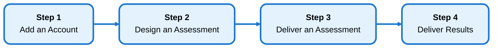

---
tags:
  - getting-started
  - onboarding
  - overview
---

# Getting Started

The **Vessel Smart Assessment Platform (VSAP)** helps you manage the full lifecycle of client assessments — from onboarding accounts and designing question templates, to delivering assessments, and publishing shareable web reports with findings, recommendations, solutions, priorities, and action timelines.

This quick-start guide walks you through the core workflow in four essential steps. Each step links to a dedicated page with screenshots and details. For deeper reference on any feature, use the main navigation menu above.

## The VSAP Lifecycle

---

## Step 1 — Add an Account

Create client organizations in the system. You can add accounts manually or invite external users to self-populate via the Intake Form.

[View Step 1 — Add an Account](creating-your-account.md){ .md-button .md-button--primary }

**Key Topics:** Account setup, contacts, intake forms

---

## Step 2 — Design an Assessment

Create assessment templates in the Library with questions, categories, and scoring rules. Templates define the structure for all assessments of that type.

[View Step 2 — Design an Assessment](design-assessment.md){ .md-button }

**Key Topics:** Library templates, question types, scoring zones

---

## Step 3 — Deliver an Assessment

Create assessment instances and share them with respondents. Collect responses via direct links or anonymous survey links.

[View Step 3 — Deliver an Assessment](deliver-assessment.md){ .md-button }

**Key Topics:** Creating assessments, sharing with respondents, tracking responses

---

## Step 4 — Deliver Results

Analyze responses using the Report Builder and publish polished web reports to share findings with clients.

[View Step 4 — Deliver Results](deliver-results.md){ .md-button }

**Key Topics:** Report builder, analyzing scores, web reports, branding

---

## What's Next?

Once you've mastered the core workflow, explore these related features:

- [**Dashboard**](../dashboard/index.md) — View assessment activity and trends across all accounts
- [**Ecosystem View**](../ecosystem/index.md) — Compare performance across multiple accounts
- [**Settings**](../settings/index.md) — Configure intake forms, web reports, branding, and more
- [**Library**](../library/index.md) — Build and manage assessment templates
