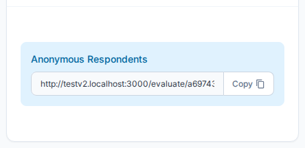

---
tags:
  - getting-started
  - assessments
  - share
  - respondents
---

# Step 4 — Send the Assessment to Respondents

Once the assessment is created, share it so respondents can submit their answers.

---

## The Share Links Card

On the Assessment Details page, scroll down to the **Share Assessments Link** card.

There are two ways to send the assessment:

### Anonymous Respondents

Copy the **Assessment Link** and share it however you like — email, chat, or your own portal. Anyone with the link can submit a response once the assessment is published.

### Direct Recipients

Click **+ Add** to send a unique, one-time link to a specific email address. Direct links are tied to that recipient and cannot be reused.

---

## Publishing the Assessment

The assessment must be set to **Published** status before respondents can submit responses. On the assessment detail page, change the status from the status dropdown in the header area.

---

## Tracking Responses

The assessment detail page shows **Total**, **Closed**, and **In Progress** counts so you can monitor participation in real time.

---

## Next Step

[Step 5 — Analyze Results](analyze-results.md){ .md-button }

[Full guide: Assessment Details](../assessments/details.md){ .md-button .md-button--secondary }

## Related

- [Assessment Details Reference](../assessments/details.md) — Full assessment management
- [Share Assessments](../assessments/details.md) — Respondent management and sharing options
