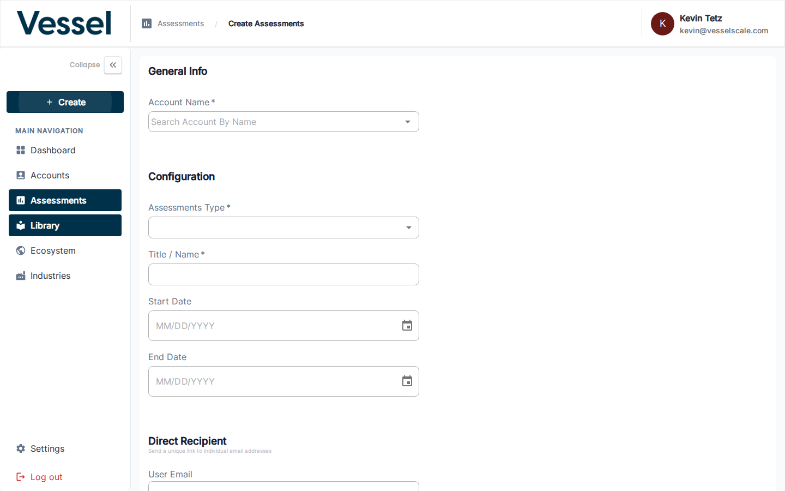

---
tags:
  - getting-started
  - workflow
  - assessments
  - create
  - assign
---

# Workflow Step 1 — Assign Assessment

Create an assessment instance by selecting an account and assessment template from your Library. When you create the assessment, it is automatically **assigned** to that account.

---

## Opening the Create Assessment Form

Click **Assign Assessment** in the sidebar under **Create** menu, or navigate to **Assessments → Create Assessment**.

---

## Form Fields

| Field | Description |
|---|---|
| **Account Name** | Search and select the account being assessed |
| **Assessment Type** | Choose the Library template to use for this assessment |
| **Title / Name** | A descriptive name for this assessment instance |
| **Start Date** | When the assessment opens for responses |
| **End Date** | When the assessment closes |
| **Direct Recipient** | Optional — a specific respondent's email address |

Click **Save** to create the assessment. You will be taken to the assessment detail page.

---

## What Happens After Assignment

Once created, your assessment:

✅ **Is assigned to the account** — The account name is now linked to this assessment  
✅ **Enters Draft status** — Assessment is ready for final edits before publishing  
✅ **Has a unique URL** — Ready to be shared once published  
✅ **Shows in the Assessment list** — Appears under Assessments in your sidebar  

---

## Next Step

[Workflow Step 2 — Publish Assessment](step-2-publish.md){ .md-button .md-button--primary }

---

## Related

- [Create Assessment Reference](../../assessments/create.md) — Detailed form fields and options
- [Assessment Details](../../assessments/details.md) — View and manage your assessment
- [Assessments Overview](../../assessments/index.md) — Assessment management guide
