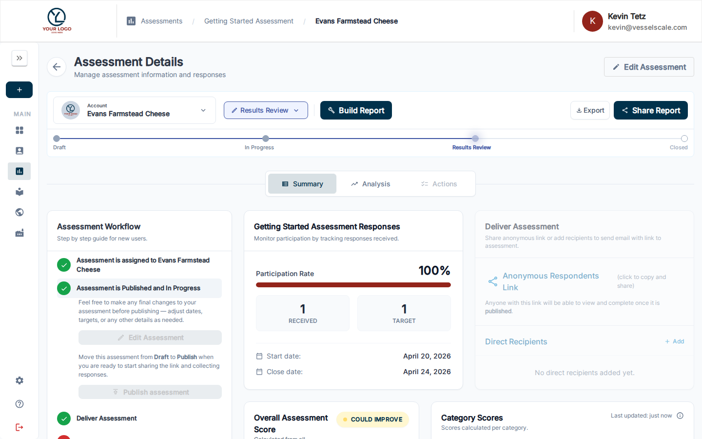
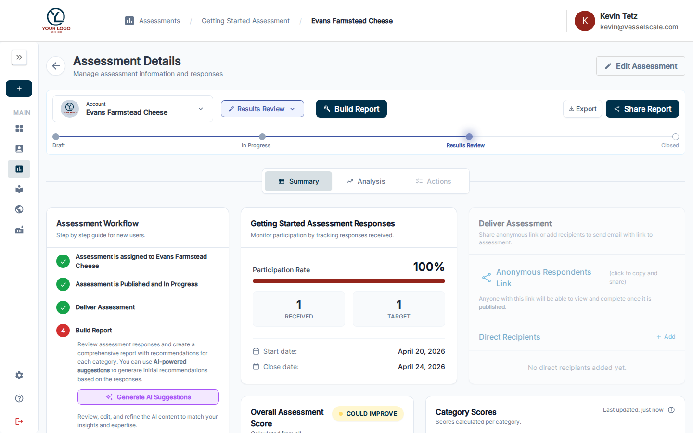

---
tags:
  - getting-started
  - workflow
  - publish
  - assessment-status
---

# Workflow Step 2 — Publish Assessment

Before you can start collecting responses from respondents, you must move your assessment from **Draft** status to **In Progress** status by publishing it.

## When to Publish

Once you've created an assessment and made any necessary edits to the questions, categories, scoring thresholds, dates, and other settings, you're ready to publish.

**Make any final changes before publishing:**
- Review assessment dates (start and end dates)
- Verify all questions and scoring rules
- Check any custom settings or branding

## How to Publish

You can publish your assessment in two ways:

### Method 1: From the Assessment Details Page

1. Navigate to **Assessments** in the sidebar
2. Click on the assessment you want to publish
3. Look for the **Assessment Workflow Guide** card on the Summary tab

4. In the **Publish** step (Step 2), click the **Edit** button to make final changes if needed
5. Click **Publish Assessment** to move it to In Progress status

The assessment status will change from **Draft** to **In Progress**, and you'll be able to start sharing it with respondents.

### Method 2: From the Assessment Edit Page

1. Open the assessment in edit mode
2. Make any final changes you need
3. Click **Publish** to move to In Progress status

## After Publishing

Once your assessment is published:

✅ **You can start collecting responses** — Share the assessment link with respondents  
✅ **Response tracking is enabled** — Monitor the number of responses in real-time  
✅ **The next step unlocks** — Move to [Step 3 — Deliver Assessment](step-3-deliver.md) to share with respondents  

## What's Next?

Once you've published your assessment, proceed to **[Step 3 — Deliver Assessment](step-3-deliver.md)** to learn how to share it with respondents and track responses.

---

**Key Concepts:**
- **Draft** status = assessment is being edited, not yet accepting responses
- **In Progress** status = assessment is published and actively collecting responses
- Publishing is a one-way action (you cannot unpublish an assessment, but you can pause response collection by closing it)

