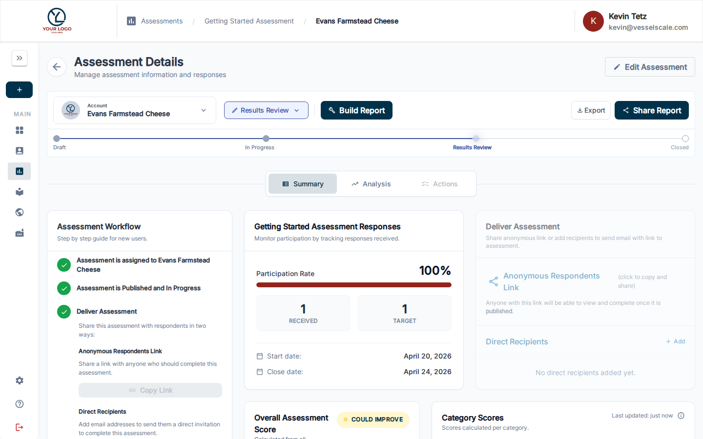

---
tags:
  - getting-started
  - workflow
  - assessments
  - share
  - respondents
  - delivery
---

# Workflow Step 3 — Deliver Assessment

Once your assessment is published, share it with respondents to start collecting their responses.

---

## Sharing Your Assessment

On the Assessment Details page, scroll down to the **Assessment Delivery** section or look for the **Deliver Assessment** card in the Workflow Guide.

There are two ways to share the assessment:

### Anonymous Survey Link

Copy the **Assessment Link** and share it however you like — email, chat, or your organization's portal. Anyone with the link can submit a response once the assessment is published and not closed.

**Best for:** Open, broad-based feedback

### Direct Recipients

Click **+ Add Recipient** to send a unique, personalized link to a specific email address. Direct links are tied to that recipient and track which person submitted each response.

**Best for:** Individual feedback, specific people you need to assess

---

## Before You Share

✅ **Assessment must be Published** — Status must be **In Progress** (done in Step 2)  
✅ **Assessment must be Open** — The current date must be between the start and end dates  
✅ **Recipients are ready** — Add any specific respondents if using direct links  

---

## Tracking Responses

The assessment detail page shows real-time response counts:
- **Total Responses** — How many responses you've received
- **Response Status** — In Progress vs. Completed
- **Respondent List** — See who has responded (for direct recipients)

---

## Pausing or Stopping Collection

To stop collecting responses before the end date, you can **close** the assessment from the Assessment Details page. Once closed, no new responses can be submitted.

---

## Next Step

[Workflow Step 4 — Build Report & Recommendations](step-4-build-report.md){ .md-button .md-button--primary }

---

## Related

- [Assessment Details Reference](../../assessments/details.md) — Full assessment management
- [Respondent Management](../../assessments/details.md) — Adding and tracking respondents
- [Anonymous Links](../../assessments/details.md) — Sharing without collecting names
