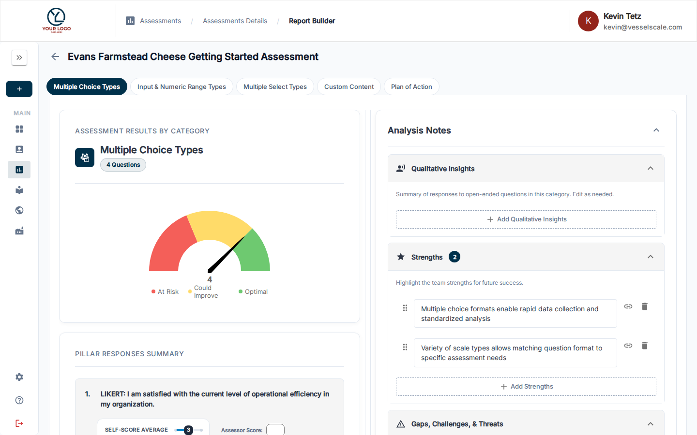

---
tags:
  - getting-started
  - workflow
  - assessments
  - reports
  - analysis
  - recommendations
  - ai
---

# Workflow Step 4 — Build Report & Recommendations

Once you've collected assessment responses, analyze them and create a comprehensive report with recommendations for each category.

---

## When to Build Your Report

- At least one respondent has submitted their response
- Assessment status is **Results Review**
- You've reviewed the responses and are ready to document your analysis

---

## Opening the Report Builder

From the Assessment Details page:

1. Look for the **Build Report** step in the **Assessment Workflow Guide** card
2. Click **Review in Analysis Tab** or navigate to the **Analysis** tab

---

## Using AI to Generate Recommendations

The Workflow Guide offers AI-powered suggestions to accelerate your analysis:

1. In Step 4 of the Workflow Guide, click **Generate Recommendations** (sparkle icon)
2. The AI will:
   - Analyze all responses
   - Identify patterns and trends
   - Generate initial recommendations for each category
3. Review and edit the AI-generated content to match your expertise and insights

!!! tip "Make it Your Own"
    AI generates a starting point — review, edit, and refine the recommendations to reflect your professional judgment and knowledge of the client.

---

## Manual Analysis Process

In the Report Builder, review each category:

| Element | Description |
|---------|-------------|
| **Category Score** | Gauge chart showing the score and performance zone (At Risk / Could Improve / Optimal) |
| **Question Responses** | Summary of how respondents answered each question |
| **Strengths** | What the client is doing well |
| **Gaps & Challenges** | Areas for improvement |
| **Root Causes** | Why these gaps exist |
| **Qualitative Insights** | Summary of open-ended question responses |
| **Plan of Action** | Specific next steps and recommendations |

---

## Building Category Recommendations

For each category, document:

1. **Strengths** — What's working well based on the responses
2. **Gaps & Challenges** — Areas where performance lags
3. **Root Causes** — Why these gaps exist
4. **Plan of Action** — Specific recommendations and next steps

---

## Moving to Results Review

When your assessment reaches **Results Review** status:

✅ **All responses are locked** — No new responses can be submitted  
✅ **Report Builder is available** — You can now add recommendations  
✅ **Next step: Close & Share** — Once complete, close the assessment and publish results  

---

## Next Step

[Workflow Step 5 — Provide Results](step-5-provide-results.md){ .md-button .md-button--primary }

---

## Related

- [Report Builder Reference](../../assessments/report-builder.md) — Detailed analysis tools
- [Assessment Scoring](../../assessments/scoring.md) — Understand score calculations
- [PDF Reports](../../assessments/pdf-reports.md) — Export findings as PDF
- [Web Reports](../../assessments/report-builder.md) — Share interactive reports with clients
