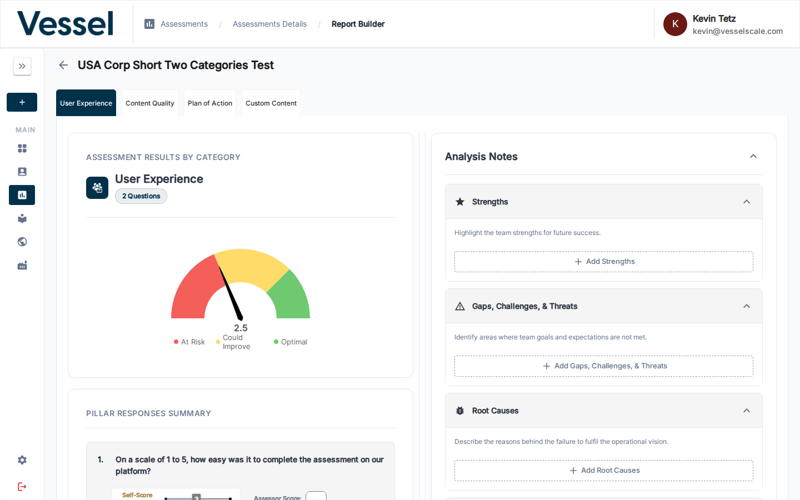

---
tags:
  - getting-started
  - workflow
  - assessments
  - reports
  - results
  - web-reports
  - pdf-reports
---

# Workflow Step 5 — Provide Results

Close the assessment and share your findings with the client using web reports and PDF reports. This is the final step of the assessment workflow.

---

## What You'll Do in This Step

1. **Close the Assessment** — Move from Results Review to Closed status
2. **Create Web & PDF Reports** — Generate shareable reports with findings
3. **Share Results** — Publish reports and share links with clients

---

## Closing Your Assessment

Once you've finished building recommendations and analysis:

1. Navigate to the **Assessment Details** page
2. In the **Assessment Workflow Guide**, look for **Step 5 — Provide Results**
3. Click **Close Assessment** or use the status dropdown to change the status to **Closed**

Once closed:
- ✅ Assessment moves to final status
- ✅ No new responses can be submitted
- ✅ Reports are ready to be generated and shared
- ✅ Assessment appears in historical records

---

## Creating a Web Report

### What is a Web Report?

A **Web Report** publishes your assessment findings as a branded, interactive web page that clients can view in their browser. It includes:

- Visual charts and gauges for each category
- Your documented analysis and recommendations
- Custom branding (logo, colors, styling)
- Responsive design that works on all devices

### How to Create a Web Report

From the Assessment Details page:

1. Click the **Share** button in the action bar
2. Select **Web Report** from the options
3. Choose a report template (or create a new one in Settings)
4. Review the preview
5. Click **Publish**

A shareable URL is generated that you can send to the client.

[Full guide: Web Reports](../../settings/web-reports.md){ .md-button }

---

## Creating a PDF Report

### What is a PDF Report?

A **PDF Report** exports your assessment findings as a professionally formatted PDF document that can be downloaded, printed, and archived. It includes all the same content as the web report in a portable format.

### How to Create a PDF Report

From the Assessment Details page:

1. Click **PDF** in the action bar
2. Choose a PDF report template
3. Review the preview
4. Click **Download** or **Send**

[Full guide: PDF Reports](../../assessments/pdf-reports.md){ .md-button }

---

## Sharing Results with Clients

You can share reports through multiple channels:

| Method | Best For |
|--------|----------|
| **Web Report Link** | Interactive viewing, quick sharing via email or chat |
| **PDF Download** | Archiving, printing, offline access |
| **Client Portal** | Self-service access if clients have portal login |
| **Email** | Direct delivery with automatic notifications |

---

## Configuring Report Templates

To create custom report templates:

1. Navigate to **Settings** in the sidebar
2. Go to **Web Reports** or **PDF Reports**
3. Click **+ Create Report Template**
4. Configure:
   - **Template Name** — Descriptive name for this template
   - **Sections** — Choose which content to display
   - **Branding** — Add logo, colors, custom styling
   - **Content** — Select analysis notes, scores, insights to include

[Full guide: Web Report Settings](../../settings/web-reports.md){ .md-button }
[Full guide: PDF Report Settings](../../settings/pdf-reports.md){ .md-button }

---

## After Providing Results

✅ **Assessment is Closed** — All data is finalized  
✅ **Reports Published** — Results are shared with clients  
✅ **Historical Record Created** — Assessment appears in your assessment history  
✅ **Next Assessment Ready** — Create a new assessment for the next evaluation cycle  

---

## Related

- [Assessment Details Reference](../../assessments/details.md) — Full assessment management
- [Web Reports](../../settings/web-reports.md) — Create and manage web report templates
- [PDF Reports](../../settings/pdf-reports.md) — Configure PDF report templates
- [Report Builder](../../assessments/report-builder.md) — Edit analysis and recommendations
- **Recommendations** — Your suggested plan of action
- **Branded Design** — Your logo, colors, and custom styling
- **Professional Layout** — Easy-to-read, mobile-friendly format

---

## Going Deeper

Once you've published your first web report, explore these additional features:

- [Configure Web Report Templates](../settings/web-reports.md) — Create and manage report designs
- [PDF Reports](../assessments/pdf-reports.md) — Export findings as a downloadable PDF
- [Branding Settings](../settings/branding.md) — Customize all reports with your logo and colors
- [Assessment Scoring Details](../assessments/scoring.md) — Understand score calculations
- [Report Builder Reference](../assessments/report-builder.md) — Detailed analysis tools and options

---

## Optional: Explore Additional Features

After mastering the four-step workflow, you can explore:

- **[Dashboard](../dashboard/index.md)** — View assessment activity and trends across all accounts
- **[Ecosystem View](../ecosystem/index.md)** — Compare performance across multiple accounts
- **[Settings](../settings/index.md)** — Configure intake forms, web reports, branding, and more
- **[Library](../library/index.md)** — Build and manage assessment templates

---

## Related

- [Report Builder Reference](../assessments/report-builder.md) — Detailed analysis tools
- [Web Reports Reference](../settings/web-reports.md) — Template creation and management
- [Assessment Scoring](../assessments/scoring.md) — Understand score calculations
- [PDF Reports](../assessments/pdf-reports.md) — Export findings as PDF
- [Branding](../settings/branding.md) — Customize report appearance and colors