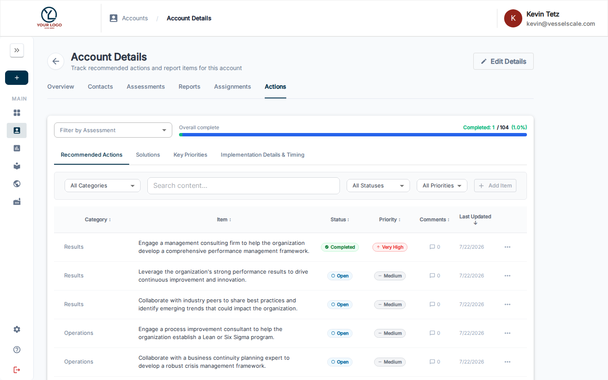

# Impact Tracker

The Impact Tracker is a comprehensive system for managing action items and tracking their impact on your assessment ecosystem. It enables seamless handoff of assessment findings into actionable improvement initiatives with built-in collaboration tools and impact measurement.

## What you can do here

- View and manage all action items from assessments
- Track action item status and priority
- Record impact metrics and business outcomes
- Collaborate with team members and clients via comments
- Visualize impact data on the Directors Dashboard
- Filter and search actions by assessment, account, or category

## Key Concepts

### Action Item Lifecycle

**1. Creation — Actions Copied After Assessment Close**

When an assessment is marked as closed, VSAP automatically creates action items for findings identified during the assessment. This ensures:
- No insights are lost when assessments complete
- All recommendations flow into a trackable system
- Action items are pre-populated with assessment context

**2. Status Management & Prioritization**

Each action item can be assigned:
- **Status** — Open, In Progress, Complete, or Won't Do
- **Priority** — Low, Medium, High, or Critical
- **Owner** — Assigned account executive, manager, or team member

**3. Impact Metrics Recording**

Once actions are in progress or completed, track their business impact:
- Quantifiable metrics (cost savings, efficiency gains, etc.)
- Qualitative outcomes (improvements in capability, customer satisfaction, etc.)
- Timeline to completion
- Risk mitigation achieved

### Impact Aggregation for Directors Dashboard

Impact data flows into the [Directors Dashboard](../dashboard/directors-dashboard.md) for executive visibility:
- Aggregate impact metrics across all action items
- Ecosystem-level impact trends and patterns
- ROI on improvement initiatives
- Success rate tracking

## Accessing the Impact Tracker

The Impact Tracker is available from:
1. **Main Navigation** — Click **Impact Tracker** in the sidebar
2. **Assessment Details** — Click the **Impact Tracker** tab on any closed assessment
3. **Directors Dashboard** — Drill into impact metrics cards

## User Roles & Collaboration

### For Account Executives
- Create and assign action items after assessment close
- Update status and priority
- Record impact metrics
- Monitor all actions across their accounts
- Add comments and notes for collaboration

### For Clients
- View action items related to their organization
- Update status on assigned actions
- Add comments and feedback
- Track progress toward goals
- See impact metrics related to their improvements

### For Directors & Leadership
- View aggregated impact metrics across the entire ecosystem
- Identify trends and high-impact initiatives
- Access analytics on action item completion rates
- Export impact data for strategic planning

## Working with Action Items

### Creating Actions

Actions are typically created automatically when assessments close, but you can also:
1. Create standalone actions from the Impact Tracker
2. Link actions to specific assessment findings
3. Assign to accounts and responsible parties
4. Set initial priority and timeline

### Updating Impact Metrics

Record the real-world outcomes of actions:

1. Open an action item
2. Go to the **Impact Metrics** section
3. Enter:
   - **Quantifiable outcomes** (e.g., cost savings, time saved)
   - **Qualitative improvements** (e.g., capability improvements)
   - **Completion date** and **time to complete**
   - **Supporting documentation** or evidence

### Collaboration Features

Add comments and updates throughout an action's lifecycle:
- Internal notes for your team
- Client-facing updates on progress
- Status change notifications
- Impact metric validations

## Filtering & Searching

Use powerful filtering to find relevant actions:
- **By Assessment** — All actions from a specific assessment
- **By Account** — All actions for a client organization
- **By Status** — Open, In Progress, Complete, Won't Do
- **By Priority** — Filter high-priority items needing attention
- **By Category** — Group by assessment category or business area
- **By Timeline** — Find overdue or upcoming actions

## Permissions & Visibility

- **Account Executives** — Can see all actions for their assigned accounts
- **Client Users** — Can see only actions related to their organization
- **Directors** — Can see all actions and impact metrics (read-only or edit depending on role)
- **Admins** — Full access to all actions across the system

## Best Practices

- **Timely Entry** — Create action items immediately when assessments close
- **Clear Ownership** — Always assign specific owners to action items
- **Regular Updates** — Update status and metrics at least monthly
- **Evidence Collection** — Document impact with supporting data
- **Client Communication** — Keep clients informed of action progress via comments
- **Leadership Review** — Present impact metrics to leadership quarterly

## Related

- [Assessment Details](../assessments/details.md)
- [Assessment Closure](../assessments/details.md#assessment-closure)
- [Directors Dashboard](../dashboard/directors-dashboard.md)
- [Collaboration & Comments](collaboration.md)
- [Impact Metrics Guide](metrics.md)
