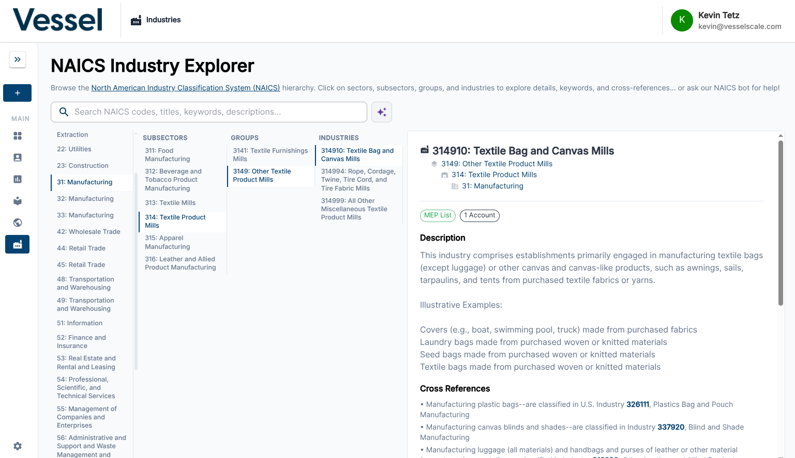

# Industries

The Industries page (NAICS Explorer) lets you browse and explore the North American Industry Classification System (NAICS) codes associated with your accounts and ecosystem.

## What you can do here

- Search and browse NAICS codes
- See which accounts belong to each industry classification
- Understand industry distribution across your ecosystem

## NAICS Explorer

The Industries page provides a hierarchical view of all NAICS industry classifications represented in your data. This interface displays how your accounts and ecosystem entities are distributed across different industry sectors and subsectors. You can navigate the classification hierarchy, see how many organizations fall into each category, and use this information to understand your business portfolio and identify industry-specific trends or gaps.

## About NAICS Codes

NAICS (North American Industry Classification System) codes are six-digit codes used to classify businesses by industry. They are used throughout VSAP to categorize accounts and filter ecosystem data.

## Related

- [Ecosystem](../ecosystem/index.md)
- [Accounts](../accounts/index.md)
