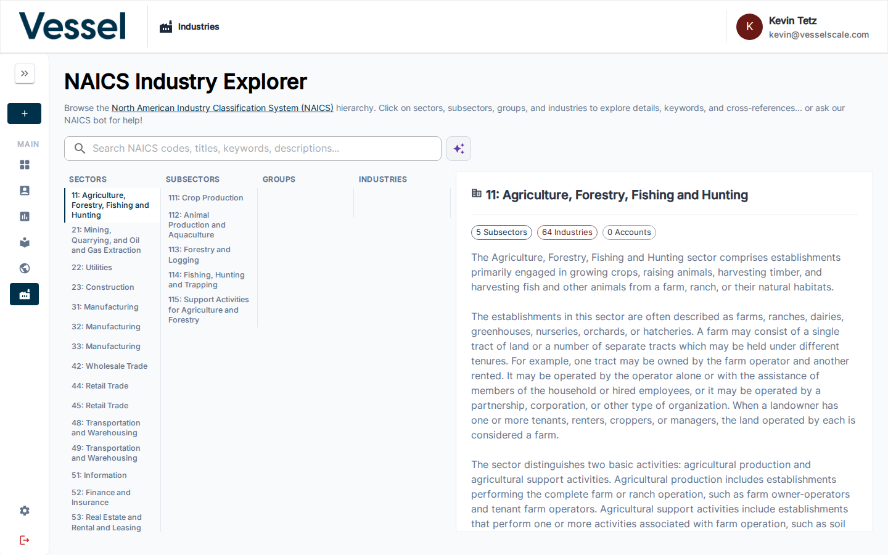
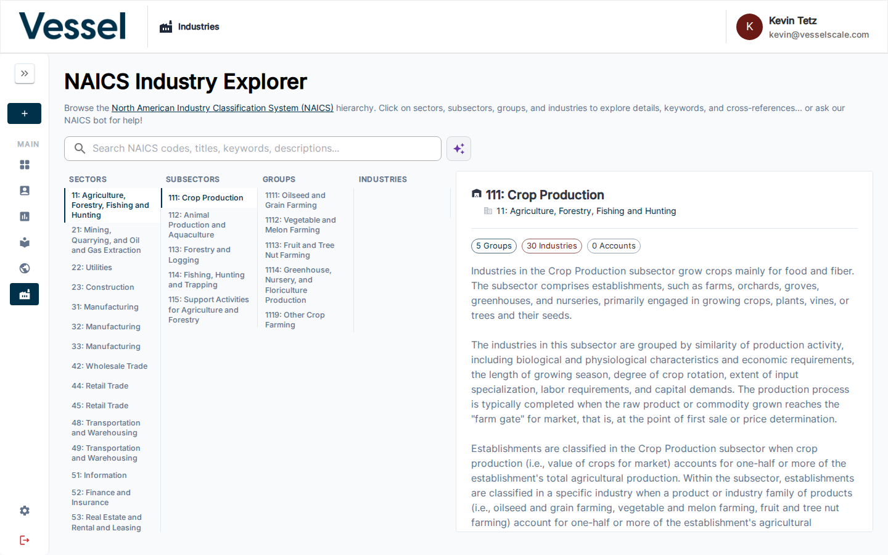
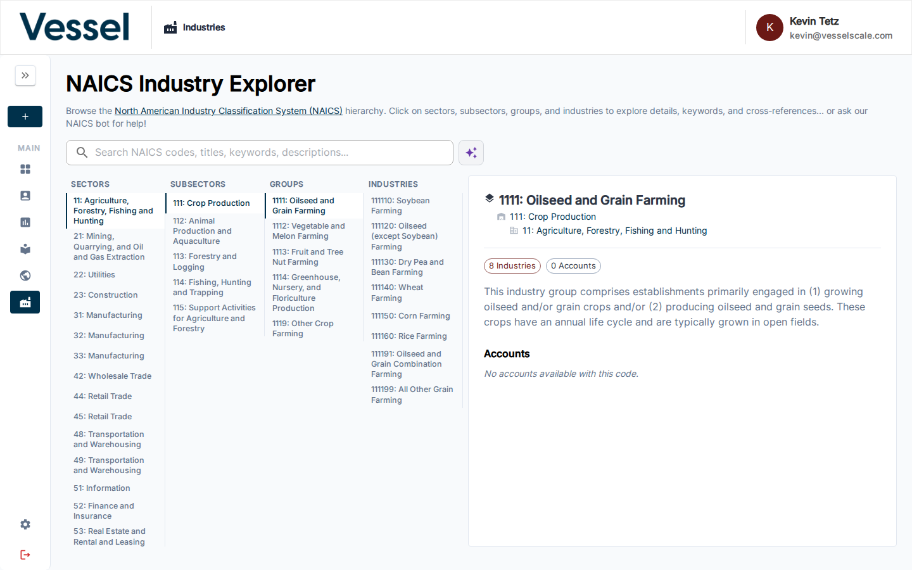
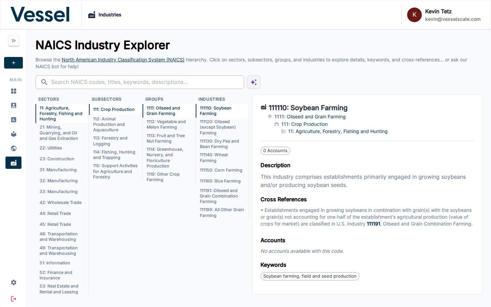

# Industries

The Industries page (NAICS Explorer) lets you browse and explore the North American Industry Classification System (NAICS) — the standard used to classify businesses by industry across the United States, Canada, and Mexico.


---

## The NAICS Hierarchy

NAICS codes are organized into four nested levels, from broad economic sectors down to specific industries. Every six-digit code an Account is assigned maps to all four levels simultaneously, which means data can be aggregated at any level.

```
Sector (2-digit)
  └── Subsector (3-digit)
        └── Group (4-digit)
              └── Industry (6-digit)
```

### Sectors

Sectors are the broadest classification — 20 major divisions of the economy identified by a **2-digit code** (e.g., `31`–`33` Manufacturing, `54` Professional Services).



Clicking a Sector shows:

- A description of the economic division
- The list of Subsectors it contains
- Cross-references to related NAICS codes

**Platform use:** Sector-level groupings appear in dashboard charts and pivot tables, letting you compare aggregate performance (average scores, company counts, sizes) across major economic categories.

---

### Subsectors

Subsectors narrow the Sector into more focused industry areas using a **3-digit code** (e.g., `311` Food Manufacturing, `332` Fabricated Metal Product Manufacturing).



Clicking a Subsector shows:

- A description of the industry cluster
- The Groups it contains
- Cross-references and related terminology

**Platform use:** Subsector-level filtering is available in the Ecosystem Map and dashboard pivot tables, enabling analysis of a specific manufacturing cluster or service area without needing to know every individual NAICS code.

---

### Groups

Groups are the third level, identified by a **4-digit code** (e.g., `3112` Grain & Oilseed Milling, `3321` Forging & Stamping). A Group typically represents a distinct production process or product category within a Subsector.



Clicking a Group shows:

- A detailed description of the production or service type
- The Industries (6-digit codes) it contains
- Any applicable keywords and cross-references

**Platform use:** Groups provide a mid-level aggregation point. When accounts share a Group code prefix, they can be grouped together in reports and dashboard charts even if their exact 6-digit codes differ.

---

### Industries

Industries are the most specific level — **6-digit codes** that identify a precise type of business activity (e.g., `311211` Flour Milling, `332111` Iron and Steel Forging).



Clicking an Industry shows:

- The official NAICS definition and scope
- A list of **Accounts in your ecosystem** assigned this code, with their city/state location
- Keywords and illustrative examples
- Cross-references to related codes

**Platform use:** The 6-digit code is what gets assigned to an Account (via the intake form's Industry Type page or manually on the Account details page). All four levels of the hierarchy are automatically implied by that code.

---

## How Industries Flow Through the Platform

Assigning a NAICS code to an Account unlocks industry-aware features throughout the platform:

| Feature | How industry data is used |
|---|---|
| **Dashboard — Business Size by NAICS Sector** | Groups all accounts by their 2-digit Sector and plots company size distribution per sector |
| **Dashboard — Average Score by NAICS** | Aggregates assessment scores at the Sector or Subsector level for benchmarking |
| **Dashboard Pivot Table** | Allows pivoting by Sector, Subsector, Group, or full Industry code |
| **Ecosystem Map** | Filter the map by NAICS Sector or Subsector to visualize geographic concentration |
| **Intake Form — Industry Type page** | Lets a submitting company select their 6-digit code; the result is stored on their Account |
| **Web Reports** | Dynamically populate report content based on the account's industry classification |
| **Settings → Custom Data → NAICS** | Admins control which codes are active and which are flagged for MEP programs |

---

## Searching

Use the search bar at the top of the page to find codes by title, keyword, or description. Results filter all four columns simultaneously, highlighting only the matching branches of the hierarchy.

The **AI assistant** (spark icon) can help you find the right code if you describe a business in plain language — it will suggest the most appropriate NAICS classification.

---

## Related

- [Ecosystem](../ecosystem/index.md)
- [Accounts](../accounts/index.md)
- [Dashboard](../dashboard/index.md)
- [Settings → Custom Data](../settings/custom-data.md)
- [Settings → Intake Forms](../settings/intake-forms.md)
