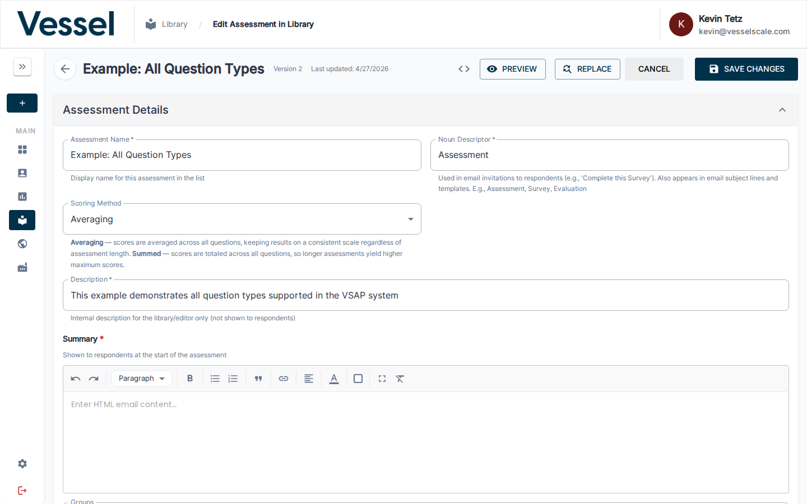
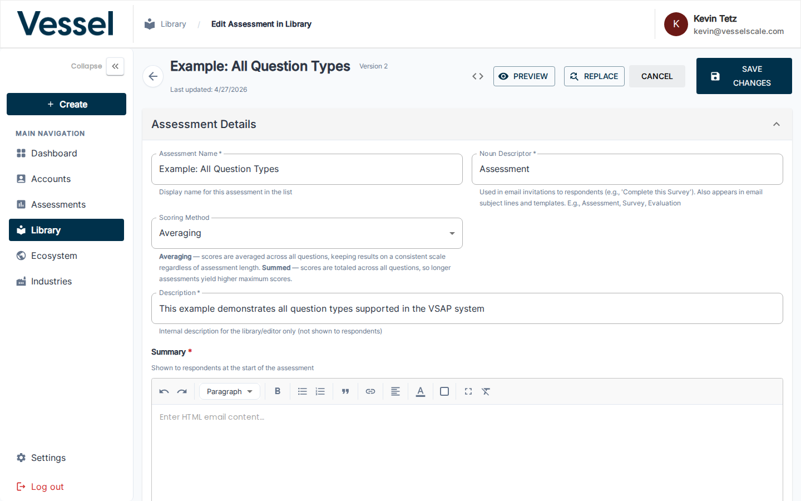
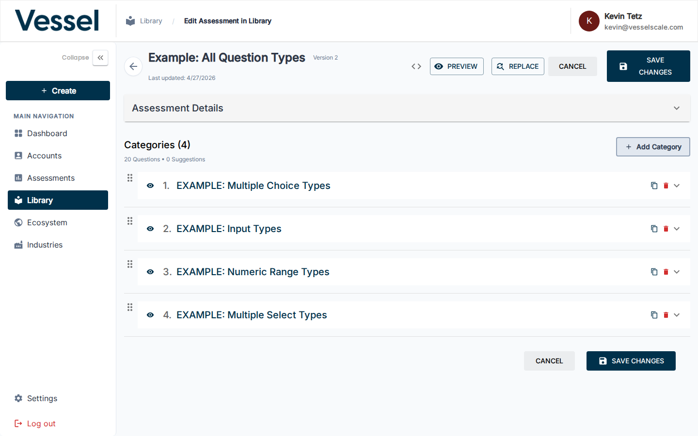
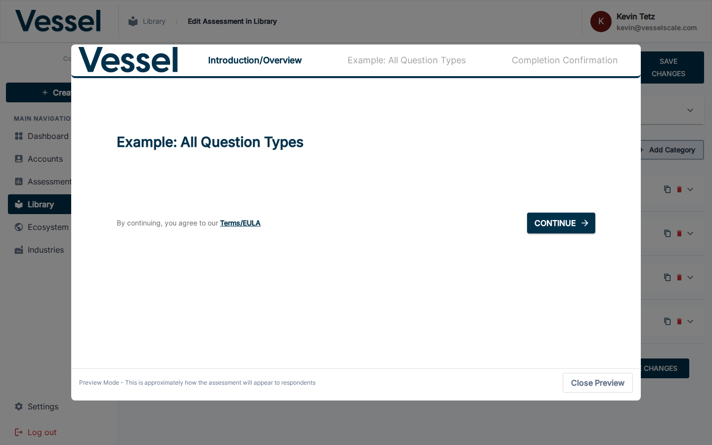
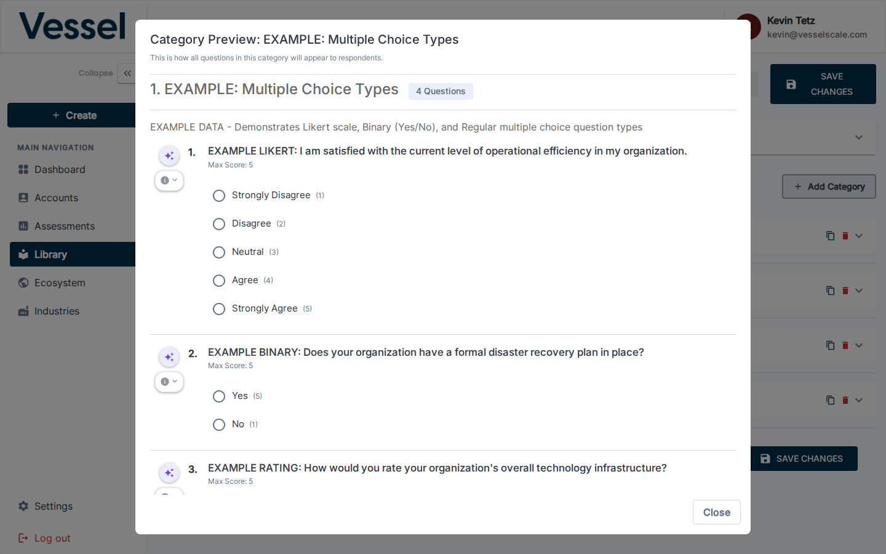

# Edit Assessment Definition

The Assessment Editor is the primary workspace for building and managing assessment definitions. This is one of the most important pages in the platform — from here you define every question, category, scoring rule, and piece of feedback that powers evaluations across the entire system.

## What you can do here

- Add, edit, reorder, and delete questions
- Organize questions into categories with descriptions
- Configure scoring sections with strengths, root causes, solutions, and recommendations
- Preview the full assessment, a single category, or check how the editor looks at a glance
- Find-and-replace text across the entire assessment at once
- Undo/redo changes freely before saving
- Save your changes or cancel to revert

## Editor Overview

The editor loads the full assessment in a single scrollable layout. The toolbar at the top contains the key action buttons — **PREVIEW**, **REPLACE**, **CANCEL**, and **SAVE CHANGES** — always visible as you work.

The toolbar provides one-click access to all major actions. The sidebar panel on the left can be expanded for navigation.

## Assessment Details

The **Assessment Details** accordion at the top of the editor lets you set the assessment name, description, summary, icon, and other top-level metadata. Expand it to edit these fields.

## Scoring Sections

Below the assessment details, each category has a **Scoring Section** panel. This is where you define what the score means for respondents. Each scoring tier (e.g. *At Risk*, *Could Improve*, *Optimal*) can contain:

- **Strengths** — what the respondent is doing well
- **Root Causes** — why they may be in this range
- **Solutions** — specific things to address
- **Recommended Actions** — concrete next steps

The **Scoring Section Feedback** accordion shows AI-generated suggestions for improving your scoring content. Use the **SYNC SCORING** button to pull in updated suggestions.

## Categories

All categories are listed in order at the bottom of the editor. Each category shows its name and the number it holds. You can reorder them by dragging, add new ones with **Add Category**, or use the action buttons on each row to **preview**, **copy**, or **delete** the category.

Expanding a category reveals all of its questions and the full editing interface for that section.

---

## Preview Functionality

The editor provides two levels of preview so you can see exactly how respondents will experience your assessment before publishing.

### Preview the Full Assessment

Click the **PREVIEW** button (`VisibilityIcon`) in the top toolbar to open a full-screen modal showing the entire assessment exactly as a respondent would see it — all categories, all questions, in order.

Scroll through the preview to review every question and response option. This is the recommended final check before saving or publishing.

**How to access:** Click `PREVIEW` in the top toolbar (labeled **Preview Assessment**).

---

### Preview a Single Category

Each category row has a dedicated **Preview category questions** button (`VisibilityIcon`). Clicking it opens a modal showing only the questions in that category.

Use this to quickly verify a specific section without scrolling through the full assessment.

**How to access:** In the categories list, click the eye icon (`👁`) on the category row you want to preview.

---

!!! tip "Preview early and often"
    Use category preview as you build each section to catch wording issues and layout problems immediately. Run a full assessment preview before every save to ensure the complete flow makes sense.

!!! warning "Impact on existing evaluations"
    Changes to a published assessment definition may affect in-progress evaluations. Review all changes carefully before clicking **SAVE CHANGES**.

!!! tip "Use Find & Replace for bulk edits"
    The **REPLACE** button lets you find and replace specific text across every question, description, and scoring section in one pass — ideal when rebranding or correcting a repeated term.

---

## Related

- [Library](index.md)
- [Create Assessment](create.md)
- [Question Types](question-types.md)
- [Scoring](scoring.md)
