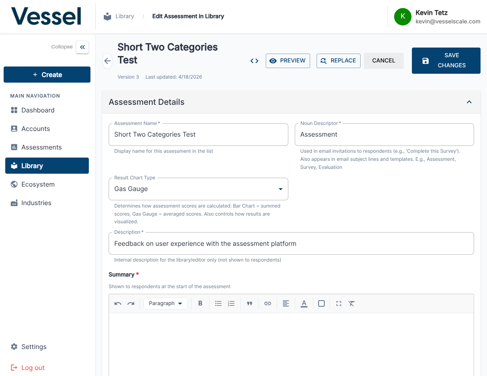
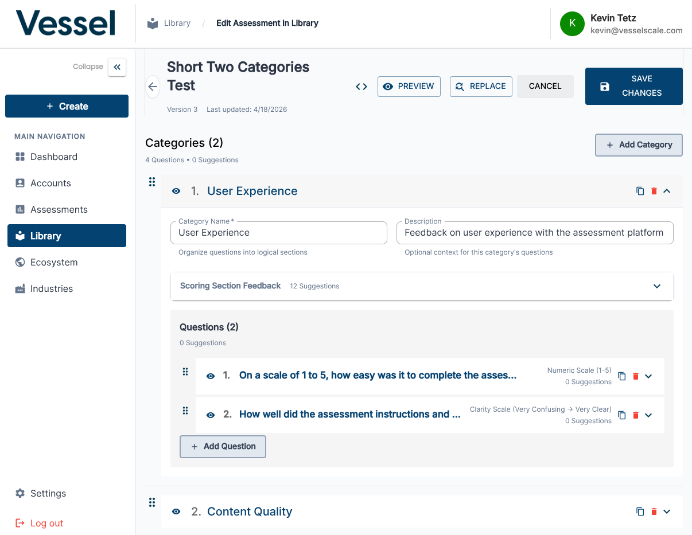

# Edit Assessment Definition

Modify an existing assessment definition in the Library.

## What you can do here

- Update questions, sections, and scoring rules
- Manage versions of the assessment
- Preview changes before publishing

## Assessment Editor

The Assessment Editor is where you build and modify assessment definitions. This interface provides tools to add questions, organize content into logical sections, set up scoring rules, and configure how the assessment behaves. The editor uses a visual interface to make it easy to structure complex assessments without requiring technical knowledge.

## Category Management

Assessment definitions are organized into categories and sections. This view shows how to manage those organizational structures, allowing you to group related questions and create logical flows through the assessment. Proper categorization improves the user experience when completing evaluations and makes reports more meaningful and organized.

## Notes

!!! warning "Impact on existing evaluations"
    Editing a published assessment definition may affect existing evaluations that use it. Review changes carefully before saving.

## Related

- [Library](index.md)
- [Create Assessment](create.md)
