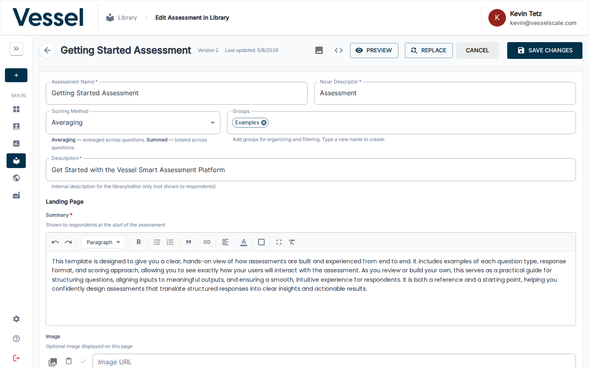
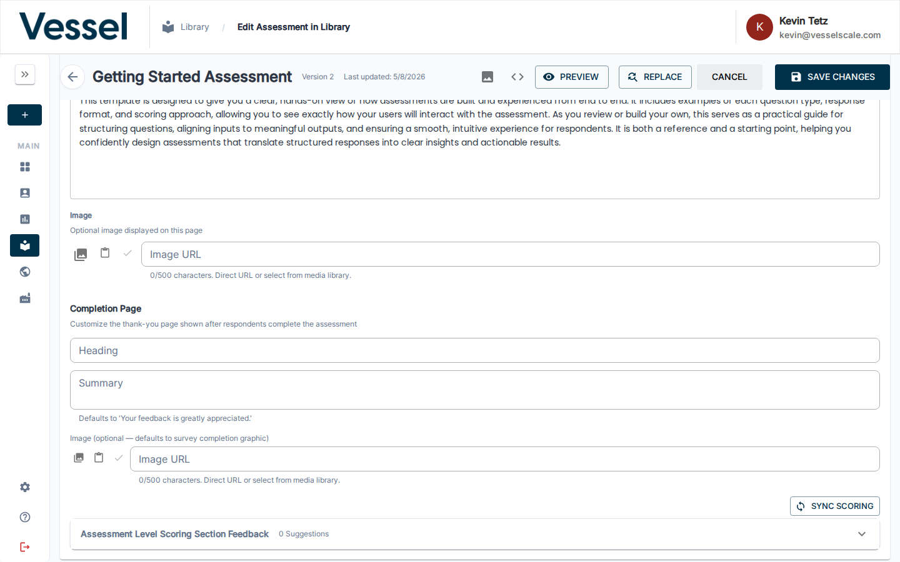
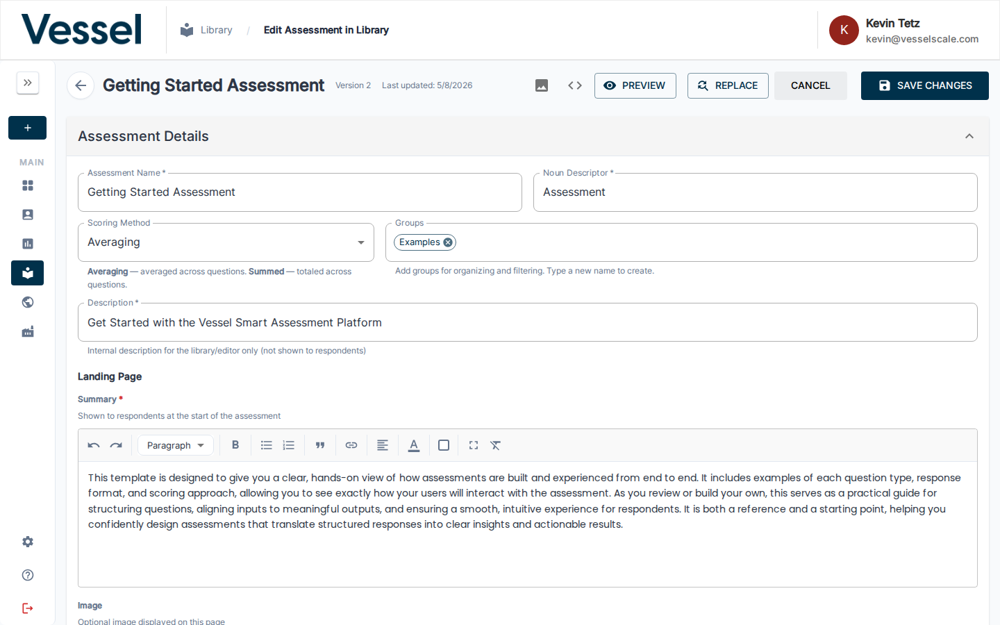
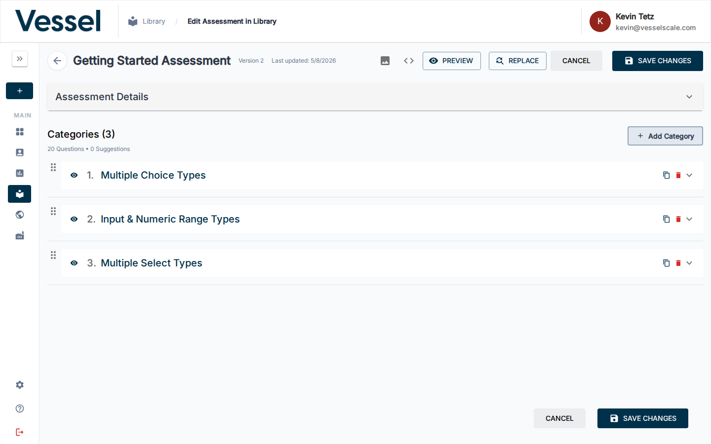
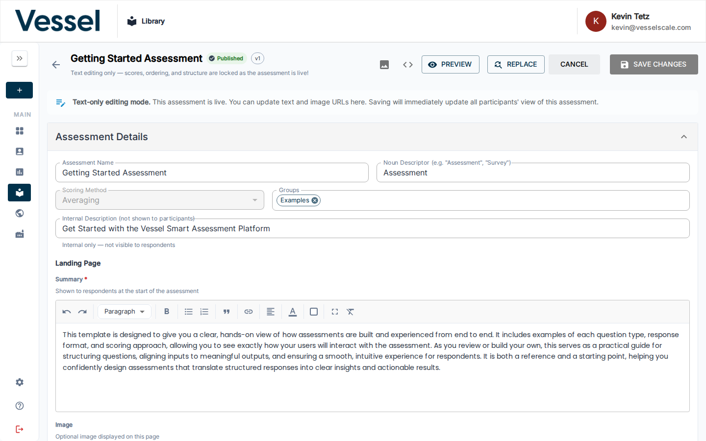
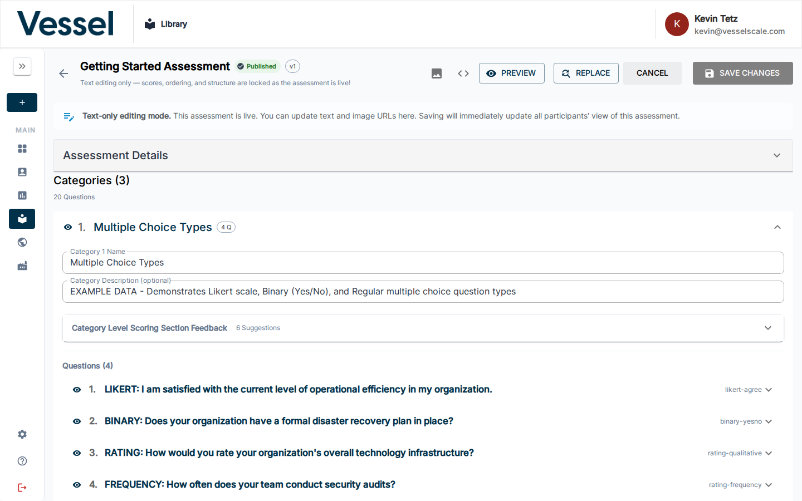
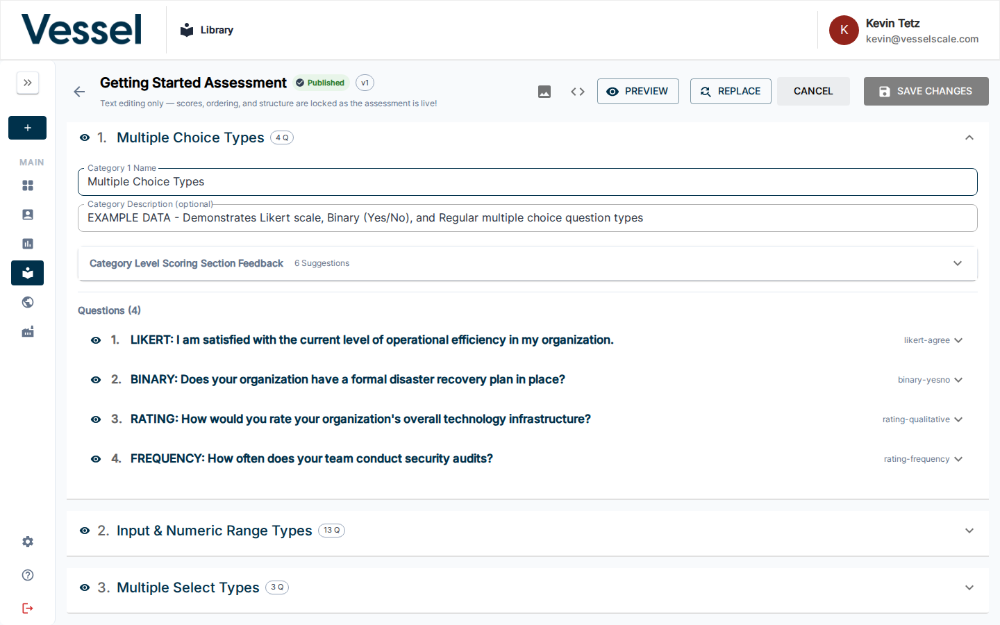
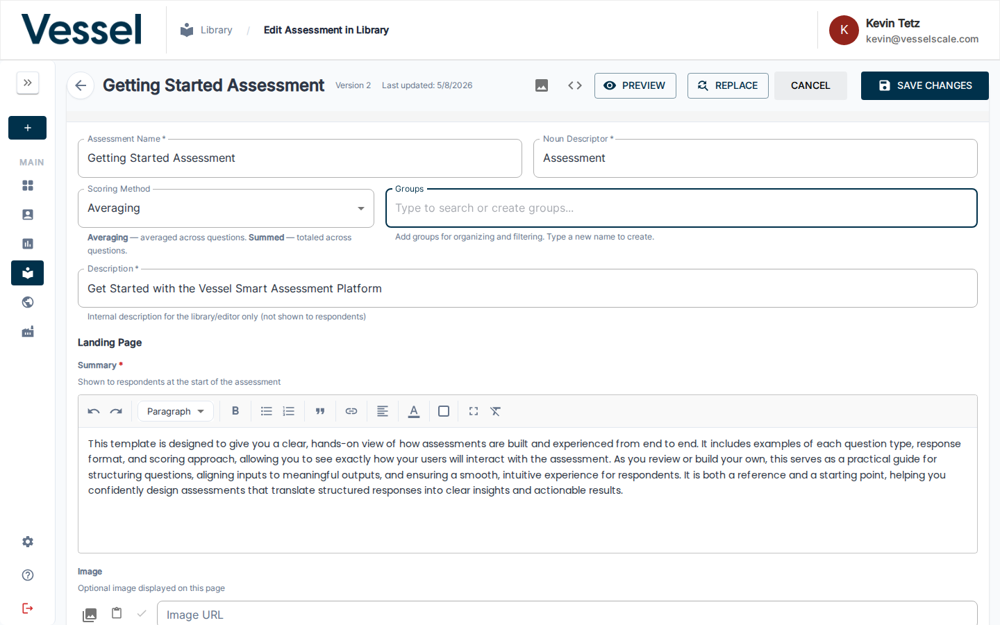

# Edit Assessment Definition

The Assessment Editor is the primary workspace for building and managing assessment definitions. This is one of the most important pages in the platform — from here you define every question, category, scoring rule, and piece of feedback that powers evaluations across the entire system.

## What you can do here

- Add, edit, reorder, and delete questions
- Organize questions into categories with descriptions
- Configure landing page and completion page messages with optional images
- Set scoring sections with strengths, root causes, solutions, and recommendations
- Preview the full assessment, a single category, or check how the editor looks at a glance
- Find-and-replace text across the entire assessment at once
- Undo/redo changes freely before saving
- Save your changes or cancel to revert

## Editor Overview

The editor loads the full assessment in a single scrollable layout. The toolbar at the top contains the key action buttons — **PREVIEW**, **REPLACE**, **CANCEL**, and **SAVE CHANGES** — always visible as you work.

The toolbar provides one-click access to all major actions. The sidebar panel on the left can be expanded for navigation.

---

## Assessment Details

The **Assessment Details** section at the very top of the editor is where you configure the assessment's core identity and settings.

Expand this accordion to edit:

- **Assessment Name** — The title shown to respondents
- **Description** — Internal notes and purpose
- **Summary** — Brief overview of what the assessment measures
- **Icon** — Visual identifier for the assessment
- **Scoring Method** — Averaged (default) or Summed

This is the first thing respondents won't see, but it's essential for organizing your assessment in the system.

---

## Landing Page Configuration

The **Landing Page** is the first screen respondents see when starting your assessment. It sets the tone, provides context, and can include a welcome message and optional image.

### Summary

The **Summary** field is a required rich text editor where you provide the introductory text shown to respondents before they begin answering questions. This is where you:

- Explain the purpose of the assessment
- Set expectations for completion time
- Highlight any important instructions
- Welcome respondents and build confidence

### Image

The **Image** field allows you to upload or link an optional image displayed on the landing page. Images can help:

- Make the assessment more visually engaging
- Reinforce your brand identity
- Provide visual context for the assessment topic
- Break up text-heavy layouts

#### Adding an Image

You have three options:

1. **Media Library** — Click the media library icon (📷) to browse and select from your organization's media library
2. **Paste URL** — Paste a direct image URL from the clipboard
3. **Direct URL Entry** — Paste or type an image URL directly into the **Image URL** field

The URL can be:
- A direct link to an image file (e.g., `https://example.com/image.png`)
- A media library URL after selecting from your organization's media collection
- Any publicly accessible image URL (up to 500 characters)

#### Previewing the Image

Once you enter an image URL, click the **Check** icon to preview the image and ensure it loads correctly. If the image fails to load, the system will display an error message — verify the URL and try again.

### Image Placement

If you add an image, you can choose where it appears on the landing page using the **Image Placement** dropdown:

- **Top** — Image appears above the summary text
- **Bottom** — Image appears below the summary text
- **Left** — Image appears to the left of the summary text
- **Right** — Image appears to the right of the summary text

Choose the placement that best complements your assessment's visual design and the respondent experience.

---

## Completion Page

The **Completion Page** (also called the "Thank You Page") is displayed after respondents complete all questions and submit their assessment. It acknowledges completion and can provide a personalized message and image.

### Heading

The **Heading** field (up to 100 characters) is the main title shown on the completion page. Examples:

- "Thank you for completing the survey!"
- "Assessment complete — your results are ready"
- "We appreciate your feedback"

### Summary

The **Summary** field is where you provide additional text or instructions after completion. If you leave it blank, the system defaults to: *"Your feedback is greatly appreciated."*

Use the summary to:
- Explain what happens next (e.g., "A report will be emailed within 24 hours")
- Provide next steps or resources
- Thank respondents again in a personalized way
- Direct them to additional actions

### Image (Optional)

The **Image** field allows you to add an optional completion graphic or celebratory image. If you don't provide one, the system displays a default survey completion graphic.

Like the Landing Page image, you can:

1. **Select from Media Library** — Click the media library icon (📷) to choose an image
2. **Paste a URL** — Use the clipboard paste icon to insert a URL
3. **Enter a URL directly** — Type or paste an image URL (up to 500 characters)

Preview the image using the **Check** icon to ensure it displays correctly before saving.

---

## Categories

All categories appear in the main editor area and are listed at the bottom for easy overview and management.

Each category shows its name and the number of questions it contains. You can reorder them by dragging, add new ones with **Add Category**, or use the action buttons on each row to **preview**, **copy**, or **delete** the category.

Expanding a category reveals all of its questions and the full editing interface for that section. This is where you:

- Add and edit individual questions
- Set question types and response options
- Configure numeric ranges
- Assign scores to answers

---

## Scoring Sections

Each category has a **Scoring Section** panel where you define what the score means for respondents.

Each scoring tier (e.g. *At Risk*, *Could Improve*, *Optimal*) can contain:

- **Strengths** — what the respondent is doing well
- **Root Causes** — why they may be in this range
- **Solutions** — specific things to address
- **Recommended Actions** — concrete next steps

The **Scoring Section Feedback** accordion shows AI-generated suggestions for improving your scoring content. Use the **SYNC SCORING** button to pull in updated suggestions.

---

## Preview Functionality

The editor provides two levels of preview so you can see exactly how respondents will experience your assessment before publishing.

### Preview the Full Assessment

Click the **PREVIEW** button (`VisibilityIcon`) in the top toolbar to open a full-screen modal showing the entire assessment exactly as a respondent would see it — all categories, all questions, in order.

Scroll through the preview to review every question and response option. This is the recommended final check before saving or publishing.

**How to access:** Click `PREVIEW` in the top toolbar (labeled **Preview Assessment**).

---

### Preview a Single Category

Each category row has a dedicated **Preview category questions** button (`VisibilityIcon`). Clicking it opens a modal showing only the questions in that category.

Use this to quickly verify a specific section without scrolling through the full assessment.

**How to access:** In the categories list, click the eye icon (`👁`) on the category row you want to preview.

---

!!! tip "Preview early and often"
    Use category preview as you build each section to catch wording issues and layout problems immediately. Run a full assessment preview before every save to ensure the complete flow makes sense.

!!! warning "Impact on existing evaluations"
    Changes to a published assessment definition may affect in-progress evaluations. Review all changes carefully before clicking **SAVE CHANGES**.

!!! tip "Use Find & Replace for bulk edits"
    The **REPLACE** button lets you find and replace specific text across every question, description, and scoring section in one pass — ideal when rebranding or correcting a repeated term.

---

## Sync Scoring

The **SYNC SCORING** feature automatically refreshes and updates scoring suggestions for your assessment based on the latest AI recommendations.

### What Sync Scoring Does

When you click the **SYNC SCORING** button in the Scoring Section Feedback accordion, the platform:

- Analyzes your current questions and category structure
- Generates or updates suggested content for strengths, root causes, solutions, and recommended actions
- Provides AI-powered recommendations tailored to your assessment
- Updates the **Scoring Section Feedback** panel with the latest suggestions

### When to Use Sync Scoring

- **Initial assessment creation** — Generate starting suggestions for a new assessment
- **After making significant changes** — Refresh suggestions when you add, remove, or substantially modify questions
- **To improve feedback quality** — Get fresh AI recommendations to enhance the respondent experience
- **When updating existing assessments** — Keep your scoring content current with the latest suggestions

### How to Use Sync Scoring

1. Expand the **Scoring Section Feedback** accordion for a category
2. Review the current AI-generated suggestions
3. Click the **SYNC SCORING** button to refresh recommendations
4. The system will process your questions and generate updated suggestions
5. Review the new recommendations and manually incorporate them into your scoring sections as desired

!!! note "Manual integration"
    Sync Scoring provides suggestions — you maintain full control over your final scoring content. Review suggestions and manually update your Strengths, Root Causes, Solutions, and Recommended Actions sections with the content you want to use.

---

## Copy Scoring Sections

The **COPY SCORING SECTIONS** feature allows you to quickly duplicate an entire category with all its questions and scoring configuration, saving time when building similar assessment sections.

### What Copy Scoring Sections Does

When you copy a category, you create an exact duplicate that includes:

- All questions and their response options
- Category name and description
- Full scoring section configuration (Strengths, Root Causes, Solutions, Recommended Actions)
- All scoring tier definitions and feedback
- Question ordering and grouping

### When to Use Copy Scoring Sections

- **Repeating patterns** — Quickly create similar assessment sections with minimal editing
- **Scaling assessments** — Expand an assessment to multiple related topics using a proven template
- **A/B testing** — Duplicate a section to create variations for comparison
- **Building from templates** — Use a well-structured category as a foundation for new ones
- **Saving development time** — Avoid rebuilding similar sections from scratch

### How to Use Copy Scoring Sections

1. Navigate to the **Categories** list at the bottom of the editor
2. Locate the category you want to copy
3. Click the **Copy category** action button (copy icon) on that category row
4. A duplicate category will be created directly below the original with the name suffix "Copy"
5. Edit the copied category name, questions, and scoring content as needed
6. Save your changes when complete

!!! tip "Organize after copying"
    After copying a category, you can rename it and use the drag-to-reorder feature to place it in the correct position within your assessment structure.

!!! warning "Update all content"
    Don't forget to update the copied category's name and all scoring feedback to match its new purpose. Generic "Copy" names and duplicated content can confuse respondents.

---

## Draft vs. Published Editors

The platform distinguishes between **Draft** (unpublished) and **Published** assessment editors, each with different capabilities and use cases.

### Draft Assessment Editor

The Draft editor is where you design and refine unpublished assessments. You have full editing capabilities:

The draft editor provides complete control over your assessment structure, allowing you to add, modify, and reorganize all elements freely.

The toolbar in the draft editor includes all editing actions: **PREVIEW**, **REPLACE**, **CANCEL**, and **SAVE CHANGES**.

In the draft editor, you can fully edit the **Assessment Details** accordion, including name, description, summary, and icon.

Scoring sections are fully editable in the draft editor, allowing you to refine feedback, strengths, root causes, solutions, and recommended actions.

All categories are fully editable, allowing you to add, delete, reorder, and customize every aspect of your assessment structure.

### Published Assessment Editor

Once you publish an assessment, it can be used by respondents to complete evaluations. The Published editor provides a read-only or limited-edit view depending on your needs:

The published editor displays the assessment in a read-only or controlled mode to prevent accidental breaking changes to live evaluations.

The toolbar in the published editor reflects the limitations of editing a live assessment, with restricted actions to preserve assessment integrity.

The **Assessment Details** section in the published editor may have limited editability to protect the assessment's core identity during active use.

Scoring sections in the published editor are displayed for reference, with limitations on editing to ensure consistency across active evaluations.

Published assessment categories are visible for reference, with restricted editing capabilities to maintain assessment stability.

### Key Differences

| Feature | Draft Editor | Published Editor |
|---------|---|---|
| Full editing | ✓ | Limited |
| Add/remove questions | ✓ | May be restricted |
| Edit assessment details | ✓ | Limited |
| Modify scoring | ✓ | Limited |
| Preview assessment | ✓ | ✓ |
| View respondent data | View only | View with restrictions |

---

## Media Library Integration

The **Media Library** is a centralized repository of images and media assets that you can browse and insert into your assessments. It's integrated throughout the editor, allowing you to quickly add images without managing URLs manually.

### Accessing the Media Library

Throughout the assessment editor, you'll see media library icons (📷) next to image fields:

- **Landing Page Image** field
- **Completion Page Image** field

Click the media library icon to open the Media Library drawer and browse available media.

### Browsing and Selecting Media

The Media Library drawer displays all available images organized by category. You can:

- **Browse** — Scroll through available media
- **Search** — Filter media by keywords if search is available
- **Select** — Click an image to select it and insert its URL into the corresponding field
- **Preview** — Hover or click images to preview them before selecting

### Benefits of Using the Media Library

- **Consistency** — Use approved brand images and assets across all assessments
- **Security** — Work with pre-vetted, properly hosted images
- **Convenience** — No need to manually manage URLs or external links
- **Organization** — Centrally manage all assessment media in one place

### Managing Your Media Library

To add new images to the media library or manage existing media:

1. Navigate to [Settings → Media Library](../settings/custom-data/media-library.md)
2. Upload new images or organize existing ones
3. The images will immediately become available in the Media Library drawer throughout your assessments

For detailed instructions on managing your organization's media library, see the [Media Library](../settings/custom-data/media-library.md) settings guide.

---

## Related

- [Library](index.md)
- [Create Assessment](create.md)
- [Question Types](question-types.md)
- [Scoring](scoring.md)
- [Media Library](../settings/custom-data/media-library.md)
