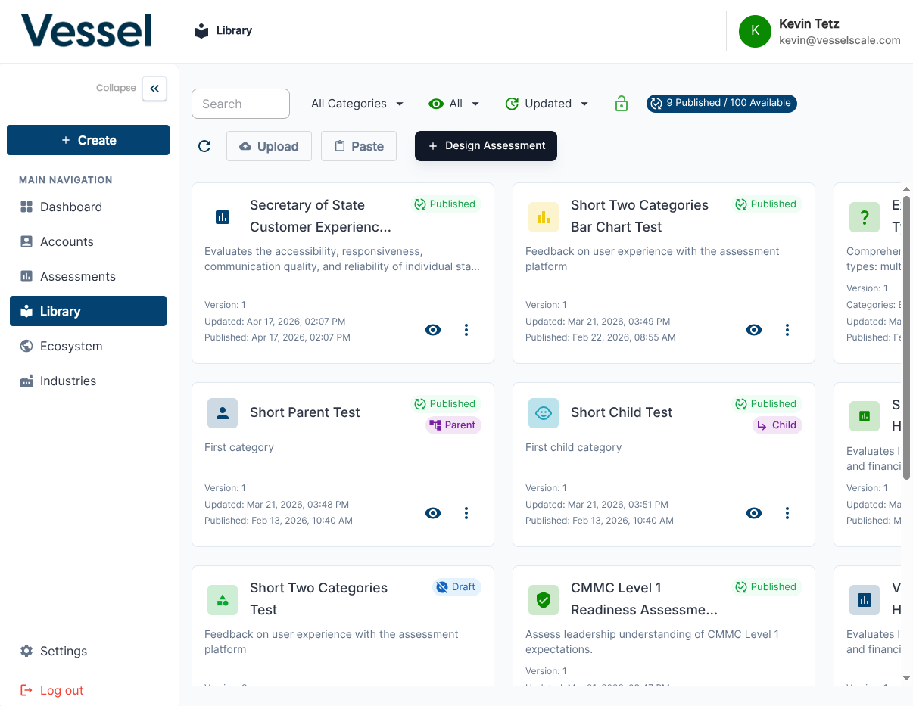

# Library

The Library contains all assessment definitions — the templates used to create evaluation instances.

## What you can do here

- Browse all available assessment definitions
- View the structure and questions of each assessment
- Create new assessment definitions
- Edit existing definitions

## Assessment Definitions List

The Library displays all assessment definition templates available in your system. These are the blueprints used to create new evaluations. From this list view, you can see all available assessments, their descriptions, when they were last updated, and how many times they've been used. This helps you understand your complete assessment inventory and find the right template when creating new evaluations.

## Related

- [Create Assessment](create.md)
- [Edit Assessment](edit.md)
- [Assessments](../evaluations/index.md)
