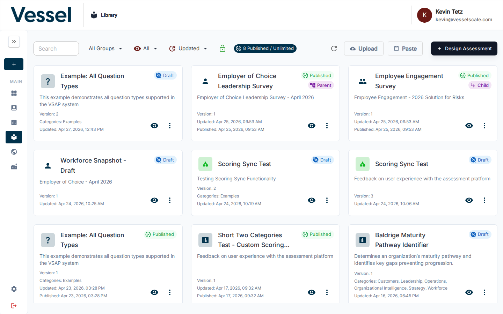

# Library

The Library contains all assessment definitions — the blueprints used to create evaluations across your accounts.

## What you can do here

- Browse all available assessment definitions
- View the structure, questions, and status of each assessment
- Create new assessment definitions
- Edit and publish drafts
- Manage parent/child assessment groups

## Overview

The Library is your central inventory of assessment templates. Definitions here can be in **Draft**, **Published**, or **Deprecated** status and can be organized into parent/child groups for multi-part evaluations. Each card shows the assessment name, icon, status badges, version, and last-updated date.

## In this section

- [Assessment List](list.md) — Browse the list, understand card actions, and manage definitions
- [Create Assessment](create.md) — Build a new assessment definition from scratch
- [Edit Assessment](edit.md) — Modify an existing definition's YAML, categories, and settings
- [Question Types](question-types.md) — Reference for all question types and their configuration options
- [Scoring](scoring.md) — Understand how assessment scores are calculated and displayed
